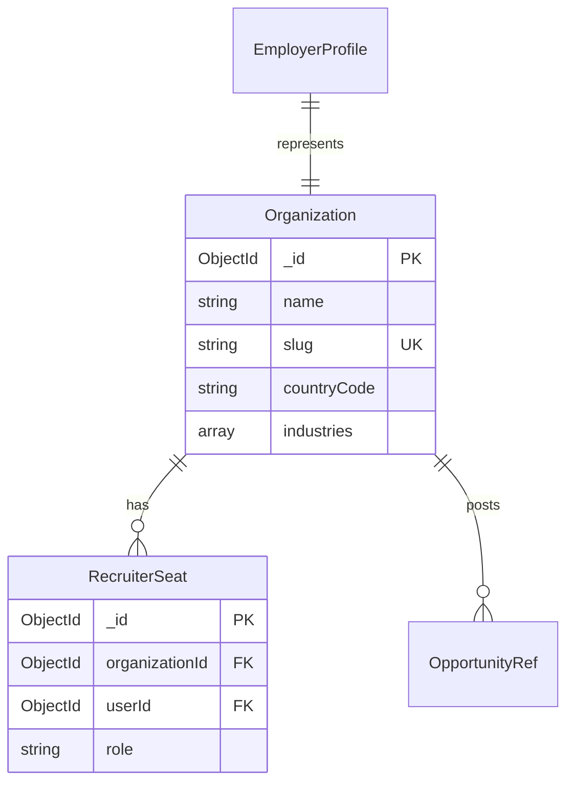
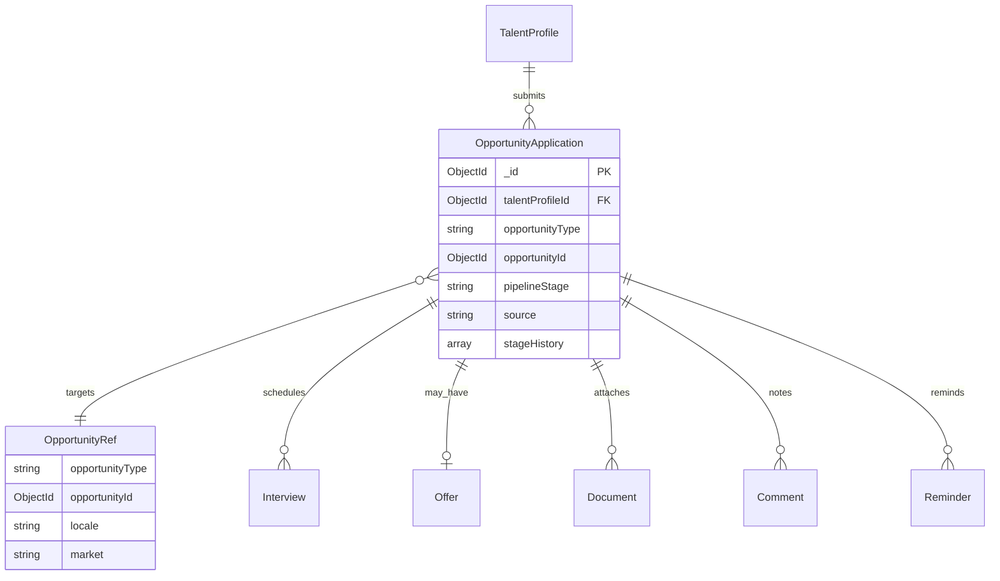
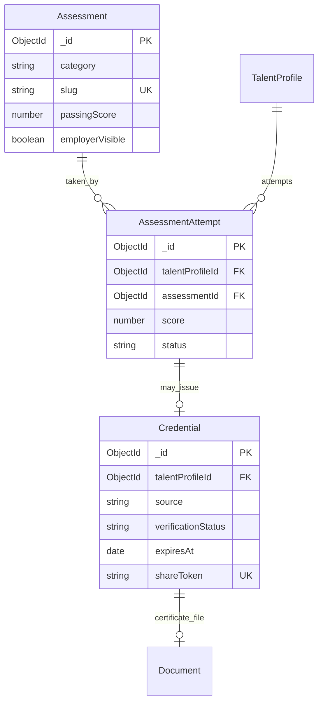
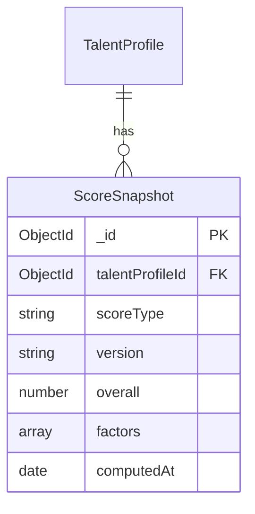
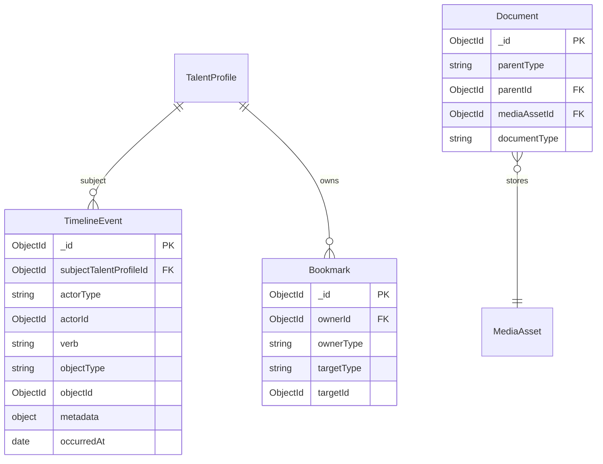
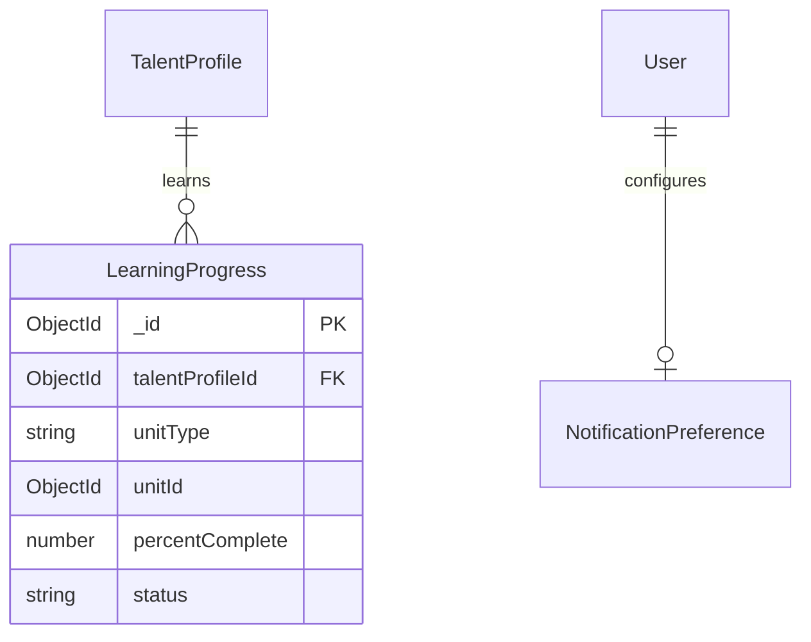
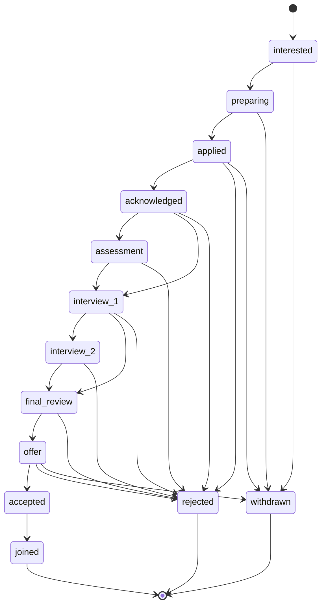

# Sprint C.8.0.1 — Career Domain Canonical Contracts & Data Model Blueprint

**Document type:** Canonical architecture contract (documentation only)  
**Status:** Single source of truth for all C.8+ implementation sprints  
**Prerequisites:** C.7.0.9 (production-ready), C.8.0.0 Career Intelligence Audit  
**Authority:** This document supersedes ad-hoc career domain decisions unless explicitly amended  
**Constraint:** No code, schema, API, route, migration, or UI changes in this sprint

---

## Document purpose

This blueprint defines **how** the Career Intelligence domain must be designed before any implementation. It exists to prevent:

- Duplicated models and parallel services
- Conflicting API surfaces
- Breaking changes to search, analytics, workflow, and localization
- Irreversible migration mistakes
- Technical debt from feature-level shortcuts

**Rule for all C.8 engineers:** If a design choice is not in this document, it must be added here before implementation merges.

---

## SECTION 1 — Current Platform Assessment

### 1.1 Completed platform (C.6 → C.7.0.9)

| Capability | Canonical location | Career relevance |
|------------|-------------------|------------------|
| Authentication | `User`, `Employer`, JWT + Redis refresh (`tokenStore.js`) | Extend, do not replace |
| RBAC | `shared` + `server/src/config/rbac.js` | Staff only today; extend for recruiter seats |
| Workflow | `WorkflowService`, `EditorialWorkflow`, `shared/workflow/*` | Assessment/credential publishing |
| Search | `SearchIndexService`, `shared/search/*` | Add career entity types |
| Analytics | `AnalyticsEventService`, `shared/analytics/*` | Add career funnel events |
| Media | `MediaAsset`, `storage/*` | Documents, certificates, portfolio |
| Forms | `FormDefinition`, `shared/formSchema.js` | Application forms, surveys |
| Notifications | `notificationService`, `jobQueueService` | Reminders, stage alerts |
| Localization | `shared/localization/*` | Market + content locale |
| Redis / Cache | `config/cache.js`, `config/redis.js` | Score cache, dashboard widgets |
| Queue workers | `BackgroundJob`, `worker.js` | Score recompute, reminders, sync |
| Docker / CI | `docker-compose.yml`, `.github/workflows/ci.yml` | No career-specific infra needed |
| Page Builder | `CmsPageLayout`, `shared/pageBuilder*` | Dashboard layouts, career pages |
| CMS | `CmsStaticPage`, `cmsController` | Roadmaps, marketing |
| Dynamic blocks | `DynamicContentService`, `shared/dynamicBlocks/*` | Dashboard content widgets |
| Revision history | `CmsPageLayoutRevision` | Page layouts only; career docs use Activity |
| Global search | `SearchDocument`, locale-aware index | Extend registry |
| Integration hub | `contentIntegration.js` | **All career mutations must route here** |
| Production | Health, metrics, graceful shutdown | Unchanged |

### 1.2 Legacy career artifacts (to be subsumed, not duplicated)

| Legacy artifact | Location | Future role |
|-----------------|----------|-------------|
| `User` career fields | `province`, `interests`, `saved*` arrays | Hydrate TalentProfile; deprecate arrays |
| `Application` | 7-status job apply record | Migrate to `OpportunityApplication` |
| `InternshipApplication` | Parallel thin model | Merge into `OpportunityApplication` |
| `Resume` | Rich document schema | Becomes `ResumeVersion` export of TalentProfile |
| `Quiz` / `Exam` | Pakistan exam prep | Wrapped by `Assessment` platform layer |
| `UserBadge` | Gamification | Display layer; `Credential` for verified skills |
| `dashboardController` | Education hub API | Replaced by career dashboard composition |

### 1.3 MUST reuse (non-negotiable)

| Service | Contract |
|---------|----------|
| `contentIntegration.js` | All career entity saves trigger search/analytics/cache invalidation |
| `scheduleAnalyticsEvent` | All user/employer actions emit canonical events |
| `SearchIndexService` | All public discoverable entities indexed via mappers |
| `config/cache.js` | All domain caches use `platformCacheGet/Set` with namespace |
| `jobQueueService` | All async work (reminders, score recompute) |
| `shared/localization/*` | Sole locale/market config source |
| `WorkflowService` | Publish flows for assessments, credentials |
| `MediaAsset` + storage providers | All file persistence |
| `FormDefinition` | Structured data collection |

### 1.4 MUST NEVER duplicate

| Forbidden duplicate | Use instead |
|-------------------|-------------|
| Per-feature note systems | `Comment` (platform Comment Service) |
| Per-feature bookmark arrays on User | `Bookmark` service |
| Per-feature timeline tables | `TimelineEvent` via Timeline Service |
| Per-feature score fields on models | `ScoreSnapshot` via Scoring Service |
| Per-feature upload endpoints | Document Service + MediaAsset |
| Per-feature notification senders | Notification Service |
| Second question/assessment engine | Assessment platform wrapping Quiz/MCQ |
| Second search implementation | SearchIndexService |
| Second analytics writer | AnalyticsEventService |

---

## SECTION 2 — Canonical Domain Model

### 2.1 Entity catalog

Naming convention: **PascalCase** entity names; MongoDB collections use **camelCase plural** (e.g. `talentProfiles`).

---

#### User

| Attribute | Value |
|-----------|-------|
| **Purpose** | Authentication and account lifecycle only |
| **Responsibilities** | Credentials, email verification, role (staff), account status, refresh tokens, product entitlements |
| **Ownership** | Platform Identity domain |
| **Relationships** | 1:1 `TalentProfile` (optional until onboarded); 0:1 staff roles |
| **Lifecycle** | `registered → email_verified → active → suspended → deleted` |
| **Persistence** | Existing `users` collection; **no new career fields** |

**Must NOT contain:** skills, applications, scores, resume content, employer data.

---

#### TalentProfile

| Attribute | Value |
|-----------|-------|
| **Purpose** | Canonical career identity for every job seeker / professional |
| **Responsibilities** | Career data root; visibility; market preferences; links to child value objects |
| **Ownership** | Career Intelligence domain |
| **Relationships** | 1:1 `User`; 1:N child entities (see §7); 0:1 `DeveloperProfileExtension` (GigRadar) |
| **Lifecycle** | `draft → active → archived` |
| **Persistence** | New `talentProfiles` collection; `userId` unique index |

---

#### EmployerProfile

| Attribute | Value |
|-----------|-------|
| **Purpose** | Hiring-side root for an employer account (wraps legacy `Employer`) |
| **Responsibilities** | Company identity, verification, billing customer, hiring defaults |
| **Ownership** | Employer domain |
| **Relationships** | 1:1 `Employer` (auth); 1:1 `Organization`; 1:N `RecruiterSeat` |
| **Lifecycle** | `pending_verification → active → suspended` |
| **Persistence** | Extend `employers` or parallel `employerProfiles` with 1:1 link |

---

#### Organization

| Attribute | Value |
|-----------|-------|
| **Purpose** | Canonical company record (may differ from auth display name) |
| **Responsibilities** | Brand, locations, industries, public employer page |
| **Ownership** | Employer domain |
| **Relationships** | 1:1 `EmployerProfile`; 1:N `Department`; links to `Opportunity` |
| **Lifecycle** | `active → merged → archived` |
| **Persistence** | New or extend `Company` model with clear ownership rules |

---

#### Opportunity

| Attribute | Value |
|-----------|-------|
| **Purpose** | Polymorphic wrapper for anything a talent can apply to |
| **Responsibilities** | Type discrimination, locale, market, publish state, SEO slug |
| **Ownership** | Listings domain (existing Job, Scholarship, etc. implement) |
| **Relationships** | Maps to existing `Job`, `Internship`, `Scholarship`, `Admission`, future types |
| **Lifecycle** | Delegates to underlying entity workflow |
| **Persistence** | **Virtual** — `opportunityType` + `opportunityId` composite; no duplicate job storage |

**Contract:** `Opportunity` is a **reference tuple**, not a new MongoDB document duplicating Job.

```
OpportunityRef = { opportunityType, opportunityId, locale?, market? }
```

---

#### OpportunityApplication

| Attribute | Value |
|-----------|-------|
| **Purpose** | Canonical application tracker for all opportunity types |
| **Responsibilities** | Pipeline stage, history, documents, reminders, employer sync |
| **Ownership** | Career Intelligence domain |
| **Relationships** | N:1 `TalentProfile`; N:1 `OpportunityRef`; N:1 `Organization` (employer) |
| **Lifecycle** | See §6 state machine |
| **Persistence** | New `opportunityApplications` collection |

---

#### Assessment

| Attribute | Value |
|-----------|-------|
| **Purpose** | Catalog entry for a skill/cognitive/domain test |
| **Responsibilities** | Metadata, passing threshold, duration, category, employer visibility |
| **Ownership** | Assessment platform |
| **Relationships** | 1:N `QuestionBank`; 1:N `AssessmentAttempt`; optional `Workflow` |
| **Lifecycle** | `draft → review → published → archived` |
| **Persistence** | New layer wrapping or extending `Quiz` pattern |

---

#### AssessmentAttempt

| Attribute | Value |
|-----------|-------|
| **Purpose** | Single talent sitting for an assessment |
| **Responsibilities** | Answers, score, timing, proctoring metadata, pass/fail |
| **Ownership** | Assessment platform |
| **Relationships** | N:1 `TalentProfile`; N:1 `Assessment`; 0:1 `Credential` |
| **Lifecycle** | `started → in_progress → submitted → scored → voided` |
| **Persistence** | Extend pattern from `QuizAttempt` |

---

#### Credential

| Attribute | Value |
|-----------|-------|
| **Purpose** | Verified proof of skill, certification, or assessment pass |
| **Responsibilities** | Issuer, expiry, verification status, public share token |
| **Ownership** | Credential Service (platform) |
| **Relationships** | N:1 `TalentProfile`; 0:1 `AssessmentAttempt`; 0:1 `MediaAsset` (certificate PDF) |
| **Lifecycle** | `pending_verification → active → expired → revoked` |
| **Persistence** | New `credentials` collection |

---

#### CareerScore (logical type)

| Attribute | Value |
|-----------|-------|
| **Purpose** | Named score category (not a stored entity) |
| **Responsibilities** | Enum/registry of score types |
| **Ownership** | Scoring Service |
| **Values** | `career_readiness`, `resume_strength`, `employer_match`, `technical_readiness`, `interview_readiness`, `learning_progress` |

---

#### ScoreSnapshot

| Attribute | Value |
|-----------|-------|
| **Purpose** | Immutable point-in-time score result |
| **Responsibilities** | Overall score, factor breakdown, version, explainability |
| **Ownership** | Scoring Service |
| **Relationships** | N:1 `TalentProfile`; references `CareerScore` type |
| **Lifecycle** | Append-only; never updated in place |
| **Persistence** | `scoreSnapshots` collection; TTL optional for stale cache copies |

---

#### TimelineEvent

| Attribute | Value |
|-----------|-------|
| **Purpose** | Single canonical activity feed entry |
| **Responsibilities** | Actor, verb, object, metadata, visibility |
| **Ownership** | Timeline Service (platform) |
| **Relationships** | Polymorphic object refs; N:1 `TalentProfile` (subject) |
| **Lifecycle** | Append-only |
| **Persistence** | `timelineEvents` collection; partitioned by date |

---

#### Bookmark

| Attribute | Value |
|-----------|-------|
| **Purpose** | Saved opportunity or profile reference |
| **Responsibilities** | Polymorphic target, folder, notes |
| **Ownership** | Bookmark Service |
| **Relationships** | N:1 `TalentProfile` or `EmployerProfile`; refs any bookmarkable entity |
| **Lifecycle** | `active → removed` |
| **Persistence** | `bookmarks` collection; migrates `User.saved*` arrays |

---

#### Document

| Attribute | Value |
|-----------|-------|
| **Purpose** | File attachment metadata linked to career entities |
| **Responsibilities** | Type, label, visibility, MediaAsset link |
| **Ownership** | Document Service |
| **Relationships** | N:1 parent (application, profile, credential); 1:1 `MediaAsset` |
| **Lifecycle** | `uploaded → verified → archived → deleted` |
| **Persistence** | `documents` collection |

---

#### Portfolio

| Attribute | Value |
|-----------|-------|
| **Purpose** | Curated showcase of projects and work samples |
| **Responsibilities** | Ordered items, public URL, visibility |
| **Ownership** | Talent domain (child of TalentProfile) |
| **Relationships** | 1:1 or embedded section in TalentProfile; items ref `Document` or external URL |
| **Lifecycle** | `draft → published` |
| **Persistence** | `portfolioItems` or embedded array with size limits |

---

#### ResumeVersion

| Attribute | Value |
|-----------|-------|
| **Purpose** | Generated/exported resume from TalentProfile at a point in time |
| **Responsibilities** | Template, rendered PDF/HTML, market tag, primary flag |
| **Ownership** | Talent domain |
| **Relationships** | N:1 `TalentProfile`; migrates from `Resume` |
| **Lifecycle** | `draft → published → superseded` |
| **Persistence** | Extend `resumes` collection with `talentProfileId`, `sourceVersion` |

---

#### LearningProgress

| Attribute | Value |
|-----------|-------|
| **Purpose** | Track completion of learning units |
| **Responsibilities** | Percent complete, milestones, last activity |
| **Ownership** | Progress Service |
| **Relationships** | N:1 `TalentProfile`; refs learning unit (webinar, quiz, external cert) |
| **Lifecycle** | `not_started → in_progress → completed → expired` |
| **Persistence** | `learningProgress` collection |

---

#### Badge

| Attribute | Value |
|-----------|-------|
| **Purpose** | Gamification achievement (display) |
| **Responsibilities** | Icon, points, trigger type |
| **Ownership** | Achievements (extends `BadgeDefinition`) |
| **Relationships** | N:M `TalentProfile` via `UserBadge` |
| **Lifecycle** | Awarded once per badge type |
| **Persistence** | Existing `badgeDefinitions`, `userBadges` |

---

#### Certification

| Attribute | Value |
|-----------|-------|
| **Purpose** | User-reported or verified external certificate |
| **Responsibilities** | Issuer, dates, credential URL, verification |
| **Ownership** | Credential Service (may merge with `Credential`) |
| **Relationships** | N:1 `TalentProfile`; 0:1 `Document` |
| **Lifecycle** | `self_reported → pending → verified → expired` |
| **Persistence** | Prefer unified `Credential` with `source: external | assessment | platform` |

---

#### NotificationPreference

| Attribute | Value |
|-----------|-------|
| **Purpose** | Granular channel preferences per event category |
| **Responsibilities** | Email/push/in-app per domain event type |
| **Ownership** | Notification Service |
| **Relationships** | N:1 `User` |
| **Lifecycle** | Updated by user |
| **Persistence** | Extend `User.notifications` or separate doc |

---

#### CareerGoal

| Attribute | Value |
|-----------|-------|
| **Purpose** | Stated career objective with timeline |
| **Responsibilities** | Target role, industry, date, status |
| **Ownership** | Talent domain |
| **Relationships** | N:1 `TalentProfile` |
| **Lifecycle** | `active → achieved → abandoned` |
| **Persistence** | Embedded in TalentProfile or child collection |

---

#### Availability

| Attribute | Value |
|-----------|-------|
| **Purpose** | When talent is available to start |
| **Responsibilities** | Notice period, start date, hours per week |
| **Ownership** | Talent domain |
| **Relationships** | 1:1 `TalentProfile` (embedded) |
| **Persistence** | Embedded in TalentProfile |

---

#### WorkPreference

| Attribute | Value |
|-----------|-------|
| **Purpose** | Remote/hybrid/onsite, relocation, travel |
| **Responsibilities** | Work mode, preferred markets, salary range |
| **Ownership** | Talent domain |
| **Relationships** | 1:1 `TalentProfile` (embedded) |
| **Persistence** | Embedded in TalentProfile |

---

#### Interview

| Attribute | Value |
|-----------|-------|
| **Purpose** | Scheduled interview instance |
| **Responsibilities** | Date, type, location/link, outcome, panel |
| **Ownership** | Application aggregate |
| **Relationships** | N:1 `OpportunityApplication`; 0:N `InterviewPanel` members |
| **Lifecycle** | `scheduled → completed → cancelled → no_show` |
| **Persistence** | Child of application or `interviews` collection with app ref |

---

#### Offer

| Attribute | Value |
|-----------|-------|
| **Purpose** | Job/offer details when employer extends offer |
| **Responsibilities** | Compensation, start date, expiry, acceptance |
| **Ownership** | Application aggregate |
| **Relationships** | 0:1 per `OpportunityApplication` |
| **Lifecycle** | `draft → extended → accepted → declined → expired` |
| **Persistence** | Embedded in application or child doc |

---

#### Recommendation

| Attribute | Value |
|-----------|-------|
| **Purpose** | System-generated suggestion (job, learning, assessment) |
| **Responsibilities** | Score, reason, entity ref, expiry |
| **Ownership** | Recommendation Service |
| **Relationships** | N:1 `TalentProfile`; refs any recommendable entity |
| **Lifecycle** | `active → dismissed → acted → expired` |
| **Persistence** | `recommendations` collection; cache-friendly |

---

#### Activity

| Attribute | Value |
|-----------|-------|
| **Purpose** | **Alias for TimelineEvent** in API vocabulary |
| **Contract** | No separate Activity collection. `Activity` = read model over `TimelineEvent`. |

---

#### Comment

| Attribute | Value |
|-----------|-------|
| **Purpose** | Threaded note on any commentable entity |
| **Responsibilities** | Author, body, visibility, parent thread |
| **Ownership** | Comment Service |
| **Relationships** | Polymorphic `commentableType` + `commentableId` |
| **Lifecycle** | `active → edited → deleted` |
| **Persistence** | `comments` collection |

---

#### Reminder

| Attribute | Value |
|-----------|-------|
| **Purpose** | Scheduled future action notification |
| **Responsibilities** | Due at, channel, payload, sent state |
| **Ownership** | Reminder Service (uses `BackgroundJob`) |
| **Relationships** | N:1 parent (application, interview) |
| **Lifecycle** | `pending → sent → cancelled` |
| **Persistence** | `reminders` collection + queue job |

---

## SECTION 3 — Aggregate Boundaries

### 3.1 Aggregate root map

| Aggregate root | Entities inside boundary | External references (by ID only) |
|----------------|-------------------------|--------------------------------|
| **User** | Auth credentials, entitlements, notification prefs | `talentProfileId` |
| **TalentProfile** | Education, experience, skills, goals, work prefs, availability, portfolio items, social links | `userId`, `mediaAssetIds`, `credentialIds` |
| **EmployerProfile** | Verification, billing refs, hiring defaults | `employerId`, `organizationId` |
| **Organization** | Departments, branding, locations | `employerProfileId` |
| **Opportunity** (ref) | None — not an aggregate | `jobId` / `scholarshipId` / etc. |
| **OpportunityApplication** | Stage, history, interviews, offers, application documents, reminders | `talentProfileId`, `opportunityRef`, `organizationId` |
| **Assessment** | Definition, question bank refs, publish metadata | `workflowId` |
| **AssessmentAttempt** | Answers, score, timing | `talentProfileId`, `assessmentId` |
| **Credential** | Verification, issuer, expiry | `talentProfileId`, `attemptId`, `documentId` |
| **ScoreSnapshot** | Immutable factors | `talentProfileId` |
| **Document** | Metadata, visibility | `mediaAssetId`, `parentId` |
| **Bookmark** | Target ref, folder | `ownerId` |
| **TimelineEvent** | Event payload | Polymorphic refs (no embedding parent docs) |

### 3.2 Transactional boundaries

| Operation | Single aggregate transaction | Cross-aggregate (eventual consistency) |
|-----------|---------------------------|----------------------------------------|
| Update talent skills | TalentProfile | Timeline write, score recompute |
| Submit application | OpportunityApplication | Timeline, analytics, notification |
| Complete assessment | AssessmentAttempt | Credential issue, score recompute, timeline |
| Issue credential | Credential | TalentProfile skill update, search reindex |
| Employer stage change | OpportunityApplication | Notify talent, timeline, analytics |

**Rule:** Cross-aggregate side effects use **domain events → queue workers**, not multi-document Mongo transactions unless required for consistency.

### 3.3 Embedding rules

| Embed | When |
|-------|------|
| WorkPreference, Availability on TalentProfile | Always read together; small, bounded |
| Stage history on OpportunityApplication | Bounded with archival policy |
| Offer on Application | 0:1; small |
| Interview array on Application | Max 20 per app; else child collection |

| Reference by ID | When |
|-----------------|------|
| Media files | Always via Document + MediaAsset |
| Credentials on profile | Array of credential IDs |
| Comments | Never embed; Comment Service |
| Timeline | Never embed in profile; Timeline Service |

---

## SECTION 4 — Canonical ER Diagrams

### 4.1 Authentication & identity

```mermaid
erDiagram
    User ||--o| TalentProfile : owns
    User {
        ObjectId _id PK
        string email UK
        string password
        string role
        string accountStatus
        boolean emailVerified
        string preferredLanguage
        object productEntitlements
    }
    TalentProfile {
        ObjectId _id PK
        ObjectId userId UK FK
        string status
        string displayName
        string publicSlug UK
        string visibility
    }
    Employer ||--o| EmployerProfile : owns
    Employer {
        ObjectId _id PK
        string email UK
        string companyName
        string verificationLevel
    }
    EmployerProfile {
        ObjectId _id PK
        ObjectId employerId UK FK
        ObjectId organizationId FK
        string billingCustomerId
    }
```

### 4.2 Talent domain

```mermaid
erDiagram
    TalentProfile ||--o{ ResumeVersion : generates
    TalentProfile ||--o{ Credential : earns
    TalentProfile ||--o{ Bookmark : saves
    TalentProfile ||--o{ LearningProgress : tracks
    TalentProfile ||--o{ ScoreSnapshot : scored
    TalentProfile ||--o| DeveloperProfileExtension : extends
    TalentProfile {
        ObjectId _id PK
        object workPreference
        object availability
        array education
        array experience
        array skills
        array careerGoals
        array portfolioLinks
    }
    ResumeVersion {
        ObjectId _id PK
        ObjectId talentProfileId FK
        string template
        boolean isPrimary
        string marketTag
    }
    DeveloperProfileExtension {
        ObjectId _id PK
        ObjectId talentProfileId UK FK
        string githubUsername
        object repoMetrics
    }
```

### 4.3 Employer & organization



### 4.4 Applications



### 4.5 Assessments & credentials



### 4.6 Scoring



### 4.7 Timeline, bookmarks, documents



### 4.8 Learning & notifications



---

## SECTION 5 — Shared Platform Services

### 5.1 Service registry

| Service | Responsibilities | Consumers | Owner module | Public interface (conceptual) |
|---------|------------------|-----------|--------------|------------------------------|
| **TimelineService** | Append/read activity events | Dashboard, tracker, employer CRM | `platform/timeline` | `appendEvent()`, `listForProfile()` |
| **DocumentService** | Attach files to parents | Applications, profile, credentials | `platform/documents` | `attach()`, `list()`, `revoke()` |
| **CredentialService** | Issue/verify/revoke credentials | Assessments, profile, employer | `platform/credentials` | `issue()`, `verify()`, `listForTalent()` |
| **BookmarkService** | Polymorphic saves | Dashboard, jobs, employer pool | `platform/bookmarks` | `save()`, `remove()`, `list()` |
| **NotificationService** | Deliver multi-channel | All domain events | Existing — extend | `notify()`, `schedule()` |
| **CommentService** | Threaded notes | Applications, employer CRM | `platform/comments` | `add()`, `list()`, `delete()` |
| **ProgressService** | % complete tracking | Learning, profile, assessments | `platform/progress` | `update()`, `get()` |
| **ScoringService** | Compute/store snapshots | Readiness, employer match | `platform/scoring` | `compute()`, `getLatest()` |
| **RecommendationService** | Generate suggestions | Dashboard, jobs | `platform/recommendations` | `getForTalent()` |
| **MediaService** | File storage | Documents, portfolio | Existing `mediaService` | `upload()`, `getUrl()` |
| **SearchService** | Index/query | Public discovery, employer search | `SearchIndexService` | `index()`, `search()` |
| **AnalyticsService** | Event ingestion | All modules | `AnalyticsEventService` | `track()` |
| **WorkflowService** | Publish approval | Assessments, credentials, content | Existing | `sync()`, `publish()` |
| **LocalizationService** | Locale/market | All public APIs | `shared/localization` | `resolveLocale()` |
| **ReminderService** | Scheduled alerts | Applications, interviews | `platform/reminders` | `schedule()`, `cancel()` |

### 5.2 Extensibility contract

Every platform service MUST:

1. Expose a **single entry module** under `server/src/services/platform/<name>/`
2. Register invalidation hooks in `contentIntegration.js` if cache/search affected
3. Emit domain events (§13) on mutations
4. Accept `locale` and `market` context where public-facing
5. Never import UI or route handlers

---

## SECTION 6 — Opportunity Application Domain

### 6.1 Replaces legacy `Application`

| Legacy | Canonical |
|--------|-----------|
| `Application` (job only) | `OpportunityApplication` |
| `InternshipApplication` | Same collection, `opportunityType: internship` |
| Flat `status` enum | `pipelineStage` + `stageHistory[]` |
| Single `note` | `CommentService` |
| `resumeURL` string | `DocumentService` |

### 6.2 Supported opportunity types

| Type | Maps to | Stage template ID |
|------|---------|-------------------|
| `job` | `Job` | `job_default` |
| `internship` | `Internship` | `internship_default` |
| `scholarship` | `Scholarship` | `scholarship_default` |
| `admission` | `Admission` | `admission_default` |
| `graduate_program` | Future | `graduate_default` |
| `fellowship` | Future | `fellowship_default` |

### 6.3 Canonical pipeline stages

```
interested
preparing
applied
acknowledged
assessment
interview_1
interview_2
final_review
offer
rejected
withdrawn
accepted
joined
```

Not all types use all stages. **Stage templates** define allowed transitions per `opportunityType`.

### 6.4 State machine (job template)



### 6.5 Stage transition contract

Every transition MUST record:

```typescript
// Conceptual contract — not implementation code
StageTransition {
  fromStage: PipelineStage
  toStage: PipelineStage
  at: ISO8601
  byActorType: 'talent' | 'employer' | 'system'
  byActorId: ObjectId
  reason?: string
  metadata?: object
}
```

### 6.6 Audit requirements

| Event | Stored in | Retention |
|-------|-----------|-----------|
| Stage change | `stageHistory[]` on application | Life of application + 7 years |
| Document upload | Document + Timeline | Same |
| Employer view | Timeline + Analytics | 2 years |
| Reminder sent | Reminder + Timeline | 1 year |
| Offer change | Offer subdoc + history | Life of application |

### 6.7 External applications

When `source: external`, talent manually creates application with `opportunityType` + URL + company name (no `opportunityId`). Pipeline still applies.

---

## SECTION 7 — Talent Profile

### 7.1 Canonical identity contract

```
TalentProfile = single source of truth for career data
ResumeVersion = rendered export (PDF/HTML/JSON) at version N
User = authentication only
```

### 7.2 TalentProfile sections

| Section | Storage | Synced to ResumeVersion |
|---------|---------|-------------------------|
| Identity (display, headline, avatar) | Profile root | Yes |
| Education[] | Profile | Yes |
| Experience[] | Profile | Yes |
| Skills[] (with level, source) | Profile | Yes |
| Languages[] | Profile | Yes |
| Certifications[] | Profile + Credential refs | Yes |
| Projects[] / Portfolio | Profile | Optional template |
| Documents[] | Document Service refs | Attachment list |
| CareerGoals[] | Profile | No |
| WorkPreference | Embedded | Summary only |
| Availability | Embedded | Optional |
| Social links | Profile | Yes |
| Badges | UserBadge refs | Optional |
| Bookmarks | Bookmark Service | No |
| Timeline | Timeline Service | No |
| LearningProgress | Progress Service | No |
| Assessment results | Credential refs | Verified only |
| Readiness | ScoreSnapshot ref | Score summary |
| Markets[] | Profile | No |

### 7.3 ResumeVersion generation

On `TalentProfile` save (debounced):

1. Queue job `resume_snapshot_generate`
2. Render primary `ResumeVersion` from profile + template
3. Do NOT write profile data from resume editor without round-trip validation

**Legacy `Resume` documents:** Migrated to `ResumeVersion` with `talentProfileId`; editor becomes view over profile.

### 7.4 GigRadar extension (no second identity)

```mermaid
erDiagram
    TalentProfile ||--o| DeveloperProfileExtension : optional
    DeveloperProfileExtension {
        ObjectId talentProfileId UK FK
        string githubUsername
        array repositorySnapshotIds
        object contributionSummary
        boolean publicDevProfile
    }
```

- GigRadar UI reads `TalentProfile` + `DeveloperProfileExtension`
- Same `userId` login; `productEntitlements` includes `gigradar`
- Technical credentials still stored as `Credential` with `category: technical`

---

## SECTION 8 — Employer Domain

### 8.1 Entity definitions

| Entity | Purpose |
|--------|---------|
| **EmployerProfile** | Auth account wrapper, billing, verification |
| **Organization** | Public company brand, slug, locations |
| **Department** | Hiring unit within organization |
| **RecruiterSeat** | User invited to manage hiring for org |
| **HiringTeam** | Group of recruiters on a requisition |
| **CandidatePipeline** | View over applications filtered by opportunity |
| **HiringNote** | Comment with `commentableType: application` |
| **HiringStage** | Maps to application pipeline (employer view) |
| **InterviewPanel** | Members on an Interview |
| **CandidateRating** | Structured score on application (not public) |

### 8.2 Employer consumption contracts

| Data | API source | Display rule |
|------|------------|--------------|
| Applications | `/api/applications?organizationId=` | Pipeline kanban |
| Assessments | `/api/assessments/attempts?applicationId=` | Only if talent consented |
| Career scores | `/api/scoring/latest?talentProfileId=` | Only `employerVisible` factors |
| Credentials | `/api/credentials?talentProfileId=&verified=true` | Badge list |
| Timeline | `/api/timeline?applicationId=` | Application-scoped only |
| Documents | `/api/documents?applicationId=` | Application attachments only |

**Privacy contract:** Employer NEVER sees full talent timeline — only application-scoped events unless talent opts into visibility.

---

## SECTION 9 — Career Scoring Architecture

### 9.1 ScoringEngine contract

```
ScoringEngine.compute(talentProfileId, scoreType, options?) → ScoreSnapshot
```

### 9.2 ScoreProvider interface (conceptual)

```typescript
interface ScoreProvider {
  id: string                    // e.g. 'resume_quality'
  scoreTypes: CareerScoreType[] // which scores this provider feeds
  weight(scoreType): number      // from versioned config
  compute(ctx: ScoreContext): Promise<ScoreFactorResult>
}

interface ScoreFactorResult {
  score: number                 // 0-100
  explanation: string
  evidence: EvidenceRef[]
}
```

### 9.3 Built-in providers (v1)

| Provider ID | Feeds | Input signals |
|-------------|-------|---------------|
| `profile_completeness` | career_readiness | TalentProfile fields |
| `resume_quality` | career_readiness, resume_strength | Resume analyzer |
| `verified_skills` | career_readiness, technical_readiness | Credentials |
| `application_engagement` | career_readiness | Application stages |
| `learning_progress` | career_readiness, learning_progress | LearningProgress |
| `experience_depth` | career_readiness | Experience entries |
| `interview_outcomes` | interview_readiness | Interview results |
| `employer_match` | employer_match | Job req vs profile (per job) |

### 9.4 ScoreSnapshot schema (conceptual)

```
ScoreSnapshot {
  talentProfileId
  scoreType: CareerScoreType
  version: "1.0.0"              // weights config version
  overall: 0-100
  factors: [{ providerId, score, weight, explanation, evidence[] }]
  computedAt
  validUntil                     // cache TTL hint
}
```

### 9.5 Versioning & explainability

- Weights live in `shared/scoring/weights/v1.json` — not in code
- New weight version → new snapshots; old retained for comparison
- UI MUST show factor breakdown; never show overall alone
- **No AI in numeric score** — AI may add narrative via separate `InsightProvider`

### 9.6 Recalculation triggers

| Trigger | Action |
|---------|--------|
| Profile update | Queue `score_recompute` (debounced 5 min) |
| Assessment complete | Immediate credential + score recompute |
| Application stage change | Recompute `application_engagement` factor |
| Nightly batch | Stale snapshot refresh |

### 9.7 Caching

- Latest snapshot per `(talentProfileId, scoreType)` in Redis — TTL 15 min
- Historical snapshots in Mongo — indexed by `talentProfileId + computedAt`

---

## SECTION 10 — Assessment Architecture

### 10.1 Layer model

```
AssessmentCatalog (CMS/admin)
    └── Assessment (definition)
            └── QuestionBank → Mcq (existing engine)
                    └── AssessmentAttempt
                            └── Credential (if pass)
```

### 10.2 Assessment definition

```
Assessment {
  slug, title, category, subcategory
  durationMinutes, passingScore, maxAttempts
  employerVisible: boolean
  proctoringLevel: 'none' | 'basic' | 'proctored'
  workflowStatus: via WorkflowService
  locale, market
  legacyQuizId?: ObjectId    // bridge to Quiz during migration
}
```

### 10.3 Categories (canonical enum)

`language | cognitive | productivity | domain | technical | soft_skills`

### 10.4 Credential issuance flow

```
AssessmentAttempt submitted
  → score >= passingScore
  → CredentialService.issue({ source: 'assessment', attemptId })
  → ScoringService.recompute(verified_skills)
  → TimelineService.append('credential_earned')
  → SearchIndexService.index credential (if public)
  → AnalyticsService.track('assessment_complete')
```

### 10.5 Proctoring extension points

| Level | v1 | Future |
|-------|-----|--------|
| none | Timed MCQ | — |
| basic | Tab focus events | Screenshot audit |
| proctored | — | Webcam, ID verify |

### 10.6 Integration matrix

| System | Integration |
|--------|-------------|
| Scoring | `verified_skills` provider reads credentials |
| TalentProfile | Skill entries updated with `source: verified` |
| Employer dashboard | Filter applicants by `credentialId` |
| Workflow | Assessment publish approval |
| Analytics | `assessment_start`, `assessment_complete` |
| Search | Index public credentials catalog |

---

## SECTION 11 — Timeline Architecture

### 11.1 Single timeline principle

**One write path:** `TimelineService.appendEvent()`  
**Many readers:** Dashboard, application detail, employer CRM (scoped)

### 11.2 Event model

```
TimelineEvent {
  _id
  subjectTalentProfileId      // whose feed
  actorType: talent|employer|system|staff
  actorId
  verb                        // canonical verb registry
  objectType                  // application|assessment|credential|document|...
  objectId
  metadata                    // verb-specific payload
  visibility: private|employer_scoped|public
  occurredAt
  locale?
}
```

### 11.3 Canonical verbs (registry)

| Verb | Trigger |
|------|---------|
| `application.created` | New OpportunityApplication |
| `application.stage_changed` | Pipeline transition |
| `resume.updated` | ResumeVersion published |
| `profile.updated` | TalentProfile material change |
| `assessment.completed` | Attempt scored |
| `credential.earned` | Credential issued |
| `credential.verified` | Manual cert approved |
| `interview.scheduled` | Interview created |
| `offer.received` | Offer extended |
| `offer.accepted` | Offer accepted |
| `score.improved` | Readiness increased ≥5 points |
| `profile.viewed` | Employer viewed (consented) |
| `document.uploaded` | Document attached |
| `learning.completed` | LearningProgress 100% |
| `notification.delivered` | Optional audit |
| `bookmark.created` | Bookmark saved |

### 11.4 Storage & retention

| Tier | Age | Storage |
|------|-----|---------|
| Hot | 0–90 days | Primary collection, full index |
| Warm | 90 days–2 years | Same collection, archived flag |
| Cold | 2+ years | Object storage export; Mongo purge |

### 11.5 Future event streaming

Timeline append MUST emit `TimelineEventCreated` domain event to allow future Kafka/EventBridge subscription without schema change.

---

## SECTION 12 — API Contracts

### 12.1 Route ownership

| Prefix | Owner | Auth |
|--------|-------|------|
| `/api/talent/*` | TalentProfile service | User (talent) |
| `/api/employers/*` | Employer domain | Employer |
| `/api/opportunities/*` | Listings (existing jobs/scholarships) | Public + admin |
| `/api/applications/*` | OpportunityApplication service | User + Employer (scoped) |
| `/api/scoring/*` | Scoring Service | User + Employer (limited) |
| `/api/assessments/*` | Assessment platform | User + admin |
| `/api/timeline/*` | Timeline Service | User + Employer (scoped) |
| `/api/credentials/*` | Credential Service | User + Employer (limited) |
| `/api/documents/*` | Document Service | Parent resource auth |
| `/api/bookmarks/*` | Bookmark Service | User |
| `/api/recommendations/*` | Recommendation Service | User |
| `/api/career/dashboard` | Dashboard composition | User |

### 12.2 Versioning strategy

- **v1:** All new career APIs under `/api/` (existing pattern)
- Breaking changes require `/api/v2/career/*` — not before C.9
- Response envelope: `{ data, meta, errors }` consistent with existing API

### 12.3 Authorization boundaries

| Resource | Talent | Employer | Staff |
|----------|--------|----------|-------|
| Own TalentProfile | RW | — | R |
| Own applications | RW | R (own org) | R |
| Other talent profile | — | R (limited fields) | R |
| Credentials | RW own | R if employerVisible | R |
| Scores | R own | R employer_visible | R |
| Timeline | R own | R application-scoped | R |

### 12.4 Validation

- All inputs validated via shared validators in `shared/career/validation.js` (future)
- Locale/market resolved via `resolveLocaleFromRequest`
- IDs always validated as ObjectId before query

---

## SECTION 13 — Event Architecture

### 13.1 Domain event envelope

```
DomainEvent {
  eventId: UUID
  eventType: string
  occurredAt: ISO8601
  aggregateType: string
  aggregateId: ObjectId
  actor: { type, id }
  payload: object
  locale?: string
  market?: string
}
```

### 13.2 Event catalog

| Event | Producer | Consumers |
|-------|----------|-----------|
| `ApplicationCreated` | Application Service | Timeline, Analytics, Notification |
| `ApplicationStageChanged` | Application Service | Timeline, Analytics, Notification, Scoring |
| `AssessmentCompleted` | Assessment Service | Credential, Scoring, Timeline, Analytics |
| `CredentialIssued` | Credential Service | Timeline, Search, TalentProfile skills |
| `ResumeVersionPublished` | Talent Service | Timeline, Scoring |
| `CareerScoreUpdated` | Scoring Service | Timeline, Analytics, Dashboard cache |
| `TimelineEventCreated` | Timeline Service | Future streaming |
| `EmployerViewedProfile` | Employer Service | Timeline, Analytics |
| `InterviewScheduled` | Application Service | Reminder, Timeline, Notification |
| `OfferAccepted` | Application Service | Timeline, Analytics, Notification |
| `RecommendationGenerated` | Recommendation Service | Analytics (optional) |
| `BookmarkCreated` | Bookmark Service | Analytics |
| `DocumentAttached` | Document Service | Timeline |

### 13.3 Delivery contract

1. Synchronous: emit to in-process event bus for same-request side effects (analytics track)
2. Asynchronous: enqueue `BackgroundJob` type `domain_event_handler` for heavy work
3. Never block HTTP response on score recompute or search reindex

---

## SECTION 14 — Search & Analytics Integration

### 14.1 Search entity registry extension

Add to `shared/search/entityTypes.js` (future sprint):

| Entity type | Indexed fields | Public search |
|-------------|----------------|---------------|
| `talent-profile` | skills, title, market (opt-in public) | Only public profiles |
| `credential` | skill, category, issuer | Catalog only |
| `assessment` | title, category | Catalog |
| `opportunity-application` | — | Never public |
| `developer` | GigRadar extension | GigRadar only |

**Mapper contract:** `mapTalentProfileToSearchDocument()` in `documentMappers.js` — follow existing pattern.

### 14.2 Analytics event extension

Add to `shared/analytics/eventTypes.js`:

`application_created`, `application_stage_changed`, `assessment_started`, `assessment_completed`, `credential_issued`, `readiness_score_viewed`, `employer_profile_view`, `recommendation_clicked`

### 14.3 Integration hub registration

Extend `contentIntegration.js`:

```
CAREER_TO_SEARCH_ENTITY = {
  'talent-profile': 'talent-profile',
  assessment: 'assessment',
  credential: 'credential',
}
```

All career saves call `onCareerEntitySaved(entityType, id, locale)`.

### 14.4 No duplicate implementations checklist

| Concern | Single path |
|---------|-------------|
| Index update | `scheduleSearchIndexUpdate` via contentIntegration |
| Analytics | `scheduleAnalyticsEvent` |
| Cache invalidation | `platformCacheInvalidateNamespace` |
| Async work | `enqueueJob` |
| File upload | MediaAsset + DocumentService |
| Notifications | notificationService |

---

## SECTION 15 — Migration Strategy

### 15.1 Principles

- **Additive only** — no destructive migrations in v1
- **Dual-write** — write new + old models during transition
- **Feature flags** — `CAREER_TRACKER_ENABLED`, `TALENT_PROFILE_ENABLED`
- **Rollback** — disable flag; old paths still work

### 15.2 Phase plan

| Phase | Action | Downtime |
|-------|--------|----------|
| M0 | Deploy schema additions (new collections) | None |
| M1 | Hydrate TalentProfile from User + primary Resume | Background job |
| M2 | Dual-write Application → OpportunityApplication | None |
| M3 | Migrate saved* arrays → Bookmark | Background job |
| M4 | Switch read path to new models (flag on) | None |
| M5 | Deprecate old write paths | None |
| M6 | Archive legacy fields (optional) | None |

### 15.3 Hydration: User + Resume → TalentProfile

```
For each User with role User:
  Find primary Resume (or latest)
  Create TalentProfile {
    userId, displayName: user.name,
    education: resume.education,
    experience: resume.experience,
    skills: resume.skills,
    ...
    workPreference: { markets: [infer from user.province] }
  }
```

### 15.4 Application migration

```
For each Application:
  Create OpportunityApplication {
    talentProfileId: lookup by userId,
    opportunityType: 'job',
    opportunityId: jobId,
    pipelineStage: mapLegacyStatus(status),
    stageHistory: [{ to: mapped, at: appliedDate, by: system }]
  }
```

### 15.5 Verification checkpoints

| Checkpoint | Gate |
|------------|------|
| CP1 | 100% users have TalentProfile |
| CP2 | Application count matches OpportunityApplication |
| CP3 | Bookmark count matches saved* totals |
| CP4 | No regression on `verify:integration` |
| CP5 | Employer inbox shows same applicants |

### 15.6 Rollback

- Flag off → UI uses legacy Application API
- New collections remain but unused
- No data delete on rollback

---

## SECTION 16 — Performance & Scalability

### 16.1 Indexes (recommended)

| Collection | Index |
|------------|-------|
| `talentProfiles` | `{ userId: 1 }` unique |
| `opportunityApplications` | `{ talentProfileId: 1, pipelineStage: 1 }` |
| `opportunityApplications` | `{ organizationId: 1, opportunityId: 1 }` |
| `timelineEvents` | `{ subjectTalentProfileId: 1, occurredAt: -1 }` |
| `scoreSnapshots` | `{ talentProfileId: 1, scoreType: 1, computedAt: -1 }` |
| `credentials` | `{ talentProfileId: 1, verificationStatus: 1 }` |
| `bookmarks` | `{ ownerId: 1, targetType: 1 }` |

### 16.2 Redis usage

| Key pattern | TTL | Purpose |
|-------------|-----|---------|
| `career:dashboard:{userId}` | 120s | Dashboard widget bundle |
| `career:score:{profileId}:{type}` | 900s | Latest score snapshot |
| `career:recommendations:{profileId}` | 300s | Recommendation list |

### 16.3 Queue jobs

| Job type | Priority |
|----------|----------|
| `score_recompute` | Normal |
| `timeline_archive` | Low |
| `migration_hydrate` | Low |
| `reminder_send` | High |
| `resume_snapshot_generate` | Normal |

### 16.4 Pagination

- Timeline: cursor-based (`occurredAt`, `_id`)
- Applications: offset with max 50
- Employer pipeline: per-stage columns paginated

### 16.5 Document growth

- `stageHistory` max 100 entries per application — archive to Timeline
- Portfolio max 50 items
- ResumeVersion max 10 per profile (configurable)

### 16.6 Global expansion readiness

- All new entities include `market` and `locale` fields
- Indexes include `{ market: 1 }` where list endpoints filter by market

---

## SECTION 17 — GigRadar Integration

### 17.1 Reuse matrix (mandatory)

| Capability | Reuse from platform |
|------------|-------------------|
| Authentication | Same User + JWT |
| TalentProfile | Base identity |
| DeveloperProfileExtension | GigRadar-only fields |
| Assessments | Technical category |
| Credentials | Technical credentials |
| Media | Portfolio artifacts |
| Workflow | Publish dev profile |
| Search | `developer` entity type |
| Analytics | Same event pipeline |
| Billing | Stripe + product SKUs |
| Notifications | Same service |
| Timeline | Same verbs + dev-specific verbs |
| Scoring | `technical_readiness` score type |

### 17.2 GigRadar-only (never in Strideto core)

- GitHub/GitLab OAuth tokens
- Repository snapshot storage
- Commit/PR/issue indexing
- AI code review results
- Developer employer search UI
- OSS contribution graph

### 17.3 Extension contract

```
DeveloperProfileExtension.talentProfileId → TalentProfile._id (required)
User.productEntitlements includes 'gigradar' → show GigRadar routes
```

No `GigRadarUser` collection. Ever.

### 17.4 API namespace

- GigRadar-specific: `/api/gigradar/*`
- Reads talent: `/api/talent/*` (shared)
- All mutations on extension go through `DeveloperProfileService` → emits same domain events

---

## SECTION 18 — Implementation Roadmap

### C.8.0.2 — TalentProfile Foundation

| Field | Value |
|-------|-------|
| **Objective** | Create canonical career identity; hydration from Resume |
| **Dependencies** | None (first career sprint) |
| **Deliverables** | TalentProfile model, CRUD API, hydration script spec |
| **Risks** | Resume/User duplication during dual-write |
| **Verification** | Profile CRUD tests; hydration count match |
| **Exit criteria** | 100% active users have profile; resume editor reads profile |
| **Constraints** | User model unchanged; additive collections only |

---

### C.8.0.3 — OpportunityApplication Foundation

| Field | Value |
|-------|-------|
| **Objective** | Canonical application aggregate + stage machine |
| **Dependencies** | C.8.0.2 (talentProfileId) |
| **Deliverables** | OpportunityApplication model, stage templates, dual-write from Application |
| **Risks** | Employer inbox regression |
| **Verification** | Stage transition tests; count parity with Application |
| **Exit criteria** | New applies write to both; employer sees applicants |
| **Constraints** | Legacy Application API remains until C.8.1 |

---

### C.8.0.4 — Timeline Service

| Field | Value |
|-------|-------|
| **Objective** | Single activity feed for all career events |
| **Dependencies** | C.8.0.2, C.8.0.3 |
| **Deliverables** | TimelineService, verb registry, append on application events |
| **Risks** | Write volume; index sizing |
| **Verification** | Event append idempotency; list pagination |
| **Exit criteria** | Application create/transition appears in timeline |
| **Constraints** | No per-feature activity tables |

---

### C.8.0.5 — Document & Credential Services

| Field | Value |
|-------|-------|
| **Objective** | Unified attachments and verified credentials |
| **Dependencies** | MediaAsset (existing), C.8.0.2 |
| **Deliverables** | DocumentService, CredentialService, assessment bridge spec |
| **Risks** | Employer visibility leaks |
| **Verification** | Auth scoping tests; media linkage |
| **Exit criteria** | Application attachments use DocumentService |
| **Constraints** | Reuse MediaAsset; no new upload routes |

---

### C.8.0.6 — Career Dashboard Foundation

| Field | Value |
|-------|-------|
| **Objective** | Widget composition API (read-only v1) |
| **Dependencies** | C.8.0.2–0.5 |
| **Deliverables** | `/api/career/dashboard`, widget providers |
| **Risks** | N+1 query performance |
| **Verification** | Response time <500ms p95 cached |
| **Exit criteria** | Dashboard shows applications summary + profile strength |
| **Constraints** | Dynamic blocks for content listings only |

---

### C.8.0.7 — Migration Layer

| Field | Value |
|-------|-------|
| **Objective** | Dual-write, hydration jobs, feature flags |
| **Dependencies** | C.8.0.2–0.3 |
| **Deliverables** | Migration scripts spec, flags, rollback runbook |
| **Risks** | Data inconsistency |
| **Verification** | Checkpoint CP1–CP3 |
| **Exit criteria** | All checkpoints pass in staging |
| **Constraints** | Zero downtime |

---

### C.8.1 — Job Application Tracker (Product)

| Field | Value |
|-------|-------|
| **Objective** | Student-facing tracker UI + full pipeline |
| **Dependencies** | C.8.0.3, C.8.0.4, C.8.0.5 |
| **Deliverables** | Tracker pages, reminders, external apply logging |
| **Risks** | UX complexity |
| **Verification** | E2E apply → track flow |
| **Exit criteria** | User can manage 12-stage pipeline with notes/docs |
| **Constraints** | Internships included |

---

### C.8.2 — Career Dashboard v2

| Field | Value |
|-------|-------|
| **Objective** | Full career command center |
| **Dependencies** | C.8.1, C.8.0.6 |
| **Deliverables** | All widgets, customization, mobile layout |
| **Risks** | Widget overload |
| **Verification** | User testing; engagement metrics |
| **Exit criteria** | Replaces legacy Dashboard as default post-login |
| **Constraints** | Page Builder optional layout wrapper |

---

### C.8.3 — Career Readiness Engine

| Field | Value |
|-------|-------|
| **Objective** | ScoringEngine + career_readiness score |
| **Dependencies** | C.8.0.2, C.8.0.5, C.8.1 |
| **Deliverables** | ScoringService, providers, ScoreSnapshot, explainability UI |
| **Risks** | Trust if opaque |
| **Verification** | Factor weights documented; snapshot immutability |
| **Exit criteria** | Readiness visible on dashboard with breakdown |
| **Constraints** | No AI in numeric score |

---

### C.8.4 — Assessment Platform

| Field | Value |
|-------|-------|
| **Objective** | Career assessments + credentials |
| **Dependencies** | C.8.0.5, Workflow, Quiz bridge |
| **Deliverables** | Assessment catalog, 4+ categories, credential issuance |
| **Risks** | Content creation burden |
| **Verification** | Pass/fail → credential → score update chain |
| **Exit criteria** | Employer can filter by credential |
| **Constraints** | Wrap Quiz; no second engine |

---

### C.8.5 — Employer Intelligence Dashboard

| Field | Value |
|-------|-------|
| **Objective** | Pipeline CRM + candidate intelligence |
| **Dependencies** | C.8.1, C.8.3, C.8.4 |
| **Deliverables** | Kanban, candidate cards, scores/credentials |
| **Risks** | Privacy compliance |
| **Verification** | Employer sees only scoped data |
| **Exit criteria** | Paid tier feature ready |
| **Constraints** | Extend employer portal; no new auth |

---

### C.9.x — GigRadar (separate product track)

| Field | Value |
|-------|-------|
| **Objective** | Developer career surface |
| **Dependencies** | C.8.0.2, C.8.0.5, C.8.3, C.8.4 |
| **Exit criteria** | DeveloperProfileExtension live; GitHub sync; dev search |
| **Constraints** | No GigRadarUser; extend TalentProfile only |

---

## Appendix A — Glossary

| Term | Definition |
|------|------------|
| **TalentProfile** | Canonical career identity document |
| **OpportunityRef** | Typed pointer to Job/Scholarship/etc. |
| **OpportunityApplication** | Tracker aggregate for any opportunity type |
| **CareerScore** | Named score type enum |
| **ScoreSnapshot** | Immutable computed score instance |
| **Credential** | Verified skill/cert proof |
| **Platform Service** | Shared module under `services/platform/` |
| **Stage template** | Allowed pipeline stages per opportunity type |

## Appendix B — Document hierarchy

```
C8_CAREER_DOMAIN_CANONICAL_CONTRACTS.md  ← THIS DOCUMENT (implementation authority)
    ↑ implements vision from
C8_CAREER_INTELLIGENCE_ARCHITECTURE_AUDIT.md
PRODUCT_ARCHITECTURE_AUDIT_GLOBAL_CAREER_PLATFORM.md
```

## Appendix C — Amendment process

Changes to canonical contracts require:

1. PR updating this document with version bump
2. Impact note on affected sprints
3. No implementation until contract PR merged

---

**Version:** 1.0.0  
**Sprint:** C.8.0.1  
**Classification:** Internal — Engineering Architecture  

*Documentation only. No code, schema, API, route, migration, UI, test, or verification script changes were made.*
