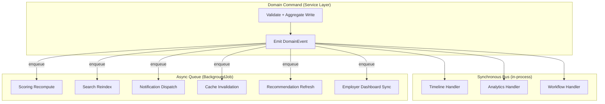
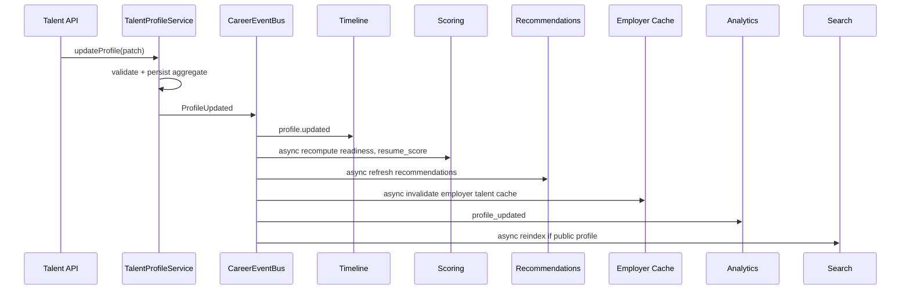
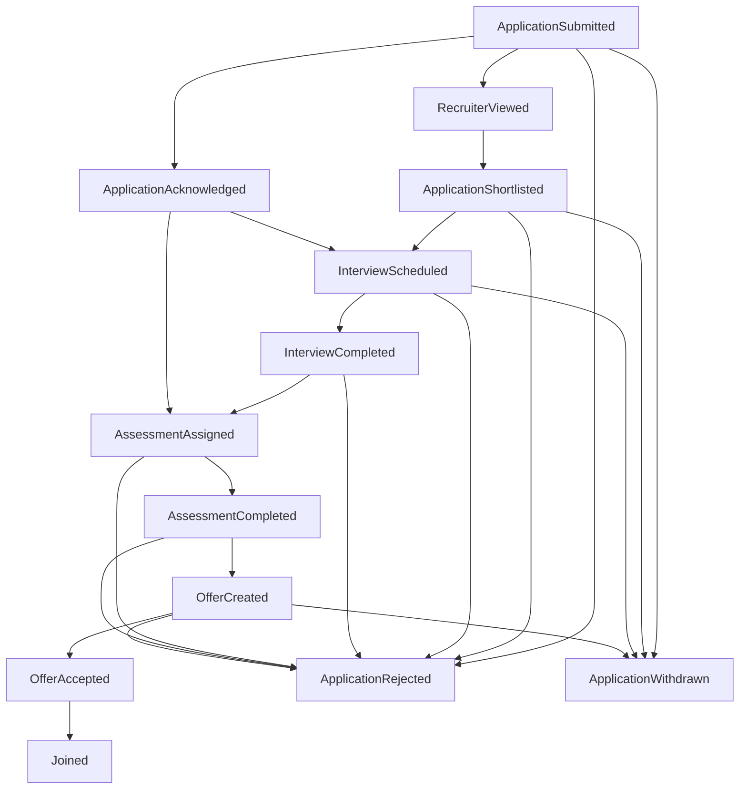
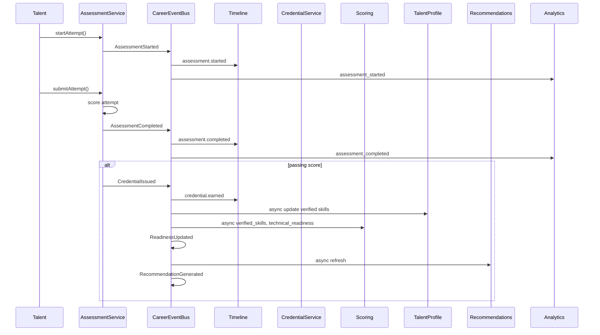
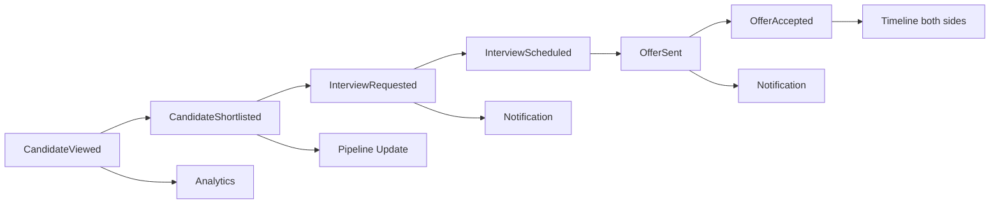
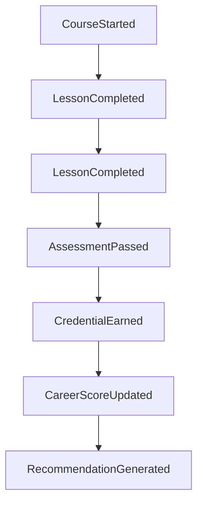
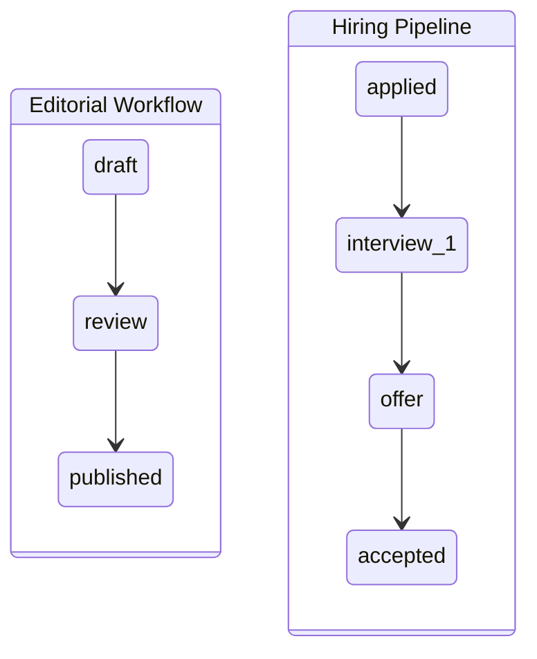

# Sprint C.8.0.1A — Career Domain Event & Workflow Architecture

**Document type:** Event & workflow contract (documentation only)  
**Status:** Canonical verb layer for Career Intelligence — complements entity contracts  
**Prerequisites:** `C8_CAREER_DOMAIN_CANONICAL_CONTRACTS.md`, C.7.0.9 production infrastructure  
**Authority:** All C.8 domain mutations MUST emit events through this pipeline; controllers MUST NOT scatter side effects  
**Constraint:** No code, schema, API, route, migration, or UI changes in this sprint

---

## Document purpose

`C8_CAREER_DOMAIN_CANONICAL_CONTRACTS.md` defines the **nouns** (entities, aggregates, APIs).  
This document defines the **verbs** (domain events, side-effect cascades, workflow reactions).

Enterprise software separates these layers:

```
Contracts (nouns)  →  Events (verbs)  →  Implementation (handlers)
```

Without this layer, developers tend to:

- Call `scheduleAnalyticsEvent` directly from controllers
- Append timeline rows in feature services
- Invalidate caches ad hoc
- Recompute scores inline during HTTP requests
- Duplicate notification logic per module

**Rule:** A career domain command (e.g. `transitionApplicationStage`) performs **one aggregate write**, emits **one domain event**, and delegates all cross-cutting effects to registered handlers via the canonical pipeline.

---

## SECTION 1 — Canonical Event Pipeline

### 1.1 Architecture overview



### 1.2 Existing platform infrastructure (MUST reuse)

| Layer | Canonical location | Career role |
|-------|-------------------|-------------|
| Integration hub | `contentIntegration.js` | Career entity saves → search/cache invalidation |
| Analytics | `scheduleAnalyticsEvent` / `AnalyticsEventService` | All funnel + engagement events |
| Search | `scheduleSearchIndexUpdate` via `searchIndexHooks.js` | Profile, credential, assessment indexing |
| Queue | `enqueueJob` / `BackgroundJob` / `worker.js` | Heavy async handlers |
| Cache | `config/cache.js` (`platformCache*`) | Dashboard, score, recommendation caches |
| Notifications | `notificationService` / `jobQueueService` | Stage alerts, reminders |
| Workflow | `WorkflowService` | Assessment/credential **publishing** only |
| Localization | `shared/localization/*` | Event payloads carry `locale` / `market` |

**No new message broker in C.8 v1.** In-process event bus + existing `BackgroundJob` queue is sufficient. Event envelope is designed for future Kafka/EventBridge without schema change.

### 1.3 Domain event envelope

Extends §13.1 of canonical contracts:

```
DomainEvent {
  eventId: UUID                    // idempotency key for handlers
  eventType: string                // PascalCase verb (e.g. ProfileUpdated)
  occurredAt: ISO8601
  aggregateType: string            // TalentProfile | OpportunityApplication | ...
  aggregateId: ObjectId
  actor: {
    type: 'talent' | 'employer' | 'system' | 'staff'
    id: ObjectId
  }
  correlationId?: UUID             // ties multi-event flows (e.g. assessment → credential)
  causationId?: UUID               // parent eventId
  payload: object                    // verb-specific; no full aggregate snapshot
  locale?: string
  market?: string
  visibility?: 'private' | 'employer_scoped' | 'public'
}
```

### 1.4 Handler registration contract (future implementation)

```
CareerEventBus.emit(event)
  → sync handlers (ordered, fail-open)
  → async handlers (enqueue BackgroundJob type: domain_event_handler)
```

| Handler priority (sync) | Handler | Failure policy |
|---------------------------|---------|----------------|
| 1 | Timeline | Log + continue (timeline is audit trail) |
| 2 | Analytics | Log + continue |
| 3 | Workflow (if applicable) | Log + continue |
| — | All async via queue | Retry with `maxAttempts: 3` |

**Controllers MUST NOT:** call timeline, analytics, search, scoring, or notification directly after a career mutation.

### 1.5 Side-effect dimensions

Every career event declares reactions across these dimensions:

| Dimension | Code | Description |
|-----------|------|-------------|
| **Timeline** | `TL` | `TimelineService.appendEvent()` |
| **Analytics** | `AN` | `scheduleAnalyticsEvent()` |
| **Notification** | `NT` | User/employer notification (optional per event) |
| **Search** | `SR` | `scheduleSearchIndexUpdate` / removal |
| **Readiness** | `RD` | `ScoringService.recompute()` for affected score types |
| **Employer dashboard** | `ER` | Invalidate employer pipeline/cache widgets |
| **Recommendation** | `RC` | Refresh recommendation cache for talent |
| **Cache** | `CA` | `platformCacheInvalidateNamespace` |
| **Workflow** | `WF` | Editorial workflow only (assessment publish) |

Legend in tables: `●` = required, `○` = optional, `—` = not applicable, `async` = queued.

---

## SECTION 2 — Profile & Identity Events

### 2.1 ProfileUpdated cascade

**Trigger:** Material change to `TalentProfile` (skills, experience, education, preferences, availability).

**Anti-pattern:** Controller saves profile → manually calls 6 services.  
**Canonical:** `TalentProfileService.update()` → emits `ProfileUpdated`.



| Dimension | Action | Sync/Async |
|-----------|--------|------------|
| TL | Verb `profile.updated`; metadata: `changedSections[]` | Sync |
| AN | `profile_updated` with `metadata.sections` | Sync |
| NT | — (no default) | — |
| SR | Reindex `talent-profile` if `visibility: public` | Async |
| RD | Recompute `career_readiness`, `resume_score` | Async |
| ER | Invalidate `employer:talent:{profileId}` cache | Async |
| RC | Invalidate `career:recommendations:{profileId}` | Async |
| CA | Invalidate `career:dashboard:{userId}` | Async |
| WF | — | — |

### 2.2 Related profile events

| Event | When | TL | AN | NT | SR | RD | ER | RC | CA |
|-------|------|----|----|----|----|----|----|----|-----|
| `ProfileCreated` | First TalentProfile from hydration or onboarding | ● | ● | ○ welcome | ○ if public | ● readiness | — | ● | ● |
| `ProfileVisibilityChanged` | Public ↔ private toggle | ● | ● | — | ● | — | — | — | ● |
| `ResumeVersionPublished` | Debounced export after profile save | ● | ● | — | — | ● resume_score | — | — | — |
| `WorkPreferenceUpdated` | Markets, salary, work mode change | ● | ● | — | — | ● match scores | — | ● | ● |
| `AvailabilityUpdated` | Start date, hours, relocation | ● | ● | — | — | ○ employer_match | — | ● | ● |
| `CareerGoalCreated` | New goal added | ● | ● | — | — | ○ readiness | — | ● | ● |
| `CareerGoalCompleted` | Goal marked done | ● | ● | ○ milestone | — | ● readiness | — | ● | ● |
| `BookmarkCreated` | Bookmark service save | ● | ● | — | — | — | — | — | — |
| `BookmarkRemoved` | Bookmark delete | — | ● | — | — | — | — | — | — |
| `DocumentAttached` | Document linked to profile | ● | ● | — | — | ○ resume_score | — | — | — |

---

## SECTION 3 — Opportunity Application Events

### 3.1 Application lifecycle (canonical verbs)

Applications are driven by **domain events**, not raw `status = interview` assignments.  
`pipelineStage` on `OpportunityApplication` changes only inside `ApplicationService.transitionStage()`, which emits `ApplicationStageChanged` (or a more specific event where noted).



### 3.2 Application event catalog

| Event | Stage mapping | TL | AN | NT | SR | RD | ER | RC | CA |
|-------|---------------|----|----|----|----|----|----|----|-----|
| `ApplicationSubmitted` | → `applied` | ● | ● `application_created` | ● talent confirm; ○ employer new applicant | — | ○ readiness | ● pipeline | — | ● both dashboards |
| `ApplicationAcknowledged` | → `acknowledged` | ● | ● | ○ talent | — | — | ● | — | ● |
| `RecruiterViewed` | metadata only | ● | ● `employer_application_view` | — | — | — | ● view count | — | — |
| `ApplicationShortlisted` | → `interview_1` or template-specific | ● | ● | ○ talent | — | — | ● column move | — | ● |
| `AssessmentAssigned` | → `assessment` | ● | ● | ● talent deadline | — | — | ● | — | ● |
| `InterviewScheduled` | → `interview_*` | ● | ● | ● both parties + reminder job | — | — | ● calendar | — | ● |
| `InterviewCompleted` | stage unchanged; metadata | ● | ● | ○ feedback request | — | ○ interview_readiness | ● | — | ● |
| `InterviewCancelled` | revert or hold | ● | ● | ● both | — | — | ● | — | ● |
| `OfferCreated` | → `offer` | ● | ● | ● talent | — | — | ● offer card | — | ● |
| `OfferUpdated` | `offer` subdoc change | ● | ● | ○ if material | — | — | ● | — | ● |
| `OfferAccepted` | → `accepted` | ● | ● | ● employer | — | — | ● | — | ● |
| `OfferDeclined` | → `rejected` or `withdrawn` | ● | ● | ○ employer | — | — | ● | — | ● |
| `ApplicationRejected` | → `rejected` | ● | ● | ○ talent | — | — | ● | — | ● |
| `ApplicationWithdrawn` | → `withdrawn` | ● | ● | ○ employer | — | — | ● | — | ● |
| `Joined` | → `joined` | ● | ● | ○ celebration | — | ● career_readiness | ● close pipeline | — | ● |
| `ApplicationStageChanged` | any template transition | ● | ● `application_stage_changed` | ○ per template | — | ○ | ● | — | ● |
| `ApplicationNoteAdded` | Comment service | ● | ● | ○ mention | — | — | ● | — | — |
| `ApplicationDocumentAttached` | Document service | ● | ● | ○ employer if shared | — | — | ● | — | — |
| `ReminderScheduled` | Reminder service | ● | ● | — | — | — | ○ | — | — |
| `ReminderSent` | Reminder fired | ● | ● | ● | — | — | — | — | — |

### 3.3 ApplicationSubmitted detail

```
ApplicationSubmitted
  payload: {
    opportunityType, opportunityId,
    applicationId, talentProfileId, organizationId,
    source: 'platform' | 'external'
  }

  → Timeline: application.created
  → Analytics: application_created
  → Notification: talent (confirmation); employer (new applicant if platform apply)
  → Employer dashboard: add to pipeline column; invalidate org application list
  → Cache: career:dashboard:{userId}, employer:pipeline:{orgId}
  → Readiness: optional trigger if first application (engagement signal)
  → Search: N/A (applications never public)
```

### 3.4 InterviewScheduled detail

```
InterviewScheduled
  payload: {
    applicationId, interviewId,
    scheduledAt, timezone, location | videoLink,
    panelMemberIds[], stage: 'interview_1' | 'interview_2'
  }

  → Timeline: interview.scheduled
  → Analytics: interview_scheduled
  → Notification: talent + employer; enqueue reminder jobs (24h, 1h)
  → Employer dashboard: update interview calendar widget
  → Workflow: N/A (hiring pipeline ≠ editorial workflow)
```

### 3.5 Stage change vs specific events

| Rule | Detail |
|------|--------|
| Prefer specific events | `OfferAccepted` not generic stage change when semantics matter |
| Generic fallback | `ApplicationStageChanged` for template-driven transitions without dedicated event |
| Both allowed | Specific event emitted first; may also emit `ApplicationStageChanged` with `causationId` link |
| History | `stageHistory[]` written in aggregate command, not in handlers |
| Idempotency | Handlers use `eventId` dedup key on `BackgroundJob.dedupKey` |

---

## SECTION 4 — Assessment Events

### 4.1 Assessment cascade



### 4.2 Assessment event catalog

| Event | TL | AN | NT | SR | RD | ER | RC | CA | WF |
|-------|----|----|----|----|----|----|----|----|-----|
| `AssessmentPublished` | — | ● | — | ● catalog | — | — | — | — | ● editorial |
| `AssessmentStarted` | ● | ● `assessment_started` | — | — | — | — | — | — | — |
| `AssessmentAttemptSubmitted` | ● | ● | — | — | — | — | — | — | — |
| `AssessmentCompleted` | ● | ● `assessment_completed` | ○ results ready | — | ● if pass | ○ if employer-assigned | ○ | ● | — |
| `AssessmentFailed` | ● | ● | ○ retry hint | — | — | — | — | ● | — |
| `AssessmentExpired` | ● | ● | ○ | — | — | — | — | — | — |
| `CredentialIssued` | ● | ● `credential_issued` | ● earn badge | ● if public | ● verified_skills | — | ● | ● | — |
| `CredentialVerified` | ● | ● | ○ | ● | ● | — | — | — | — |
| `CredentialRevoked` | ● | ● | ○ | ● remove | ● | — | ● | ● | — |
| `ReadinessUpdated` | ○ if Δ≥5 | ● `readiness_score_updated` | ○ milestone | — | — | — | — | ● | — |
| `TalentProfileUpdated` | ● (skills) | ● | — | ○ | — | — | — | — | — |
| `RecommendationGenerated` | — | ○ | — | — | — | — | — (write cache) | — | — |

### 4.3 Assessment ↔ Application bridge

When employer assigns assessment during hiring:

```
AssessmentAssigned (from Application domain)
  payload: { applicationId, assessmentId, dueAt }

  → Creates AssessmentAttempt with applicationId link
  → On AssessmentCompleted: update application metadata; may auto-transition stage
  → Employer dashboard: show score on candidate card
```

---

## SECTION 5 — Employer Action Events

Employer actions emit events from **employer actor context** (`actor.type: employer`).  
Talent-facing side effects (notifications, timeline on talent feed) are handler responsibilities.

### 5.1 Employer cascade



### 5.2 Employer event catalog

| Event | TL | AN | NT | SR | RD | ER | RC | CA |
|-------|----|----|----|----|----|----|----|-----|
| `CandidateViewed` | ● `profile.viewed` | ● `employer_profile_view` | — | — | — | ● view log | — | — |
| `CandidateShortlisted` | ● | ● | ● talent | — | — | ● pipeline | — | ● |
| `CandidateUnshortlisted` | ● | ● | — | — | — | ● | — | ● |
| `InterviewRequested` | ● | ● | ● talent | — | — | ● | — | ● |
| `InterviewScheduled` | ● | ● | ● | — | — | ● | — | ● |
| `HiringNoteAdded` | ● | ● | — | — | — | ● | — | — |
| `CandidateRated` | ● | ● | — | — | — | ● rating aggregate | — | ● |
| `OfferSent` | ● | ● `offer_created` | ● talent | — | — | ● | — | ● |
| `OfferAccepted` | ● | ● | ● employer | — | — | ● | — | ● |
| `OfferRejected` | ● | ● | ○ employer | — | — | ● | — | ● |
| `ApplicationBulkStageChanged` | ● per app | ● | ○ | — | — | ● | — | ● |
| `PipelineExported` | — | ● | — | — | — | — | — | — |

### 5.3 Employer consumption of platform artifacts

| Artifact | Consumed via | Events that refresh |
|----------|--------------|---------------------|
| Applications | Employer pipeline API | All `Application*` events |
| Assessments | Candidate card embed | `AssessmentCompleted`, `CredentialIssued` |
| Career scores | Candidate insight panel | `ReadinessUpdated`, `CareerScoreUpdated` |
| Credentials | Filter + badge display | `CredentialIssued`, `CredentialVerified` |
| Timeline | CRM activity tab | All employer + linked application events |
| Documents | Application attachments | `DocumentAttached`, `ApplicationDocumentAttached` |

**Cache namespace:** `employer:pipeline:{orgId}`, `employer:candidate:{applicationId}`, `employer:dashboard:{employerId}`.

---

## SECTION 6 — Learning & Progress Events

Learning uses the shared **Progress Service** (not a separate timeline).  
Course content may remain CMS/Page Builder; progress is career domain.

### 6.1 Learning cascade



### 6.2 Learning event catalog

| Event | TL | AN | NT | SR | RD | ER | RC | CA |
|-------|----|----|----|----|----|----|----|-----|
| `CourseStarted` | ● | ● `learning_course_started` | — | — | — | — | ○ | ● |
| `LessonCompleted` | ● | ● | — | — | ○ learning_progress | — | — | ● |
| `CourseCompleted` | ● | ● | ○ certificate avail | — | ● learning_progress | — | ● | ● |
| `LearningPathCompleted` | ● | ● | ○ | — | ● career_readiness | — | ● | ● |
| `AssessmentPassed` | ● | ● | — | — | ● | — | ○ | ● |
| `CredentialEarned` | ● | ● | ● | ○ | ● | — | ● | ● |
| `CareerScoreUpdated` | ○ if Δ≥5 | ● | ○ milestone | — | — | — | — | ● |
| `RecommendationGenerated` | — | ○ | — | — | — | — | ● write | — |

---

## SECTION 7 — Scoring Events

| Event | TL | AN | NT | SR | RD | ER | RC | CA |
|-------|----|----|----|----|----|----|----|-----|
| `CareerScoreComputed` | — | — | — | — | — | — | — | ● snapshot cache |
| `CareerScoreUpdated` | ○ `score.improved` | ● | ○ | — | — | ○ employer match | ○ | ● |
| `ScoreSnapshotCreated` | — | ○ | — | — | — | — | — | ● |
| `EmployerMatchScoreUpdated` | — | ● | — | — | — | ● | ● | ● |

**Rule:** Scoring handlers never call AI. `ScoreProvider` plugins run inside `ScoringService.recompute()` triggered by events.

---

## SECTION 8 — Timeline Verb Registry

Timeline verbs are **stable API contracts** (dot-notation). Domain events (PascalCase) map 1:1 or 1:N to timeline verbs.

| Domain event | Timeline verb | Visibility |
|--------------|---------------|------------|
| `ProfileUpdated` | `profile.updated` | private |
| `ApplicationSubmitted` | `application.created` | private |
| `ApplicationStageChanged` | `application.stage_changed` | private |
| `InterviewScheduled` | `interview.scheduled` | private |
| `OfferCreated` | `offer.received` | private |
| `OfferAccepted` | `offer.accepted` | private |
| `AssessmentCompleted` | `assessment.completed` | private |
| `CredentialIssued` | `credential.earned` | private |
| `CandidateViewed` | `profile.viewed` | employer_scoped |
| `CareerScoreUpdated` | `score.improved` | private |
| `DocumentAttached` | `document.uploaded` | private |
| `CourseCompleted` | `learning.completed` | private |

**Employer CRM** reads timeline with `visibility IN (employer_scoped, public)` + application scope filter.

---

## SECTION 9 — Analytics Event Registry Extension

Add to `shared/analytics/eventTypes.js` (implementation sprint — not this doc's scope):

| Analytics type | Domain event source |
|----------------|---------------------|
| `profile_updated` | ProfileUpdated |
| `profile_created` | ProfileCreated |
| `application_created` | ApplicationSubmitted |
| `application_stage_changed` | ApplicationStageChanged |
| `employer_application_view` | RecruiterViewed |
| `employer_profile_view` | CandidateViewed |
| `interview_scheduled` | InterviewScheduled |
| `interview_completed` | InterviewCompleted |
| `offer_created` | OfferCreated |
| `offer_accepted` | OfferAccepted |
| `assessment_started` | AssessmentStarted |
| `assessment_completed` | AssessmentCompleted |
| `credential_issued` | CredentialIssued |
| `readiness_score_updated` | ReadinessUpdated |
| `recommendation_clicked` | (client) |
| `learning_course_started` | CourseStarted |
| `learning_course_completed` | CourseCompleted |

**Metadata contract:** Include `aggregateType`, `aggregateId`, `market`, `locale`, `opportunityType` where applicable.

---

## SECTION 10 — Notification Matrix

Notifications dispatch via `enqueueJob({ type: 'notification', ... })` — never inline email.

| Event | Recipient | Template key | Channel |
|-------|-----------|--------------|---------|
| `ApplicationSubmitted` | talent | `application_submitted` | in-app + email |
| `ApplicationSubmitted` | employer | `new_applicant` | in-app |
| `InterviewScheduled` | talent, employer | `interview_scheduled` | in-app + email |
| `OfferCreated` | talent | `offer_received` | in-app + email |
| `OfferAccepted` | employer | `offer_accepted` | in-app |
| `AssessmentAssigned` | talent | `assessment_assigned` | in-app + email |
| `CredentialIssued` | talent | `credential_earned` | in-app |
| `ApplicationRejected` | talent | `application_rejected` | in-app |
| `ReminderSent` | talent | `application_reminder` | in-app + email |

**Optional (`○`):** Controlled by `NotificationPreference` on TalentProfile / EmployerProfile.

---

## SECTION 11 — Search Reindex Matrix

| Event | Entity type | Condition |
|-------|-------------|-----------|
| `ProfileUpdated` | `talent-profile` | `visibility: public` |
| `ProfileVisibilityChanged` | `talent-profile` | always |
| `CredentialIssued` | `credential` | `verificationStatus: verified` AND public catalog |
| `CredentialRevoked` | `credential` | removal |
| `AssessmentPublished` | `assessment` | workflow published |
| `ResumeVersionPublished` | — | not indexed (export only) |
| Application events | — | never indexed |

**Path:** `onCareerEntitySaved()` extension in `contentIntegration.js` (per canonical contracts §14.3).

---

## SECTION 12 — Workflow Distinction

Two workflow concepts coexist:

| Workflow type | Purpose | Service | Events |
|---------------|---------|---------|--------|
| **Editorial workflow** | Publish assessments, credentials, CMS | `WorkflowService` | `AssessmentPublished`, content publish |
| **Hiring pipeline** | Application stage machine | `ApplicationService` + stage templates | `ApplicationStageChanged`, `OfferAccepted`, etc. |

**Hiring pipeline MUST NOT use `EditorialWorkflow` model.**  
Stage templates define allowed transitions; `ApplicationService` validates and emits events.



---

## SECTION 13 — Career vs Editorial Event Routing

```
                    ┌─────────────────────┐
                    │   Domain Command    │
                    └──────────┬──────────┘
                               │
              ┌────────────────┼────────────────┐
              ▼                ▼                ▼
     CareerEventBus    contentIntegration   WorkflowService
     (verbs/side-fx)   (entity save/search)  (publish only)
```

| Mutation type | Emit | Hub call |
|---------------|------|----------|
| TalentProfile save | `ProfileUpdated` | `onCareerEntitySaved('talent-profile', id)` |
| Application stage change | `ApplicationStageChanged` | — |
| Assessment publish | `AssessmentPublished` | `onContentPublished('assessment', id)` |
| Credential issue | `CredentialIssued` | `onCareerEntitySaved('credential', id)` |

---

## SECTION 14 — Async Job Types

Extend `BackgroundJob.type` registry (implementation):

| Job type | Trigger events | Payload |
|----------|----------------|---------|
| `domain_event_handler` | all async reactions | `{ eventId, eventType, handlerName }` |
| `score_recompute` | Profile*, Assessment*, Credential* | `{ talentProfileId, scoreTypes[] }` |
| `search_index_career` | Profile*, Credential*, Assessment* | `{ entityType, entityId, locale }` |
| `recommendation_refresh` | Profile*, Score*, Credential* | `{ talentProfileId }` |
| `employer_cache_invalidate` | Application*, Employer* | `{ orgId, scope }` |
| `resume_snapshot_generate` | ProfileUpdated (debounced) | `{ talentProfileId }` |
| `application_reminder` | InterviewScheduled, custom | `{ reminderId }` |

**Dedup:** `dedupKey: ${eventType}:${eventId}:${handlerName}`

---

## SECTION 15 — Idempotency & Ordering

| Concern | Contract |
|---------|----------|
| Idempotency | Handlers check `eventId` before side effects |
| Ordering | Same-aggregate events processed in `occurredAt` order per handler |
| Debounce | `ProfileUpdated` → single `score_recompute` per profile per 60s |
| Failure | Async retry 3x; dead-letter logged to `BackgroundJob` failed status |
| Correlation | `AssessmentCompleted` → `CredentialIssued` share `correlationId` |

---

## SECTION 16 — GigRadar Event Extensions

GigRadar emits **additional** events; same pipeline, same handlers.

| Event | Extends | Notes |
|-------|---------|-------|
| `RepositorySynced` | — | TL only; no duplicate identity |
| `ContributionScored` | `CareerScoreUpdated` | `technical_readiness` provider |
| `DeveloperProfileUpdated` | `ProfileUpdated` | Extension fields only |
| `CodeReviewCompleted` | — | GigRadar analytics namespace |

**Rule:** No `GigRadarEventBus`. All events flow through `CareerEventBus`.

---

## SECTION 17 — Anti-Patterns (Forbidden)

| Anti-pattern | Correct approach |
|--------------|------------------|
| Controller calls `TimelineService.append` after save | Service emits event; timeline handler appends |
| `Application.pipelineStage = 'interview_1'` in controller | `ApplicationService.transitionStage('interview_1')` |
| Inline `ScoringService.recompute` in profile controller | `ProfileUpdated` → async job |
| New analytics types without registry entry | Add to `eventTypes.js` first |
| Per-feature `activityLog` collection | Timeline Service only |
| Employer service sends email directly | Notification handler via queue |
| Search index in assessment submit handler | `AssessmentCompleted` → async search job |

---

## SECTION 18 — Verification Contract (Future Sprints)

Each implementation sprint must verify event discipline:

| Check | Method |
|-------|--------|
| Event emitted | Unit test: command → `CareerEventBus.emit` called once |
| Handlers registered | Integration test: event triggers expected side effects |
| No controller leakage | Lint/grep: controllers do not import Timeline/Scoring directly |
| Idempotency | Replay same `eventId` → no duplicate timeline rows |
| Async completion | Queue job completes; cache invalidated |

**Script (future):** `npm run verify:career-events`

---

## SECTION 19 — Implementation Roadmap (Refined)

This section **refines** §18 of `C8_CAREER_DOMAIN_CANONICAL_CONTRACTS.md`.  
Where they differ on C.8.0.2 split, this document takes precedence.

### Phase 1 — Core Domain

#### C.8.0.2A — TalentProfile Backend Foundation

| Field | Value |
|-------|-------|
| **Objective** | TalentProfile aggregate, APIs, dual-write, event emission (`ProfileUpdated`) |
| **Dependencies** | C.8.0.1A (this document) |
| **Deliverables** | Model, repository, `TalentProfileService`, `/api/talent/*`, hydration spec, `CareerEventBus` skeleton, handler stubs, tests |
| **Events** | `ProfileCreated`, `ProfileUpdated`, `ResumeVersionPublished` |
| **Risks** | Event bus not wired → side effects scattered |
| **Verification** | CRUD tests; event emission tests; hydration count; no UI |
| **Exit criteria** | Profile API works; `ProfileUpdated` triggers registered handler chain (stubs OK) |
| **Constraints** | No UI changes; User model unchanged |

#### C.8.0.2B — TalentProfile UI Integration

| Field | Value |
|-------|-------|
| **Objective** | Profile editor, dashboard read integration, localization, search indexing |
| **Dependencies** | C.8.0.2A |
| **Deliverables** | Profile forms, resume editor as export view, dashboard widgets, search mapper, analytics |
| **Events** | Full `ProfileUpdated` cascade live |
| **Risks** | Legacy resume editor writes around profile |
| **Verification** | E2E profile edit; search index for public profiles; timeline shows updates |
| **Exit criteria** | User edits profile → timeline + readiness job + search (if public) |
| **Constraints** | Resume editor reads/writes TalentProfile only |

#### C.8.0.3 — OpportunityApplication Foundation

| Field | Value |
|-------|-------|
| **Objective** | Application aggregate, stage machine, application event catalog |
| **Dependencies** | C.8.0.2A |
| **Deliverables** | `OpportunityApplication` model, `ApplicationService`, stage templates, dual-write |
| **Events** | Full §3 catalog wired |
| **Risks** | Employer inbox regression |
| **Verification** | Stage transition emits correct events; handler matrix spot-checks |
| **Exit criteria** | Apply flow writes aggregate + emits `ApplicationSubmitted` chain |
| **Constraints** | Legacy Application API remains until C.8.1 |

---

### Phase 2 — Shared Platform Services

#### C.8.0.4 — Timeline Service

| Field | Value |
|-------|-------|
| **Objective** | `TimelineService` as first consumer of event bus |
| **Dependencies** | C.8.0.2A, C.8.0.3 |
| **Deliverables** | Verb registry (§8), append/list APIs, idempotent handler |
| **Events** | All TL column `●` reactions live |
| **Exit criteria** | Application + profile events appear in unified feed |

#### C.8.0.5 — Document & Credential Services

| Field | Value |
|-------|-------|
| **Objective** | Document + Credential services with event emission |
| **Dependencies** | C.8.0.2A, MediaAsset |
| **Deliverables** | Attach flow, `CredentialIssued` chain from assessments |
| **Events** | §4 assessment + credential cascade |
| **Exit criteria** | Assessment pass → credential → readiness → recommendation chain |

---

### Phase 3 — User Experience

#### C.8.0.6 — Career Dashboard Foundation

| Field | Value |
|-------|-------|
| **Objective** | Read-model dashboard composed from events + caches |
| **Dependencies** | C.8.0.2B, C.8.0.3, C.8.0.4 |
| **Deliverables** | `/api/career/dashboard`, cache namespaces |
| **Exit criteria** | Dashboard reflects application + profile events (<500ms p95 cached) |

#### C.8.0.7 — Migration Layer

| Field | Value |
|-------|-------|
| **Objective** | Dual-write, hydration, feature flags; events for migrated records |
| **Dependencies** | C.8.0.2A, C.8.0.3 |
| **Deliverables** | Migration jobs emit `ProfileCreated`, `ApplicationSubmitted` with `actor: system` |
| **Exit criteria** | CP1–CP3 pass; no silent migrations without events |

---

### Phase 4 — High-Value Features

| Sprint | Objective | Key events enabled |
|--------|-----------|-------------------|
| **C.8.1** | Job Application Tracker UI | Full §3 employer + talent visibility |
| **C.8.2** | Career Dashboard v2 | All dashboard cache invalidations |
| **C.8.3** | Career Readiness Engine | `CareerScoreUpdated`, `ReadinessUpdated` |
| **C.8.4** | Assessment Platform | Full §4 cascade |
| **C.8.5** | Employer Intelligence Dashboard | Full §5 employer reactions |

**Sequence rationale:** Visible user value (C.8.1 tracker) ships after domain + timeline + documents exist, but before full readiness engine — matching "stable foundations first, UX second, intelligence third."

---

## SECTION 20 — Document Hierarchy

```
C8_CAREER_DOMAIN_CANONICAL_CONTRACTS.md     ← nouns (entities, APIs, aggregates)
C8_CAREER_DOMAIN_EVENT_WORKFLOW_ARCHITECTURE.md  ← verbs (events, handlers, cascades)  [THIS DOC]
C8_CAREER_INTELLIGENCE_ARCHITECTURE_AUDIT.md      ← audit & gap analysis
PRODUCT_ARCHITECTURE_AUDIT_GLOBAL_CAREER_PLATFORM.md ← product strategy
```

**Implementation rule:**

1. Entity design → canonical contracts
2. Mutation design → this document (event + handler matrix)
3. Code → service emits event; handlers only in registered modules

Amendments to event catalogs require PR updating **both** this document and the event type registries in `shared/`.

---

## Appendix A — Master Event Index

| # | Event | Domain |
|---|-------|--------|
| 1 | ProfileCreated | Talent |
| 2 | ProfileUpdated | Talent |
| 3 | ProfileVisibilityChanged | Talent |
| 4 | ResumeVersionPublished | Talent |
| 5 | WorkPreferenceUpdated | Talent |
| 6 | AvailabilityUpdated | Talent |
| 7 | CareerGoalCreated | Talent |
| 8 | CareerGoalCompleted | Talent |
| 9 | ApplicationSubmitted | Application |
| 10 | ApplicationAcknowledged | Application |
| 11 | RecruiterViewed | Application |
| 12 | ApplicationShortlisted | Application |
| 13 | AssessmentAssigned | Application |
| 14 | InterviewScheduled | Application |
| 15 | InterviewCompleted | Application |
| 16 | InterviewCancelled | Application |
| 17 | OfferCreated | Application |
| 18 | OfferUpdated | Application |
| 19 | OfferAccepted | Application |
| 20 | OfferDeclined | Application |
| 21 | ApplicationRejected | Application |
| 22 | ApplicationWithdrawn | Application |
| 23 | Joined | Application |
| 24 | ApplicationStageChanged | Application |
| 25 | AssessmentStarted | Assessment |
| 26 | AssessmentCompleted | Assessment |
| 27 | AssessmentFailed | Assessment |
| 28 | CredentialIssued | Credential |
| 29 | CredentialVerified | Credential |
| 30 | ReadinessUpdated | Scoring |
| 31 | CareerScoreUpdated | Scoring |
| 32 | RecommendationGenerated | Recommendation |
| 33 | CandidateViewed | Employer |
| 34 | CandidateShortlisted | Employer |
| 35 | InterviewRequested | Employer |
| 36 | OfferSent | Employer |
| 37 | CourseStarted | Learning |
| 38 | LessonCompleted | Learning |
| 39 | CourseCompleted | Learning |
| 40 | CredentialEarned | Learning |
| 41 | DocumentAttached | Document |
| 42 | BookmarkCreated | Bookmark |
| 43 | TimelineEventCreated | Timeline (meta) |

---

*End of Sprint C.8.0.1A — Career Domain Event & Workflow Architecture*
