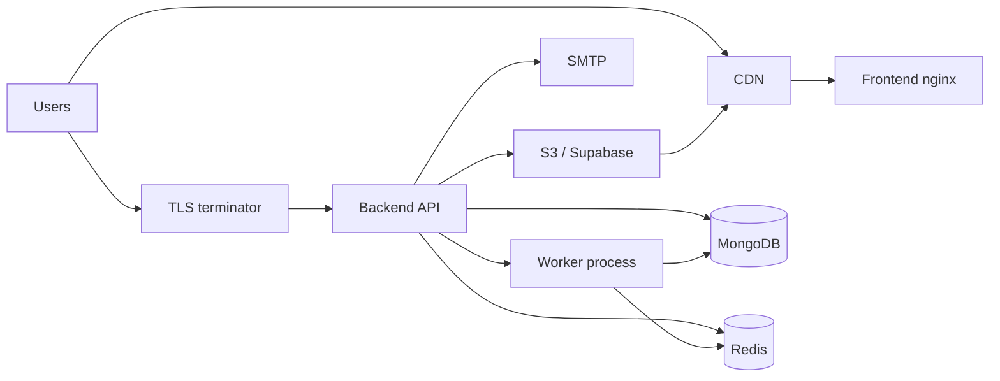
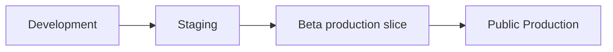
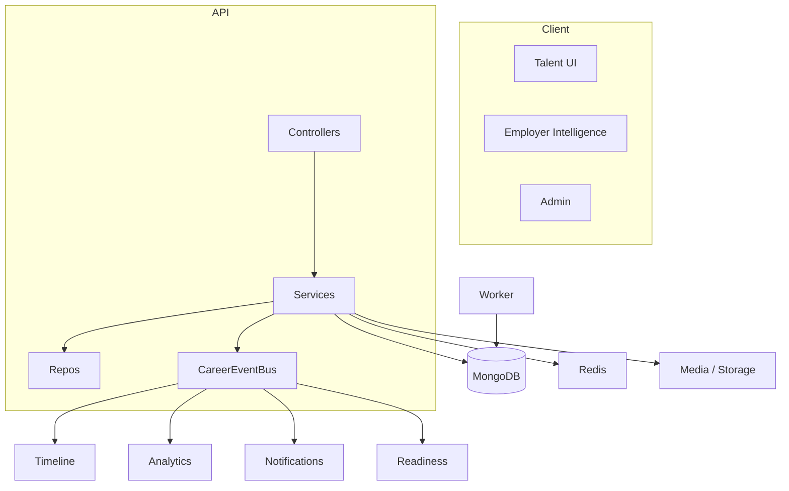
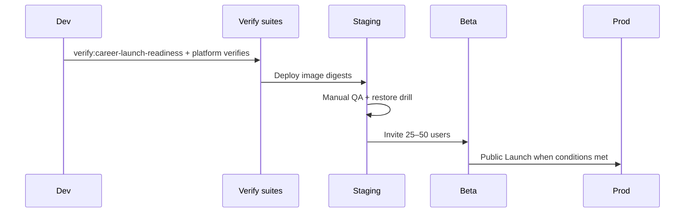

# L.1 — Production Readiness & Launch Audit

**Status:** Complete (documentation only)  
**Date:** 2026-07-14  
**Type:** Production readiness, Beta planning, Public Launch planning  
**Scope:** Documentation and operational planning — **no code, APIs, schemas, migrations, or features changed**

**Related gates:**

- Career product gate: `npm run verify:career-launch-readiness` (165/165 PASS — C.8.5A)
- Platform verify suite: production / security / deployment / backups / monitoring / performance scripts (static wiring checks)

This document is the authoritative guide to move from **feature-complete MVP** → **Staging** → **Beta (25–50 users)** → **Public Launch**.

---

## 1. Executive Platform Status

### 1.1 Completed systems (MVP)

| Track | Status |
|-------|--------|
| C.6 Platform Foundation | Complete |
| C.7 Core Platform (CMS, search, analytics, media, localization, ops) | Complete |
| C.8 Career Intelligence (TalentProfile → Employer Intelligence) | Complete |
| C.8.5A Career Launch Readiness Audit | PASS (165/165) |
| MVP feature development | **Frozen** |

Career Intelligence stack considered complete for MVP:

TalentProfile · OpportunityApplication · Timeline · Documents · Credentials · Migration · Application Tracker · Readiness · Career Dashboard V2 · Assessments · Employer Intelligence

### 1.2 Reusable platform services (do not re-implement)

Authentication · RBAC · TalentProfile · Credentials · Readiness · Timeline · Assessments · Billing/Stripe hooks · Search · Analytics · Notifications · Localization · Feature Flags · Media Library · CareerEventBus · Dashboard Composition · Background Jobs

These are the shared foundation for EduRozgaar **and** the future GigRadar product (C.9). Freelancer Business OS is a **separate roadmap** and is out of L.1 scope.

### 1.3 Production dependencies

| Dependency | Role | Notes |
|------------|------|-------|
| MongoDB 7 | Primary datastore | Compose-managed volume |
| Redis 7 | Cache, JWT revoke, queue locks | Required for multi-instance |
| Node API (`backend`) | HTTP API | `docker/Dockerfile.server` |
| Worker | Background jobs + reminders | `node src/worker.js`, `WORKER_ONLY=1` |
| Frontend (nginx) | Static client | `docker/Dockerfile.client` |
| SMTP | Transactional email | Env-configured |
| Stripe (optional at Beta) | Job plan payments | Secrets + webhook |
| Object storage (S3 / Supabase) | Media durability | **Validate** before Public Launch if containers are ephemeral |
| CDN (optional) | `AWS_S3_CDN_URL` / Supabase CDN | Recommended at scale |

See: `docker-compose.yml`, `.env.template`, `docs/PRODUCTION_DEPLOYMENT.md`, `docs/ENVIRONMENT_VARIABLES.md`.

---

## 2. Infrastructure Readiness

| Area | Classification | Evidence / action |
|------|----------------|-------------------|
| Docker Compose (mongo, redis, backend, worker, frontend) | **Ready** | `docker-compose.yml`, `docker/Dockerfile.*` |
| Redis | **Needs Validation** | Optional single-node (in-memory fallback); **required** multi-instance for revoke/locks — confirm prod `REDIS_URL` + health |
| Queue workers | **Ready** | Mongo `BackgroundJob` + `server/src/worker.js`; API cron disabled in compose for queue/reminders by default |
| Storage provider | **Needs Validation** | Default `MEDIA_STORAGE_PROVIDER=local`; set S3/Supabase for durable prod |
| CDN | **Needs Validation** | Wire CDN URL when using remote storage |
| SSL / TLS | **Needs Work** | Terminate TLS at reverse proxy / load balancer (not defined inside app compose) |
| DNS | **Needs Work** | Point `SITE_URL` / `FRONTEND_URL` to staging then production hosts |
| Email (SMTP) | **Needs Validation** | Configure `MAIL_*`; send test transactional mail |
| Environment variables | **Ready** (template) | `.env.template`, `docker/.env.production.example`, `validateEnv.js` (prod fatal: JWT ≥32, SITE_URL, MONGO_URI) |
| Secret management | **Needs Work** | Move secrets to host secrets manager / sealed env; never commit real `.env` |

### Infrastructure diagram (target production)

---

## 3. Security Audit

| Control | Status | Notes |
|---------|--------|-------|
| Authentication (JWT access + refresh) | Ready | `requireAuth`; employer vs talent tokens |
| Token revoke | Needs Validation | Redis-backed revoke store; fails closed on Redis errors for multi-instance |
| Authorization / RBAC | Ready | `requireRole`, `requirePermission`, admin route permissions |
| Rate limiting | Ready | `apiLimiter`, auth/upload/admin limiters |
| Input validation | Ready | Shared validators + career validation modules |
| File upload security | Ready | Upload rate limits; media pipeline; MIME/size controls in upload paths |
| XSS | Ready | Helmet CSP; HTML sanitize utilities; React escaping |
| CSRF | Ready* | Bearer-token API — classic CSRF N/A; document cookie-session change would need CSRF |
| NoSQL injection | Ready | `express-mongo-sanitize` |
| Session handling | Ready | Stateless JWT; refresh rotation/revoke support |
| Secrets | Needs Work | Enforce strong `JWT_SECRET`; rotate Stripe/mail keys; secrets manager |
| API protection | Ready | Helmet, CORS config, rate limits, auth gates |
| Feature flags | Ready | Kill switches exist; **default ON** unless `=0` — document rollout carefully |
| Admin permissions | Ready | Staff/admin RBAC; assessment authoring Admin-only (C.8.5A) |
| Sensitive logging | Needs Validation | Structured logger; confirm no tokens/PII in production `LOG_LEVEL` |

### Remaining production risks

| Risk | Severity | Mitigation |
|------|----------|------------|
| Weak/short JWT in misconfigured env | P0 | `validateEnv` fatal in production |
| Local media on disposable containers | P1 | S3/Supabase before Public Launch |
| Redis down with multiple API replicas | P1 | Require Redis + health alerts |
| Feature flags all ON by default | P1 | Explicit staging matrix; disable experimental flags |
| SMTP / Stripe secrets missing at launch | P1 | Validate before Beta payments/email |
| Honesty gap: “AI” UX without LLM | P2 | Product copy; cost policy §14 |

---

## 4. Performance Audit

| Area | Status | Notes |
|------|--------|-------|
| Database indexes | Ready | Career models indexed (timeline, applications, documents, credentials, talent) |
| Pagination | Ready | Application lists, timeline cursor pagination |
| Caching | Ready | Platform cache + Redis; dashboard TTL composition caches |
| Queue usage | Ready | Analytics, reminders, migrations, notifications side effects |
| Dashboard composition | Ready | Single composition fetch; shared context providers |
| Employer candidate list | Needs Validation | Concurrent card composition (limit 200); watch under load |
| Media optimization | Needs Validation | Prefer CDN + image sizes; avoid serving large binaries from API disk |
| Lazy loading (client) | Ready | Route-level `lazy` / Suspense |
| Search | Ready | Indexer + cache; talent-profile/credential types included |
| Analytics | Ready | Scheduled/async events |
| Background jobs | Ready | Worker poll; dead-letter visibility via metrics |

### Likely production bottlenecks

1. **Employer Intelligence** candidate card composition under large applicant volumes  
2. **Search reindex** full rebuilds during peak  
3. **Mongo connection pool** if under-tuned (`MONGO_MAX_POOL_SIZE`)  
4. **Local media I/O** if remote storage not configured  
5. **Dashboard cache stampedes** after mass invalidation  

Recommend: staging load smoke (dashboard compose, employer list 100–200 apps, search q=) before Public Launch.

---

## 5. SEO & Discoverability

| Item | Status | Evidence |
|------|--------|----------|
| Metadata / SeoHead | Ready | Client SEO helpers |
| Canonical URLs | Needs Validation | Confirm `SITE_URL` matches public host |
| Structured data | Ready | `client/src/seo/schemas.js` |
| OpenGraph / Twitter | Ready | `client/src/seo/config.js` |
| Sitemaps | Ready | `GET /sitemap.xml` |
| Robots | Ready | `GET /robots.txt` (private routes disallowed) |
| Breadcrumbs | Ready | `breadcrumbSchema` |
| Internal linking | Needs Validation | Content/ops QA on landing pages |
| JobPosting schema | Ready | Job/Internship detail |
| EducationalOrganization | Ready | Institution schemas |
| Scholarship schema | Ready | Scholarship detail |

**Action:** Staging crawl of `/sitemap.xml`, robots, and sample Job/Scholarship/University pages for rich-result eligibility.

---

## 6. Accessibility

| Area | Status | Notes |
|------|--------|-------|
| WCAG alignment | Needs Validation | Components aim for accessible patterns; full WCAG 2.2 AA audit not automated as release gate |
| Keyboard navigation | Needs Validation | Manual QA: employer nav, forms, dashboard widgets |
| Screen readers | Needs Validation | Sample VoiceOver/NVDA on auth, apply, dashboard |
| ARIA | Needs Validation | Dialogs/menus present; spot-check new Intelligence pages |
| Contrast | Needs Validation | Light/dark themes — contrast sample |
| Forms | Ready / Needs Validation | Labels present in major flows; complete pass pending Beta QA |
| Localization | Ready | en/ur (+ ar stubs); RTL considerations for ur |
| Responsive design | Ready | Layouts include mobile breakpoints |

**Beta checklist:** keyboard-only signup → profile → apply → dashboard; employer intelligence path.

---

## 7. Monitoring & Operations

### Recommended monitoring stack

| Signal | Source | Target |
|--------|--------|--------|
| Liveness | `GET /api/health/live` | Load balancer |
| Readiness | `GET /api/health/ready` | Deploy gates |
| Extended health | `GET /api/health`, admin platform health | Ops |
| Metrics | `GET /api/metrics` (+ Prometheus format) | Prometheus/Grafana or host metrics |
| Logs | Structured JSON logger | Central log drain |
| Crash reporting | `SENTRY_DSN` | Sentry (optional, enable before Public) |
| Queue failures | metrics `dead24h` | Alert if > threshold |
| Redis | health + ping latency | Alert if down in multi-instance |
| Search | index stats + error rate | Ops dashboard |
| Media | upload failure rate / storage errors | Ops |
| Analytics pipeline | scheduled event backlog | Ops |
| Audit logging | Admin audit trail | Retain for incidents |

See: `docs/MONITORING_GUIDE.md`, `npm run verify:monitoring`.

### Operational alerts (minimum)

| Condition | Severity | Response |
|-----------|----------|----------|
| Ready probe 503 | P0 | Page on-call; check Mongo/Redis |
| API 5xx rate spike | P0 | Rollback or scale; Sentry triage |
| Queue dead letter growth | P1 | Inspect worker logs / failed jobs |
| Redis unavailable (prod HA) | P1 | Restore Redis; avoid multi-replica without it |
| Disk full (local media) | P1 | Expand volume or migrate storage |

---

## 8. Backup & Disaster Recovery

Reference: `docs/BACKUP_GUIDE.md`, `npm run verify:backups`.

| Item | Recommendation |
|------|----------------|
| Database backups | Daily `mongodump`; 30-day retention |
| Media backups | Weekly + provider versioning (S3/Supabase) |
| Config / `.env` | Encrypted secrets store on change; 1-year retention |
| Restore procedures | `scripts/backup/mongo-restore.sh`; monthly restore-to-staging drill |
| Rollback procedures | Previous Docker image tags + `docker compose` rollback |
| RPO | Target ≤ 24h (daily backups); tighten to ≤ 1h if paid backups available |
| RTO | Target ≤ 4h for API+DB restore on staging-practiced playbook |
| Deployment rollback | Re-deploy previous image digest; keep prior compose `.env` |
| Feature flag rollback | Set `*_ENABLED=0` for subsystem; no redeploy required for kill switches |

**Recovery drill (pre-Public):** restore latest Mongo backup to staging → `npm run verify:integration` → spot-check login + listing pages.

---

## 9. Testing & QA

| Layer | Status | Notes |
|-------|--------|-------|
| Unit tests | Needs Validation | Not the primary gate; prefer verify suites + targeted tests |
| Integration tests | Needs Validation | `verify:integration` exists; run against staging |
| Verification suites | Ready | Career launch readiness + platform verify-* scripts |
| Manual QA | Needs Work | Required for Beta (journeys below) |
| Cross-browser | Needs Work | Chrome, Safari, Firefox, Edge smoke |
| Mobile testing | Needs Work | iOS/Android browsers on critical paths |
| Regression | Needs Work | Checklist from C.8 journeys after each deploy |
| Load testing | Needs Work | Soft load before Public (dashboard, search, employer list) |
| Accessibility testing | Needs Work | Keyboard + one screen reader pass |
| Security testing | Needs Validation | OWASP smoke; authZ negative tests (talent ≠ employer) |

### Manual QA journeys (Beta)

1. Talent: register → verify email (if enabled) → TalentProfile → resume/docs → apply to job → tracker → dashboard  
2. Assessments: catalog → attempt → submit → credential/readiness update  
3. Employer: register → post job → view Intelligence candidates → stage/note/interview  
4. Admin: login → smoke CMS/search/reindex (staff only)  
5. Localization: switch en ↔ ur on home, job detail, employer nav  

---

## 10. Deployment Strategy

### Environments

| Env | Purpose | Data | Flags |
|-----|---------|------|-------|
| Development | Local Docker / compose.dev | Synthetic | All career ON OK |
| Staging | Pre-prod parity | Anonymized or seed | Match intended Beta matrix |
| Beta | Limited real users | Real (small) | Conservative flags; dual-write OFF unless validating migration |
| Production | Public | Real | Kill switches ready; paid AI OFF |

### Migration order (safe)

1. Deploy API + worker + frontend images to staging  
2. Confirm Mongo indexes / app boot / health ready  
3. Run migration **dry-run** if using career migration jobs (`CAREER_MIGRATION_JOBS`)  
4. Enable dual-write only if validating (`APPLICATION_DUAL_WRITE=1` etc.) — default **OFF**  
5. Canonical read flags only after reconcile (`*_READ_CANONICAL=1`)  
6. Promote same artifact digests to Beta, then Public  

### Feature flag rollout (recommended Beta defaults)

| Flag family | Beta recommendation |
|-------------|---------------------|
| Core career (`TALENT_PROFILE`, `OPPORTUNITY_APPLICATION`, `TIMELINE`, `DOCUMENTS`, `CAREER_DASHBOARD`, `SCORING`, `ASSESSMENTS`, `EMPLOYER_INTELLIGENCE`) | ON |
| Dual-write / read-canonical migration | OFF unless actively migrating |
| `DASHBOARD_PERSONALIZATION_ENABLED` | OFF until DnD UX complete |
| Paid AI (future) | OFF — see §14 |

Remember: unset `*_ENABLED` defaults to **ON** (`!== '0'`). Explicitly set `=0` to disable.

### Release checklist (short)

- [ ] Secrets present (`JWT_SECRET`, `MONGO_URI`, `SITE_URL`, Redis, Mail)  
- [ ] Images tagged & digest recorded  
- [ ] Migrations dry-run reviewed  
- [ ] Health ready green  
- [ ] Smoke journeys passed  
- [ ] Sentry/log drain confirmed (Public)  
- [ ] Rollback image identified  

### Rollback strategy

1. Redeploy previous image digests  
2. Or set subsystem feature flags to `0`  
3. If DB migration applied: restore backup only if forward fix impossible (practice on staging first)

---

## 11. Beta Launch Plan

### Cohort

- **25–50 users** mix: 15–30 talent seekers, 5–10 employers, 2–3 staff  
- Invite-only; no paid marketing push  

### Feedback collection

- In-app feedback / email alias `beta@…`  
- Weekly 15-min interview with 3–5 users  
- Employer-specific: candidate list clarity, pipeline, ranking explanations  

### Bug reporting

- Severity labels P0–P3  
- Template: steps, role (talent/employer), locale, browser, screenshot  
- Track in issue board; P0 fix-before-continue  

### Success metrics (Beta)

| Metric | Target |
|--------|--------|
| Signup → profile completion | ≥ 40% of invitees |
| Application created / tracked | ≥ 25% of talents |
| Employer posts ≥1 job | ≥ 50% of employer invites |
| Critical bugs open > 48h | 0 P0 |
| Crash-free sessions | ≥ 99% |
| Support response SLO | < 1 business day |

### Acceptance criteria to exit Beta → Public

- [ ] No open P0  
- [ ] P1 list triage with owners / dates  
- [ ] Staging restore drill completed once  
- [ ] Redis + durable media validated  
- [ ] SMTP delivering  
- [ ] SEO smoke + health monitors live  
- [ ] Product copy does not claim paid-LLM AI where deterministic  

---

## 12. Public Launch Plan

### Launch checklist

- [ ] DNS + TLS live on production host  
- [ ] Compose/k8s services healthy (API, worker, mongo, redis, FE)  
- [ ] Secrets in manager; `.env` not in git  
- [ ] Backups scheduled + restore drill logged  
- [ ] Sentry (or equivalent) + alerts  
- [ ] Stripe webhook (if monetization live)  
- [ ] Feature flag matrix documented  
- [ ] Support inbox staffed  
- [ ] Status communication channel ready  

### Operational responsibilities

| Role | Responsibility |
|------|----------------|
| On-call eng | Health, incidents, rollbacks |
| Product | Flag decisions, Beta → Public go |
| Support | Ticket triage, escalation |
| Content/SEO | Sitemap/content freshness |

### Incident response (outline)

1. Detect (alert / user report)  
2. Assess blast radius (auth, apply, pay)  
3. Mitigate (flag OFF / rollback / scale)  
4. Communicate (status note)  
5. Postmortem within 5 business days  

### Support process

- Tickets via existing support/help flows  
- P0: acknowledge < 1h during business hours  
- Known issues page / changelog for Beta cohort  

### Communication plan

- Pre-launch: Beta invite email  
- Launch day: site banner / blog / social (optional)  
- Post-launch: weekly stability note for first 4 weeks  

### First 90 days

| Window | Focus |
|--------|-------|
| Days 0–14 | Stability, P0/P1 burn-down, monitor employer + apply paths |
| Days 15–45 | SEO/content ops, performance tweaks, support playbooks |
| Days 46–90 | Decide C.9 GigRadar kickoff readiness; no unpaid AI spend creep |

---

## 13. Technical Debt (production-relevant only)

### P0 — must fix before Public (ops, not code in L.1)

| Item | Notes |
|------|-------|
| Production secrets + TLS + DNS | Hosting setup |
| Durable media if containers ephemeral | S3/Supabase |
| Redis required for any multi-replica API | Avoid revoke/lock inconsistency |

### P1 — should fix / validate before or during early Beta

| Item | Notes |
|------|-------|
| SMTP deliverability | Sign-up / notifications |
| Staging environment parity | Same compose topology |
| Employer list load under 100+ applicants | Monitor; batch later |
| Explicit feature-flag matrix in staging/prod | Defaults are ON |
| Manual a11y + mobile QA | Journeys §9 |
| Sentry enabled for Public | Crash visibility |

### P2 — scheduled after Beta / early Public

| Item | Notes |
|------|-------|
| Unify analytics to bus subscribers | Architecture debt from C.8 audits |
| Recommendation service extraction | Dashboard still queries listing models |
| Timeline warm archival | Growth control |
| CSRF only if cookie-session APIs added | N/A today |
| Full WCAG automated CI | Expand verify coverage |

### P3 — nice-to-have ops hygiene

| Item | Notes |
|------|-------|
| Prometheus/Grafana dashboards polish | Metrics endpoint exists |
| CDN always-on front door | Scale |
| Monthly DR game day automation | Process |

**Excluded from this list:** GigRadar, global expansion, Freelancer OS, LLM product features (see §14).

---

## 14. AI & Cost Readiness

**Platform policy (mandatory):**

- AI remains **optional**  
- Paid AI remains **disabled by default**  
- Every AI-labeled surface must have a **deterministic non-AI fallback**  
- Paid AI must **never** be a dependency for core platform functionality (auth, apply, profiles, employer pipeline, readiness scoring, assessments)

### Inventory

| Capability | Already implemented | Behind flag | Requires paid API | Deterministic fallback | Est. monthly cost | Recommended launch state |
|------------|---------------------|-------------|-------------------|------------------------|-------------------|--------------------------|
| Resume analyzer | Yes (heuristic / placeholder skills) | No dedicated AI flag | **No** today | Keyword/heuristic scoring | **$0** | **ON** — label honestly as analysis, not LLM |
| Cover letter helper | Yes (template/rules paths) | Product-dependent | **No** unless wired later | Templates | **$0** | ON with clear copy |
| Admin “AI” job description | Template generator | Admin-only | **No** today | Templates | **$0** | ON for staff; copy = assistive |
| Chatbot | Keyword placeholder | Route exists | **No** today | FAQ / links | **$0** | Soft-launch or hide if misleading |
| Readiness Engine | Deterministic weighted scoring | `SCORING_ENABLED` | **No** | Rule-based providers | **$0** | ON |
| Employer ranking | Deterministic weighted | `EMPLOYER_INTELLIGENCE_*` | **No** | Explicit factors | **$0** | ON |
| Assessment scoring | Deterministic | `ASSESSMENTS_*` | **No** | Snapshot grading | **$0** | ON |
| LLM resume scoring / matching | **Not implemented** | N/A | Would require paid API | Must keep heuristics | Avoid | **OFF / do not ship** until budget |
| GigRadar AI code review (C.9) | Out of scope | Future | Likely paid | Rule-based review later | Avoid at EduRozgaar launch | Deferred |

**Finding:** Codebase has **no** OpenAI/Anthropic/Gemini env vars or SDK integrations in `.env.template`. “AI” UX is largely deterministic/template — **good for cost**, **needs honest product language**.

### Launch configuration (minimal operating budget)

| Setting | Value |
|---------|-------|
| Paid LLM providers | **Not configured** |
| Core career flags | ON |
| Dual-write migration | OFF |
| Dashboard personalization | OFF until UX ready |
| Chatbot public promotion | Optional OFF if claims exceed capability |
| Stripe | Enable only if monetizing jobs at Beta |
| Object storage | Free-tier / low-cost S3-compatible preferred over egress-heavy Cloudinary |

**Estimated incremental AI OpEx at MVP launch: $0** (no paid model calls). Keep it that way unless a funded experiment opts in with a hard spend cap.

---

## 15. Executive Verdict

# GO WITH CONDITIONS

### Justification

**GO** on product maturity:

- C.6–C.8 MVP feature set complete and frozen  
- Career launch readiness verification **165/165 PASS**  
- Architecture composed; EventBus / flags / permissions audited  
- Core security middleware and Docker topology exist  
- SEO foundations and structured data exist  
- Deterministic career intelligence does not require paid AI  

**CONDITIONS** before Public Launch (Beta may start once “Beta-minimum” is met):

| # | Condition | Gate |
|---|-----------|------|
| 1 | Staging environment live with Docker topology + real secrets pattern | Before Beta |
| 2 | Redis confirmed for any multi-instance / multi-worker deploy | Before Beta if HA |
| 3 | Durable media provider **or** durable volume strategy | Before Public |
| 4 | SMTP validated (mail flow) | Before Beta |
| 5 | Manual QA journeys + no open P0 | Before Public |
| 6 | TLS + DNS on production host | Before Public |
| 7 | Backup schedule + one restore drill | Before Public |
| 8 | Monitoring/alerts (ready probe + 5xx) | Before Public |
| 9 | Feature flag matrix written down (explicit ON/OFF) | Before Beta |
| 10 | Product copy does not claim paid-LLM AI | Before Beta |

**NO-GO** would apply only if conditions 1–2–5 cannot be met or a P0 security/secrets failure is known. Those are operational gaps, not missing MVP features.

---

## Appendices

### A. Architecture (current MVP)

### B. Deployment flow

### C. Production checklist

- [ ] Secrets manager populated  
- [ ] `JWT_SECRET` ≥ 32 chars  
- [ ] `MONGO_URI`, `REDIS_URL`, `SITE_URL`, `FRONTEND_URL`  
- [ ] Media provider configured for durability  
- [ ] SMTP verified  
- [ ] TLS certificates valid  
- [ ] Worker running  
- [ ] Health ready green  
- [ ] Backups scheduled  
- [ ] Alerts wired  
- [ ] Feature flag matrix archived  
- [ ] Rollback image noted  

### D. Beta checklist

- [ ] Staging signed off  
- [ ] 25–50 invites prepared  
- [ ] Feedback channel live  
- [ ] Manual journeys passed  
- [ ] No P0 bugs  
- [ ] Employer + talent cohorts balanced  
- [ ] AI copy reviewed for honesty  
- [ ] Support rota assigned  

### E. Launch checklist

- [ ] All Production checklist items  
- [ ] Beta exit criteria met  
- [ ] Comms ready  
- [ ] Incident runbook reviewed  
- [ ] First-week on-call named  

### F. Rollback checklist

- [ ] Previous image digests available  
- [ ] Feature flag kills tested on staging  
- [ ] DB restore procedure practiced  
- [ ] Comms template for outage  

### G. Risk matrix

| Risk | Likelihood | Impact | Mitigation |
|------|------------|--------|------------|
| Data loss (no backup) | L | Critical | Daily mongodump + drill |
| Media loss (local disk) | M | High | S3/Supabase |
| Auth issues multi-instance without Redis | M | High | Require Redis |
| Misleading AI claims | M | Med | Copy + policy §14 |
| Employer list latency | M | Med | Monitor; concurrency already applied |
| Flag default ON surprise | M | Med | Explicit matrix |
| Email deliverability | M | Med | SPF/DKIM + SMTP test |

### H. Operational readiness summary

| Domain | Ready for Beta? | Ready for Public? |
|--------|-----------------|-------------------|
| Product / Career MVP | Yes | Yes (feature) |
| Verification / architecture | Yes | Yes |
| Infrastructure / secrets / TLS | Conditional | Conditional |
| Media durability | Conditional | Required |
| Monitoring / backups | Conditional | Required |
| Manual / a11y / load QA | Conditional | Required |
| AI OpEx | Yes ($0) | Yes ($0) if policy held |

---

## Implementation Checklist (status after L.1)

### EduRozgaar MVP

- [x] C.6 Platform Foundation complete  
- [x] C.7 Core Platform complete  
- [x] C.8 Career Intelligence complete  
- [x] Employer Intelligence complete  
- [x] Assessment Platform complete  
- [x] Career Dashboard V2 complete  
- [x] Career Launch Readiness Audit passed (165/165)  
- [x] MVP feature development complete  

### Launch Preparation

- [x] Feature development frozen  
- [x] Separate Freelancer Business OS roadmap established (not part of EduRozgaar)  
- [x] AI cost policy defined (paid AI deferred unless within budget)  
- [x] **L.1 Production Readiness & Launch Audit**  
- [ ] Fix production-critical issues (ops conditions in §15)  
- [ ] Staging deployment  
- [ ] Beta launch (25–50 users)  
- [ ] Public production launch  

---

*End of L.1 — no further product implementation is required until staging conditions are addressed.*
