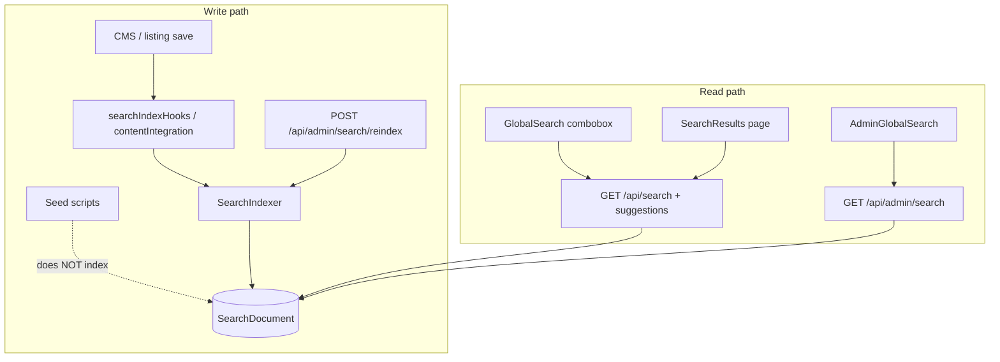
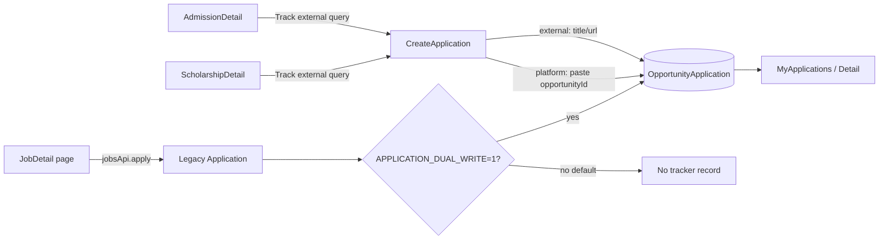
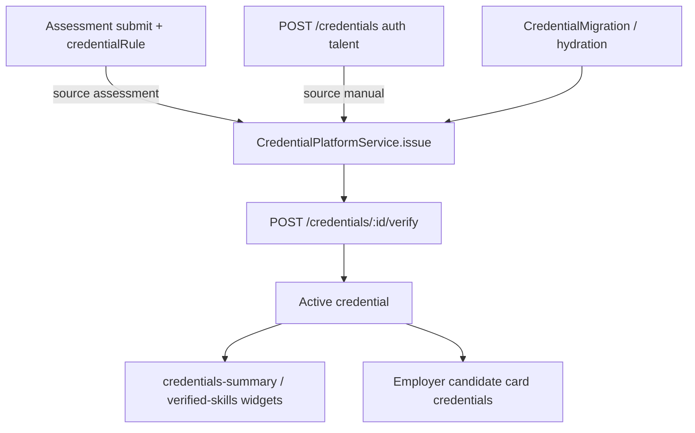
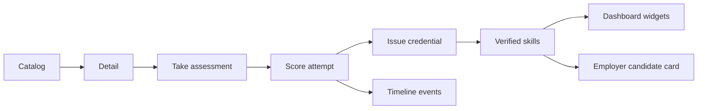
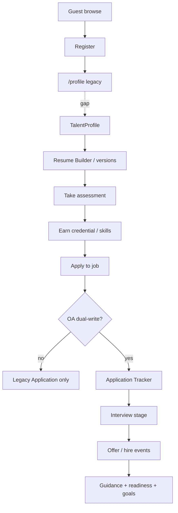

# L.2.5 — Career Experience & Feature Completeness Audit

**Status:** Complete (documentation only)  
**Date:** 2026-07-14  
**Type:** End-to-end Career Platform UX & feature completeness audit  
**Scope:** Documentation and classification only — **no code, APIs, schemas, migrations, architecture redesign, or features changed**

**Related gates:**

| Gate | Result |
|------|--------|
| C.6 / C.7 / C.8 feature tracks | Complete |
| C.8.5A Career Launch Audit | PASS (165/165) |
| L.1 Production Readiness | Complete — GO WITH CONDITIONS |
| L.2 Staging Operations | Complete |

This document is the **authoritative experience audit before Beta implementation fixes**.  
Technical launch readiness (verify scripts) ≠ polished user experience. L.2.5 measures the latter.

---

## 1. Executive Summary

### 1.1 Verdict

**Beta experience: CONDITIONAL GO** — core Career OS surfaces exist and compose correctly under feature flags, but several **visible** user journeys fail or feel incomplete without ops/content steps and a small set of UX bridges.

| Dimension | Score (0–100) | Notes |
|-----------|---------------|-------|
| Platform completeness (code + APIs) | **88** | Aligns with C.8.5A / L.1 |
| End-to-end UX completeness | **62** | Gaps in search ops, job→tracker, resume preview, learning, guidance depth |
| Content / seed readiness for Beta | **55** | Listings & articles strong; Assessments & QuestionBanks empty |
| Integration continuity (journeys) | **58** | Register→TalentProfile and Job apply→OA split |
| **Overall Career Experience Beta readiness** | **66** | Fix P0s below before inviting 25–50 Beta users |

### 1.2 Top findings (must know)

1. **Global Search returns empty after seed** until `POST /api/admin/search/reindex` — seeds never write `SearchDocument`. Backend search is production-ready; empty results are primarily an **ops/indexing gap**, not a broken query UI.
2. **Hero search layout feels wrong** because category/province filters sit *outside* `GlobalSearch`, while the component’s unused `showCategoryFilter` prop implies filters belong inside — visual mismatch (glass selects + white input) and type filter not applied to suggestions.
3. **Job apply ≠ Application Tracker** unless `APPLICATION_DUAL_WRITE=1`. Users have no “Track application” CTA on job pages; platform create requires pasting an Opportunity ID.
4. **TalentProfile resume Preview shows raw JSON** — intentional debug-style panel, not production CV preview. Resume Builder path already has professional `ResumeDocument` + PDF.
5. **Assessments engine is ready; catalog is empty** — no Assessment/QuestionBank seed; no admin authoring UI (staff API only).
6. **Recommended Learning is an explicit placeholder** — provider always returns `{ placeholder: true, items: [] }`; does not use Assessments, Readiness, or AI.
7. **Credentials API works; talent manage UI missing** — assessment can auto-issue; self-issue/verify via API with trust gaps; dashboard shows credentials read-only.
8. **Career Guidance** is hybrid: CMS articles = MVP; degree/skill cards = brochure placeholders; no roadmaps or structured career/industry pages.

### 1.3 What this sprint does / does not do

| Does | Does not |
|------|----------|
| Classify every major surface for Beta | Implement fixes |
| Recommend canonical workflows | Change APIs / schemas |
| Prioritize P0–P3 production-relevant UX | Redesign architecture |
| Inventory placeholders & dead ends | Add features or migrations |

---

## 2. Classification Legend

| Label | Meaning |
|-------|---------|
| **Production Ready** | Live data, coherent UX, safe for Beta with normal ops |
| **Needs Polish** | Works; UX/copy/layout incomplete |
| **Needs Integration** | Pieces exist but journeys/ops not wired end-to-end |
| **Placeholder** | Explicit stub UI or empty provider |
| **Future Release** | Intentionally out of Beta / Public Launch MVP |
| **Broken** | Visible path that fails incorrectly (not merely empty content) |

---

## 3. Audit Area 1 — Global Search

### 3.1 System map



**Key files**

| Role | Path |
|------|------|
| Indexer | `server/src/services/search/SearchIndexer.js` |
| Mappers | `server/src/services/search/documentMappers.js` |
| Query service | `server/src/services/search/SearchIndexService.js` |
| Hooks | `server/src/utils/searchIndexHooks.js`, `contentIntegration.js` |
| Public API | `server/src/routes/search.js`, `searchController.js` |
| Admin API | `adminSearchController.js` — `/search`, `/search/stats`, `/search/reindex` |
| Homepage UI | `client/src/components/search/GlobalSearch.jsx`, `pages/Home/Home.jsx` |
| Results UI | `client/src/pages/Search/SearchResults.jsx` |
| Admin UI | `client/src/pages/Admin/AdminGlobalSearch.jsx` |
| Entity types | `shared/search/entityTypes.js` |

### 3.2 Entity coverage

| Entity | Indexed | Public search default | Notes |
|--------|---------|----------------------|-------|
| job, scholarship, admission | Yes | Yes | Core Beta surface |
| university, blog, career-guidance | Yes | Yes | |
| cms-page, page-builder-page | Yes | Yes | |
| form, media | Yes | No | Admin / internal |
| talent-profile, credential | Yes | No | Privacy-sensitive |
| applications | No | — | Intentional (C.8.0.3A) |

### 3.3 Why the search box layout is incorrect

**Root cause: composition mismatch, not a broken combobox.**

| Observation | Evidence |
|-------------|----------|
| Category + province controls wrap *around* `GlobalSearch` on the hero | `Home.jsx` ~265–292 |
| `GlobalSearch` accepts `showCategoryFilter` but **never uses it** | `GlobalSearch.jsx` prop default `true`, unused in render |
| Hero input is solid white; flanking selects are glass/translucent white-on-blue | Visual mismatch in hero flex row |
| On `sm+`, three controls share one row (`flex-row`); search is `flex-1` and can look squeezed between two selects | Layout UX |
| Type filter applies only on **Enter → `/search?type=`** via `handleSearchNavigate`; suggestions API does **not** receive category type | Partial filter wiring |

**Classification:** Needs Polish (layout + filter ownership).

### 3.4 Why searching returns no results

| Hypothesis | Verdict | Evidence |
|------------|---------|----------|
| Query API broken | Unlikely if index has docs | Public API + verify-search scripts exist |
| Empty `SearchDocument` after seed | **Primary cause** | `npm run seed` / `seed:launch` write listings; **no indexer calls** |
| Incremental index never ran | Likely on fresh DB | Hooks fire on content save paths, not seed |
| Admin reindex never run | Ops gap | `POST /api/admin/search/reindex` required; **Admin UI has no reindex button** (`AdminGlobalSearch` never calls `adminReindex`) |
| UI bug hiding results | Unlikely | `SearchResults` correctly renders empty state when `results` empty |

**Conclusion:** Issue is **backend indexing ops / missing seed→index integration**, not SearchResults rendering. Listing pages (`/jobs`) can be full while `/search` is empty.

### 3.5 Permissions & performance

| Topic | Status |
|-------|--------|
| Public: searchable + published/active only | Production Ready |
| Admin: `includeDraft: true` | Production Ready |
| Suggestion debounce | Production Ready (`SEARCH_DEBOUNCE_MS`) |
| Cache / ranking weights | Production Ready (`SearchIndexService`, shared ranking) |
| Background `search_reindex` job type | Enum exists; **no worker consumer** → Needs Integration |
| Facets API → Results UI | Facets unused on SearchResults → Needs Polish |

### 3.6 Recommended fixes (do not implement here)

| Priority | Fix |
|----------|-----|
| P0 | After every seed/deploy content load: run admin reindex (document in Beta runbook; optional seed hook later) |
| P0 | Add Admin “Rebuild search index” button calling existing reindex API |
| P1 | Unify hero search chrome: either move category into `GlobalSearch` or style outer filters as one control group; pass `type` into suggestions |
| P1 | Surface type facets/filters on `SearchResults` |
| P2 | Call indexer from seed scripts or enqueue `search_reindex` after seed |
| P2 | Complete delete/update hook coverage for all mapped entities |

---

## 4. Audit Area 2 — Opportunity Tracking Flow

### 4.1 Current dual pipeline



### 4.2 Findings

| Topic | Finding |
|-------|---------|
| Opportunity IDs | Canonical Mongo `_id` stored as `opportunityRef.opportunityId` |
| How user obtains ID today | Manual paste from listing URL, or query prefills (`opportunityId`, `external=1`, …) |
| Job page → tracker | **No** Track CTA; apply uses legacy Application only |
| Should users paste IDs? | **No as primary UX** — paste is acceptable fallback only |
| Should tracker launch from job page? | **Yes** — mirror scholarship/admission pattern; prefer platform `opportunityId` |
| Should IDs be visible? | Optional advanced “Copy listing ID”; never require daily users to see raw ObjectIds |
| Should tracking be automatic? | **Yes for on-platform apply**: create or dual-write OA on successful apply |
| Calendar tab | Placeholder copy in MyApplications |
| Dual-write | `ApplicationMigrationService.dualWriteFromLegacyJobApplication` — default **OFF** |

### 4.3 Canonical workflow (recommended)

1. **Browse** public job / scholarship / admission detail.
2. **Apply**
   - Internal job: existing legacy apply + resume path (employer inbox).
   - External job: open employer site + create tracker entry.
3. **Track automatically**
   - On successful platform apply → ensure OpportunityApplication exists (dual-write **or** primary OA path).
   - Detail page primary CTA: “Track this opportunity” → `/applications/new?opportunityId=<id>&type=job` (no paste).
4. **Manage** stages, notes, interviews, documents in Application Detail; metrics on dashboard.
5. **Fallback:** CreateApplication “External” for opportunities not listed on the platform.

**Classification**

| Piece | Status |
|-------|--------|
| OA API + MyApplications + Detail | Production Ready |
| Create external | Production Ready |
| Create platform (paste ID) | Needs Polish / Missing UX |
| Scholarship/Admission track links | Needs Polish (external mode vs platform ID) |
| Job → OA | Needs Integration |
| Calendar view | Placeholder |

---

## 5. Audit Area 3 — Resume Builder & Resume Preview

### 5.1 Two preview surfaces

| Surface | Behavior | Classification |
|---------|----------|----------------|
| **Resume Builder** (`ResumeBuilder.jsx` → `ResumePreview` → `ResumeDocument`) | Structured professional HTML/CSS resume | Production Ready |
| **PDF download** (`ResumeDownload.jsx` via html2canvas + jspdf) | Client-side PDF of rendered preview | Production Ready |
| **TalentProfile ResumeVersionsPanel Preview** | `JSON.stringify(preview.snapshot)` in `<pre>` | Needs Polish (debug UX) |

Evidence (`ResumeVersionsPanel.jsx` ~134–136):

```text
<pre>…{JSON.stringify(preview.snapshot || {}, null, 2)}</pre>
```

### 5.2 Is JSON preview intentional?

**Yes as interim/debug during versioning work; No as production experience.**  
The production-ready presentation already exists in Resume Builder. TalentProfile preview never reused `ResumeDocument`.

### 5.3 What Preview should show (production)

| Mode | Recommendation |
|------|----------------|
| Default Preview | Same professional layout as Resume Builder (`ResumeDocument`) |
| ATS layout | Optional toggle (clean, single-column, parseable) — P2 |
| Print layout | `@media print` / print stylesheet on same document — P1 |
| PDF preview | Prefer “Download PDF” (already exists on builder); inline PDF blob preview optional P2 |

Publish/version APIs are Production Ready; unify preview rendering before Beta if TalentProfile is the post-register landing for resumes.

---

## 6. Audit Area 4 — Credential Platform

### 6.1 Lifecycle (as implemented)



### 6.2 Who issues credentials?

| Issuer | Status today | Notes |
|--------|--------------|-------|
| Assessment engine | Production Ready (flag + rules) | Auto-issue / optional auto-verify on pass |
| Talent self (API) | Partial — API yes, **UI missing** | Trust gap: talent can also call verify on own credential |
| Admin issuer UI | Missing | No dedicated admin credential console |
| Partner organizations / universities | Future Release | No org issuer model in this surface |
| Manual verification by staff | Missing UX | API update/revoke exist; no staff workflow UI |

### 6.3 Completeness

| Piece | Status |
|-------|--------|
| Issue / verify / revoke / list services | Production Ready (API) |
| Assessment → credential linkage | Production Ready when assessments published |
| Skill verification via credentials | Partial (employer visibility Partial) |
| Certificates (visual certificate assets) | Future / Needs Polish |
| Verified badges UI | Needs Polish (widgets show lists; badge design thin) |
| Readiness scoring using credentials | Production Ready (providers consume credentials) |
| Talent credentials manage page | **Missing** (`credentialsApi` unused by pages) |

### 6.4 Recommended missing pieces (product, not schema redesign)

1. Talent **Credentials** page: list, status, evidence links, revoke request.
2. Policy: **self-verify disabled** for `manual` source; only staff/assessment auto-verify.
3. Admin/staff issuer or “mark verified” for imports.
4. Assessment seed that emits at least one demonstrable credential in Beta.
5. Badge + readiness copy that distinguishes *self-reported certifications* (profile fields) vs *platform credentials*.

---

## 7. Audit Area 5 — Career Guidance Module

### 7.1 Current state

| Piece | Status | Evidence |
|-------|--------|----------|
| CMS Career Articles (list/detail/admin/SEO/search) | Production Ready | `CareerGuidance.jsx`, `CareerArticleDetail.jsx`, admin, launch seed ~100 |
| Degree path cards | Placeholder / Needs Polish | Static `DEGREE_KEYS` + i18n — no degree detail routes/models |
| Skill cards | Needs Integration | Link to generic `ROUTES.BLOG`, not skill pages |
| Resume tip cards | Needs Integration | Same Blog redirect |
| Prep tips | Needs Polish | Static i18n array |
| Roadmaps | Future Release | No roadmap models/pages |
| Industry / salary / PK-intl structured pages | Future Release | Not implemented as IA |

**MVP intent:** Article CMS + guidance landing = yes. Structured degree→career→roadmap product = not yet.

### 7.2 Recommended Career Guidance information architecture (content later)

```text
/career-guidance                          Landing hub
/career-guidance/articles/:slug           CMS articles (exists)
/careers/:slug                            Career pages (role, skills, outlook)
/degrees/:slug                            Degree pages (PK programs → careers)
/industries/:slug                         Industry overviews
/careers/:slug/roadmap                    Progressive roadmap (skills → certs → roles)
```

Each **career** page (content domains, not implementation):

- Role overview · required skills · recommended assessments  
- Certifications · education pathways (Pakistan + international)  
- Salary guidance bands (clearly sourced / last-updated)  
- Sample progression (junior → mid → senior)  
- Related jobs / scholarships / learning on platform  

**Beta recommendation:** Keep articles Production Ready; treat degree/skill strips as polish or hide links that dump to generic Blog; schedule structured IA for Public Launch / post-launch.

---

## 8. Audit Area 6 — Recommended Learning

| Question | Answer |
|----------|--------|
| Implementation status | **Placeholder** |
| UI | `RecommendedLearningWidget.jsx` — placeholder copy only |
| Provider | `recommendedLearningProvider` → `{ placeholder: true, items: [] }` |
| Depends on Assessments? | Intended later; **not wired** even though Assessments shipped |
| Depends on Readiness? | No |
| Depends on AI? | **No** — and must not (see `docs/AI_BUDGET_POLICY.md`) |

### 8.1 When it should become active

Activate for Beta when **deterministic** rules exist and at least one bank of learning URLs/modules is available:

1. Failed / low score assessment category → recommend matching learning item.  
2. Readiness gaps (skills missing vs goals) → recommend category-linked resources.  
3. Static curated catalog in shared/CMS (no LLM).  
4. Optional: map Exam Prep topics → learning links where overlap exists.

**P1 before Public Launch; optional thin P0 for Beta** if “empty Learning widget” confuses testers — prefer hide widget until provider is real.

---

## 9. Audit Area 7 — IQ / Aptitude / Assessment Coverage

### 9.1 Platform capabilities vs product types

Engine supports category-based MCQ assessments (`mcq` / `true_false` / `multi_select`) under families: `general_employment`, `technical`, `professional`.

Default category slugs (`shared/career/assessmentConstants.js`):

| Category slug | Family | Content status |
|---------------|--------|----------------|
| english, communication | general_employment | Category only — **no seeded assessments** |
| aptitude, logical_reasoning | general_employment | Category only — placeholder coverage |
| excel, ms_office | general_employment | Category only |
| html, css, javascript, react, sql, python, java | technical | Category only |
| project_management, customer_service, hr, sales, accounting | professional | Category only |

### 9.2 Coverage matrix

| Assessment type | Supported as category/engine? | Seeded content? | Beta recommendation |
|-----------------|------------------------------|-----------------|---------------------|
| IQ tests | **No** (deprioritized in prior audits) | No | Future Release |
| Logical reasoning | Category slug yes | No | MVP: 1 short published assessment |
| Numerical reasoning | No dedicated slug | No | P2 add category + short bank |
| Verbal reasoning | Via english / communication | No | MVP via english |
| Personality | No | No | Future Release |
| Career aptitude | `aptitude` slug | No | MVP: 1 assessment |
| Soft skills | communication / customer_service | No | MVP: 1 communication |
| Technical skills | Yes (stack slugs) | No | MVP: 2–3 tech (e.g. JS, SQL, Excel) |
| Coding (IDE/judge) | No (MCQ only) | No | Future Release |
| Interview readiness | No dedicated | No | P2 content under communication |
| Communication | Yes | No | MVP |

**MVP Beta coverage (recommended):** 5–8 published assessments with QuestionBanks across aptitude, logical_reasoning, communication, excel, javascript, sql — authored via staff API or a one-time seed script (implementation later).

---

## 10. Audit Area 8 — Assessment Platform Journey

### 10.1 Intended journey



### 10.2 Journey status

| Step | Status | Gap |
|------|--------|-----|
| Catalog UI | Production Ready | Empty without published docs |
| Take / score engine | Production Ready | |
| Credential on pass | Production Ready | Flags + `credentialRule` |
| Dashboard recent-assessments / verified-skills | Production Ready | Live when data exists |
| Timeline events | Production Ready | Via CareerEventBus |
| Employer visibility | Needs Polish | Card fields exist; fuller employer UX deferred |
| Admin/staff authoring UI | Missing | Staff routes only |
| QuestionBank seed | Missing | Empty Beta |

**Complete user journey:** works when content exists; **broken as a Beta story** without seed/authoring.

---

## 11. Audit Area 9 — Dashboard Widgets

Registry: `shared/career/dashboardWidgetRegistry.js`  
Composition: `DashboardCompositionService.js`

| Widget | Live data? | Classification |
|--------|------------|----------------|
| profile-summary | Yes | Production Ready |
| readiness-score | Yes (heuristic) | Production Ready |
| applications-summary | Yes (OA) | Production Ready |
| timeline-recent | Yes | Production Ready |
| documents-recent | Yes | Production Ready |
| credentials-summary | Yes | Needs Polish (no manage page) |
| recommendations | Recent listings | Needs Polish (not personalized) |
| dynamic-content | Page builder | Production Ready |
| quick-links | Static routes | Production Ready |
| career-health | Derived | Production Ready |
| weekly-progress | Derived | Production Ready |
| profile-completion | Yes | Production Ready |
| upcoming-deadlines | App reminders | Production Ready |
| interview-schedule | App interview fields | Production Ready |
| recommended-jobs | Latest active jobs | Needs Polish |
| recommended-scholarships | Latest active | Needs Polish |
| recommended-admissions | Latest active | Needs Polish |
| **recommended-learning** | Hardcoded empty | **Placeholder** |
| goals-targets | Profile careerGoals | Production Ready |
| notification-center | UserNotification | Production Ready |
| recent-achievements | Credentials + readiness + apps | Production Ready |
| layout-customize | Persistence; DnD deferred | Placeholder |
| recent-assessments | Assessment attempts | Production Ready (empty until content) |
| verified-skills | Active credentials | Production Ready (empty until content) |

---

## 12. Audit Area 10 — User Journey Audit



| Step | Status | Issue |
|------|--------|-------|
| Guest browse | Production Ready | |
| Register | Needs Integration | `Register.jsx` → `ROUTES.PROFILE` (`/profile`), not TalentProfile |
| Complete profile | Split brain | Legacy Profile = prefs/saved; Career OS = TalentProfile |
| Upload resume / docs | Production Ready | On Talent / Documents paths |
| Take assessment | Needs Integration | Empty catalog |
| Verify skills | Needs Integration | Depends on assessment credentials |
| Apply to job | Production Ready (legacy) | |
| Track application | Needs Integration | Dual-write off; no job CTA |
| Interview / offer | Production Ready (OA stages + notifications) | When OA exists |
| Career growth | Needs Polish | Guidance depth + learning placeholder |

**Dead ends / manual steps**

- Paste Opportunity ID for platform tracking  
- Admin must reindex search after seed  
- Staff must create assessments via API  
- Skill/resume cards on Career Guidance → generic Blog  
- MyApplications calendar placeholder  

---

## 13. Audit Area 11 — Seed Data Audit

| Domain | Seed coverage | Enough for Beta? |
|--------|---------------|------------------|
| Jobs | Strong (`seed`, phase4, `seed:launch` ~300) | Yes |
| Scholarships | Strong (~150 launch) | Yes |
| Admissions | Strong (~80 launch) | Yes |
| Career articles | Launch ~100 (not in default `npm run seed`) | Yes if `seed:launch` |
| Exam Prep MCQs | Launch ~1000 | Yes (separate from career Assessments) |
| Universities / blogs | Base seed | Adequate |
| **Assessments** | **None** | **No** |
| **QuestionBanks** | **None** | **No** |
| Credentials | Only via assessment/hydration | Need demo path |
| SearchDocument | **Not seeded** | Must reindex |
| Notifications | Phase4 legacy Notification; career inbox via events | Adequate after user actions |

### 13.1 Recommended additional seed (for a later sprint)

1. 5–8 published Assessments + QuestionBanks (MVP categories in §9).  
2. Optional demo TalentProfile fixtures for employer ranking demos.  
3. Post-seed search reindex invocation.  
4. Ensure `seed:launch` includes career articles whenever Beta DB is built from scratch.

---

## 14. Audit Area 12 — Beta Readiness Classification (Modules)

| Module | Classification |
|--------|----------------|
| Career Guidance (CMS articles) | Production Ready |
| Career Guidance (degrees/skills/roadmaps) | Placeholder / Future Release |
| Assessment engine + talent take UI | Production Ready |
| Assessment content + authoring UX | Needs Integration |
| Credential Platform (API + assessment issue) | Needs Polish |
| Credential manage UI + trust policy | Needs Integration |
| Talent Profile | Production Ready |
| Resume Builder + PDF | Production Ready |
| TalentProfile resume version preview | Needs Polish |
| Employer Intelligence | Production Ready (C.8.5; content-dependent) |
| Application Tracking (OA surfaces) | Production Ready |
| Job apply ↔ Tracker bridge | Needs Integration |
| Dashboard (most widgets) | Production Ready |
| Recommended Learning | Placeholder |
| Search (engine + APIs) | Production Ready |
| Search (ops after seed + hero UX) | Needs Integration / Needs Polish |
| Notifications (widget + inbox + career bus) | Production Ready |
| Readiness | Production Ready |
| Documents | Production Ready |
| Timeline | Production Ready |

---

## 15. Feature Completeness Matrix

| Feature | Backend | UI | Integration | Content | UX quality | Overall |
|---------|---------|----|-------------|---------|------------|---------|
| Global Search | Ready | Ready | Seed→index gap | Depends on index | Polish | Needs Integration |
| Opportunity Tracker | Ready | Ready | Job bridge gap | N/A | Polish | Needs Integration |
| Resume Builder | Ready | Ready | Ready | N/A | Ready | Production Ready |
| Resume version preview | Ready | JSON only | — | — | Poor | Needs Polish |
| Credentials | Ready | Partial | Trust/UI gaps | Sparse | Partial | Needs Integration |
| Career Guidance articles | Ready | Ready | Search index | Launch seed | Ready | Production Ready |
| Career Guidance paths | — | Static | Blog dead-ends | Static i18n | Weak | Placeholder |
| Recommended Learning | Stub | Stub | None | None | Placeholder | Placeholder |
| Assessments | Ready | Ready | Seed/admin UI | Empty | Ready shell | Needs Integration |
| Dashboard v2 | Ready | Ready | Learning stub | — | Good | Needs Polish |
| Employer Intelligence | Ready | Ready | Ranking data | Depends on profiles | Ready | Production Ready |
| Notifications | Ready | Ready | Event bus | Event-driven | Ready | Production Ready |

---

## 16. UX Gap Analysis (inventory)

| ID | Gap | Impact |
|----|-----|--------|
| UX-01 | Hero search control group inconsistency | Brand trust / first impression |
| UX-02 | Empty search post-seed without reindex | “Platform appears broken” |
| UX-03 | No admin reindex button | Ops friction |
| UX-04 | Opportunity ID paste as primary platform create | Tracker adoption failure |
| UX-05 | No Track CTA on JobDetail | Dual systems confusion |
| UX-06 | Register → legacy Profile | Career OS orphaned |
| UX-07 | Resume version Preview = JSON | Looks unfinished |
| UX-08 | No credentials manage page | Creds feel read-only/opaque |
| UX-09 | Learning widget placeholder copy stale | Contradicts “Assessments shipped” |
| UX-10 | Career Guidance cards → generic Blog | Dead end |
| UX-11 | Empty assessment catalog | Core value story fails |
| UX-12 | Applications calendar placeholder | Minor |
| UX-13 | SearchResults lacks facet/type UI | Discoverability |
| UX-14 | Talent can self-verify credentials via API | Trust / employer integrity |

---

## 17. Integration Dependency Map

```mermaid
flowchart TB
  Seed[Content seeds] --> Listings[Jobs / Scholarships / Admissions / Articles]
  Seed -.->|missing| AssessContent[Assessments + QuestionBanks]
  Listings --> Reindex[Admin search reindex]
  Reindex --> SearchUX[Global Search]
  AssessContent --> Attempt[Assessment attempts]
  Attempt --> Creds[Credentials]
  Creds --> Readiness[Readiness score]
  Creds --> Emp[Employer Intelligence]
  Creds --> Learn{Recommended Learning}
  Attempt -.->|not wired| Learn
  Readiness -.->|not wired| Learn
  JobApply[Legacy job apply] -.->|dual-write flag| OA[OpportunityApplication]
  OA --> DashApps[Applications widgets]
  OA --> Notify[Notifications]
  Reg[Register] -.->|should| TP[TalentProfile]
  Reg --> Legacy[/profile]
```

---

## 18. Placeholder Inventory

| Placeholder | Location | Replace with |
|-------------|----------|--------------|
| Recommended Learning provider | `DashboardCompositionService` | Deterministic catalog rules |
| Learning widget copy | `RecommendedLearningWidget` / i18n | Real items or hide widget |
| Layout customize DnD | Dashboard layout-customize | Keep stub or hide until DnD |
| MyApplications calendar | Applications i18n | Calendar or remove tab |
| Degree / skill path cards | CareerGuidance | Structured pages or demote to “coming soon” |
| Assessment empty catalog | AssessmentsCatalog | Seed / authoring |
| Resume version JSON preview | ResumeVersionsPanel | ResumeDocument |

---

## 19. Missing Workflow Inventory

| Workflow | Missing piece |
|----------|---------------|
| Seed → searchable site | Automatic or documented mandatory reindex |
| Register → Career OS | Redirect / onboarding to TalentProfile |
| Job apply → Tracker | Dual-write default for Beta **or** Track CTA + OA create |
| Listing → platform track | Prefill `opportunityId` (jobs, fix scholarships/admissions to platform mode) |
| Author assessments | Admin UI or seed script |
| Issue/manage credentials | Talent + staff UIs + verify policy |
| Preview published resume version | Rendered CV, not JSON |
| Learning recommendations | Deterministic provider |

---

## 20. Priority Matrix

### P0 — Must fix before Beta

| ID | Issue | Rationale |
|----|-------|-----------|
| P0-1 | Search empty after content load (reindex ops + Admin button) | Search appears broken |
| P0-2 | Job → OpportunityApplication bridge (dual-write **or** Track CTA with platform ID) | Tracker unused for primary flow |
| P0-3 | Register / login career handoff to TalentProfile (or explicit dashboard onboarding) | Users never enter Career OS |
| P0-4 | Seed or manually publish MVP assessments + QuestionBanks | Assessment story empty |
| P0-5 | ResumeVersionsPanel Preview → rendered resume (reuse ResumeDocument) | Visible “JSON” unfinished product |

### P1 — Should fix before Public Launch

| ID | Issue |
|----|-------|
| P1-1 | Hero GlobalSearch layout + unused `showCategoryFilter` / suggestions type filter |
| P1-2 | SearchResults type/facet filters |
| P1-3 | Credentials talent manage page + restrict self-verify for manual sources |
| P1-4 | Deterministic Recommended Learning (or hide widget) |
| P1-5 | Scholarship/Admission track links use platform `opportunityId` when on-platform |
| P1-6 | Staff/Admin assessment authoring UI (beyond raw API) |
| P1-7 | Career Guidance Blog dead-ends → proper links or demote cards |
| P1-8 | Seed scripts invoke search reindex |

### P2 — After Launch

| ID | Issue |
|----|-------|
| P2-1 | Structured career/degree/industry IA + salary guidance content |
| P2-2 | ATS + print resume modes |
| P2-3 | Numerical reasoning category + banks |
| P2-4 | Background search_reindex worker usage |
| P2-5 | Personalized job/scholarship recommendations (rule-based) |
| P2-6 | Applications calendar view |
| P2-7 | Visual certificate / badge assets |

### P3 — Future Roadmap

| ID | Issue |
|----|-------|
| P3-1 | IQ / personality batteries |
| P3-2 | Coding judges / IDE assessments |
| P3-3 | University / partner credential issuers |
| P3-4 | Interactive career roadmaps product |
| P3-5 | Paid AI learning paths (explicitly out of budget unless policy changes) |
| P3-6 | Dashboard DnD layout builder |

---

## 21. Beta Readiness Scorecard

| Category | Weight | Score | Weighted |
|----------|--------|-------|----------|
| Search experience | 10% | 55 | 5.5 |
| Application tracking UX | 12% | 65 | 7.8 |
| Talent / Resume | 12% | 85 | 10.2 |
| Assessments + skills | 15% | 45 | 6.75 |
| Credentials | 10% | 55 | 5.5 |
| Dashboard | 10% | 80 | 8.0 |
| Career Guidance | 8% | 60 | 4.8 |
| Learning recommendations | 5% | 20 | 1.0 |
| Notifications / Timeline / Docs | 8% | 90 | 7.2 |
| Seed / demo content | 10% | 55 | 5.5 |
| **Total** | 100% | | **~62 / 100** |

Interpret: **engine ready; experience not yet Beta-safe** until P0 closes.

---

## 22. Executive Recommendations

1. **Treat empty Search as a runbook P0**, not a rewrite — reindex after seed; expose Admin rebuild; then polish hero layout.  
2. **Unify apply + track** for jobs before Beta invites — users should never need a Mongo ObjectId.  
3. **Land new users in TalentProfile / Career Dashboard**, not legacy Profile alone.  
4. **Ship MVP assessment content** (even 5 short banks) so credential → readiness → employer path is demonstrable.  
5. **Replace JSON resume preview** with existing `ResumeDocument` — high visibility, low design risk.  
6. **Either implement deterministic Recommended Learning or hide the widget** so Beta feedback isn’t about placeholders.  
7. **Do not expand into IQ, coding judges, or AI learning for Beta** — stay on MCQ categories and rule-based recs.  
8. **Keep architecture freeze** — all of the above are UX/content/ops bridges on existing Career OS composition.

---

## 23. Constraints (reaffirmed)

- No second candidate/hiring/application system.  
- Compose existing TalentProfile → OpportunityApplication → Timeline → Readiness → Credentials → Employer workspace.  
- Controllers remain thin; side effects via CareerEventBus.  
- Paid AI remains off (`AI_BUDGET_POLICY`).  
- This sprint produced **documentation only**.

---

## 24. Suggested Beta Fix Sprint Order (implementation later)

| Order | Theme | Maps to |
|-------|-------|---------|
| 1 | Search ops + Admin reindex UI | P0-1 |
| 2 | Job→OA bridge + Track CTA | P0-2 |
| 3 | Auth → TalentProfile handoff | P0-3 |
| 4 | Assessment seed content | P0-4 |
| 5 | Resume version rendered preview | P0-5 |
| 6 | Hero search polish + Results filters | P1-1, P1-2 |
| 7 | Credentials page + verify policy | P1-3 |
| 8 | Deterministic learning widget | P1-4 |

---

## 25. Document Control

| Field | Value |
|-------|-------|
| Authoring mode | Audit / documentation only |
| Primary evidence sources | Source paths cited above; C.8.5A; L.1; L.2 |
| Supersedes | N/A — new L.2.5 gate |
| Next gate | Beta Implementation Fixes sprint (code) guided by §20 P0 |

**End of L.2.5 Career Experience & Feature Completeness Audit.**
