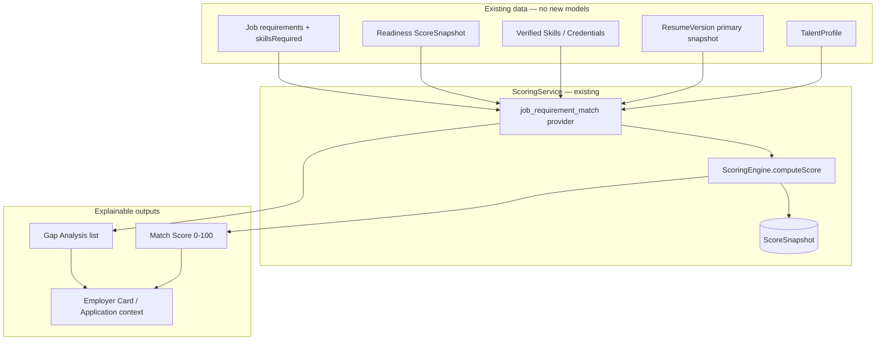
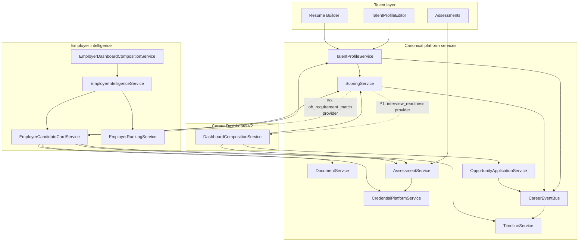
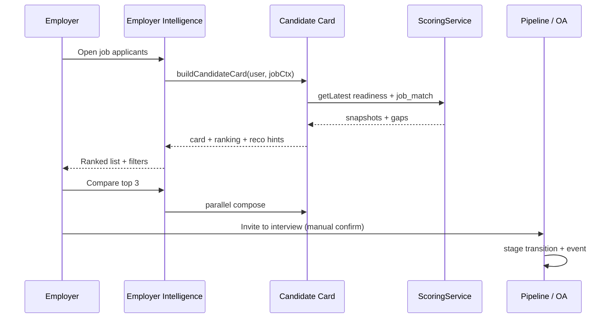
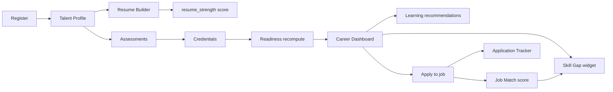

# L.2.7 — Career Intelligence Enhancement Audit

**Status:** Complete (documentation only)  
**Date:** 22 July 2026  
**Type:** Architecture audit & enhancement planning  
**Scope:** Documentation and integration analysis — **no code, APIs, schemas, migrations, or architecture redesign**

**Prior gates (complete):**

| Gate | Result |
|------|--------|
| C.6–C.8 Career Intelligence | Complete |
| C.8.5 / C.8.5A Launch Readiness | 165/165 PASS |
| L.1 Production Readiness | GO WITH CONDITIONS |
| L.2 Staging Operations | 48/48 verify PASS |
| L.2.5 Experience Audit | Conditional GO (P0 list) |
| L.2.6 Beta Experience Completion | Complete |
| L.2.6.5 Verification & Bug Fix | 48 PASS / 2 PARTIAL / 0 FAIL — **Beta Ready** |

**Purpose:** Single source of truth for the next implementation sprint — which enhancements to ship before Public Launch, how they integrate with existing Career Intelligence services, and what must wait.

**Policy:** All MVP enhancements must remain **fully functional with paid AI disabled** (`docs/AI_BUDGET_POLICY.md`).

---

## 1. Executive Summary

EduRozgaar is a **Career Intelligence Platform**, not a traditional job board. The canonical stack composes **TalentProfile → Readiness → Assessments → Credentials → OpportunityApplication → Employer Intelligence** via shared services and `CareerEventBus`. Core engines are **deterministic**, explainable, and audited.

**Maturity at a glance:**

| Dimension | Score (0–100) | Summary |
|-----------|---------------|---------|
| **Career Intelligence (overall)** | **82** | Strong foundation; gaps are composition and UX exposure, not missing domain models |
| **Employer Readiness** | **74** | Candidate cards + ranking work for applicants; job-specific match, comparison, and filter UI are thin |
| **Student Experience** | **86** | Post-L.2.6 journeys verified; skill-gap and application insights need composition layers |
| **Public Launch (product slice)** | **78** | Beta-ready; P0 enhancements are integration-heavy, not greenfield |

**Key finding:** Most proposed enhancements **already have underlying data or partial engines**. The next sprint should **compose and expose** existing services — not introduce parallel scoring engines, profile models, or recommendation systems.

**Verdict:** Proceed to Public Launch after completing a **small set of P0 composition extensions** (Job Match Score, unified Resume Quality, employer filter UI, deterministic hiring actions). Defer talent discovery search, candidate comparison v2, and job seat automation until post-launch unless employer Beta feedback demands them.

---

## 2. Executive Capability Summary

Classification legend: **Complete** · **Partially Complete** · **Placeholder** · **Missing**

| System | Status | Executive summary |
|--------|--------|-------------------|
| **Talent Profile** | **Complete** | Canonical `TalentProfile` + `TalentProfileService`; rich schema (education, experience, skills, preferences, availability, goals). Dual-write to legacy Resume optional. |
| **Resume Builder** | **Complete** | `ResumeVersionService`, `ResumeDocument` renderer, PDF, ATS skin (`minimal-ats`), profile bridge. |
| **Resume Preview** | **Complete** | Professional preview via `ResumePreview` / `ResumeDocument` (L.2.6); no JSON dump in production path. |
| **Career Readiness Engine** | **Complete** | `ScoringService` + `ScoreSnapshot`; weighted providers in `shared/scoring/weights/v1.json`; types `career_readiness`, `resume_strength` live. |
| **Assessment Platform** | **Complete** | MCQ lifecycle, 11 MVP assessments seeded, auto-credential on pass, `getEmployerVisibleSkills`. |
| **Credential Platform** | **Complete** | Issue / verify / revoke; linked to assessments and documents. Talent manage UI partial. |
| **Employer Intelligence** | **Partially Complete** | Candidate cards, ranking, pipeline, dashboard widgets production-ready; applicant-only source (limit 200), thin filter UI. |
| **OpportunityApplication** | **Complete** | Full OA lifecycle + dual-write from legacy apply; employer pipeline syncs OA when linked. |
| **Timeline** | **Complete** | Append-only from career events; surfaced on candidate cards and talent dashboard. |
| **Career Dashboard** | **Complete** | V2 composition, readiness, applications, learning, credentials widgets. Personalization flag off. |
| **Documents Platform** | **Complete** | Canonical `DocumentService`; migration path from legacy profile documents. |
| **Search** | **Partially Complete** | Public content strong (869+ indexed); `talent-profile` / `credential` indexed but not public search; no fuzzy match. |
| **Notifications** | **Complete** | Career event handlers; milestone notifications for applications and hiring. |
| **Analytics** | **Complete** | Event types wired; employer and talent activity tracked via bus. |

**Declared but not implemented score types** (in `shared/scoring/constants.js`): `employer_match`, `technical_readiness`, `interview_readiness`, `learning_progress` — **Partially Complete** at type level only.

---

## 3. Capability Matrix

| Capability | Exists | Composable from existing | Needs small extension | Needs new surface only |
|------------|--------|--------------------------|----------------------|------------------------|
| Profile completion % | ✓ (3 formulas) | Unify to `ScoringService` / card | Canonical field optional | Dashboard already shows |
| Career readiness score | ✓ | — | — | — |
| Resume strength score | ✓ | — | — | Expose in Resume Builder UI |
| Resume quality (client) | ✓ | Merge into `resumeQualityProvider` | Unify rules | Resume Builder widget |
| Job–candidate match score | Placeholder | ✓ | New provider + weights | Job detail + employer card |
| Skill gap analysis | Partial | ✓ | Gap provider | Student dashboard widget |
| Employer ranking | ✓ | — | Job-aware weight tweak | — |
| Hiring action recommendations | Partial | ✓ | Rule table | Employer candidate detail |
| Candidate comparison | Missing | ✓ | — | Compare UI + API compose |
| Employer advanced filters | Partial (server) | ✓ | Card field exposure | Filter panel UI |
| Job seats / vacancy | Missing | — | Job model fields + hook | Employer job UI |
| Deterministic learning paths | ✓ | — | — | — |
| Degree roadmaps | ✓ | — | — | — |

---

## 4. Employer Hiring Intelligence Audit

### 4.1 What employers see today

`EmployerCandidateCardService.buildCandidateCard()` composes (no duplicate talent model):

| Signal | Source | Employer-visible |
|--------|--------|------------------|
| Readiness Score | `ScoringService.getLatest(userId, 'career_readiness')` | ✓ `readiness.overall` |
| Verified Skills | `AssessmentService.getEmployerVisibleSkills` | ✓ |
| Assessments | Via verified skills + credentials | ✓ (indirect) |
| Resume | Primary resume version id/title | ✓ (metadata; preview via documents/resume routes) |
| Documents | `DocumentService.listForUser` | ✓ list |
| Timeline | `TimelineService.listForUser` | ✓ summary (8 events) |
| Credentials | `CredentialPlatformService.listForUser` | ✓ |
| Career history | Experience summary + years | ✓ |
| Profile completion | Inline `completionPercent` on card | ✓ |
| Pipeline / interview | OA + legacy Application bridge | ✓ |
| Ranking | `EmployerRankingService.rankCandidate` | ✓ explainable factors |

**Ranking weights** (`shared/employer/ranking/v1.json`): readiness 40%, verified assessments 25%, experience 20%, profile completeness 10%, recent activity 5%. **`aiUsed: false`** always.

### 4.2 Sufficiency for hiring decisions

| Decision | Supported today? | Gap |
|----------|------------------|-----|
| Shortlist by overall quality | **Yes** | Ranking + readiness |
| Verify claimed skills | **Yes** | Assessment-backed credentials |
| Understand activity / engagement | **Partial** | Timeline summary only |
| **Fit for this specific job** | **No** | No job-requirement match score on card |
| Compare two finalists | **No** | No comparison UI |
| Know salary alignment | **No** | `preferences.salaryExpectation` on profile **not projected** on card |
| Portfolio review | **Partial** | `portfolioReferences` on profile; not highlighted on card |
| Interview readiness | **No** | Score type declared, no provider |

### 4.3 Missing deterministic hiring intelligence (recommended)

All must reuse existing projections — **no AI, no automated reject/hire**:

1. **Job Match Score** per application (see §5) — highest employer value  
2. **Hiring action hints** — rule-based: “Request Excel assessment”, “Portfolio missing”, “Invite to interview” (see §6)  
3. **Salary range overlap** — compare `TalentProfile.preferences.salaryExpectation` vs `Job.salaryRange` (parse/heuristic)  
4. **Portfolio availability flag** on card — boolean from `portfolioReferences.length`  
5. **Credential freshness** — max age of verified credentials on card  

**Employer confidence today:** **Adequate for Beta** (rank + verify skills + pipeline). **Insufficient for Public Launch positioning** as “Career Intelligence” without **job-specific match** and **explainable next actions**.

---

## 5. Job Match Intelligence Audit

### 5.1 Current state

| Component | Status |
|-----------|--------|
| `employer_match` in `CAREER_SCORE_TYPES` | Declared only — **no weights, no provider** |
| `resumeAnalyzerController.matchJobs` | **Placeholder** — hardcoded skills + regex on job text |
| `resumesController.optimizeForJob` | **Partial** — keyword diff vs single job (deterministic) |
| Dashboard job recommendations | **Placeholder** — recent listings, not skill-matched |
| Employer ranking | Generic — not job-requirement aware |

**Conclusion:** A canonical **Job Match Score does not exist**. Keyword overlap exists in isolated endpoints, not in `ScoringService`.

### 5.2 Recommended architecture (reuse, no duplicate engine)

Extend **`ScoringService`** with score type `employer_match` (or `job_match` alias) — **one new provider**, not a second scoring engine.



**Provider logic (deterministic):**

| Factor | Weight (example) | Source |
|--------|------------------|--------|
| Required skills overlap | 35% | `Job.skillsRequired` ∩ profile skills + verified skills |
| Experience band fit | 20% | `experienceYears` vs job `experience` string/heuristic |
| Education fit | 15% | Profile education vs `educationRequirement` |
| Readiness contribution | 15% | Existing `career_readiness` overall (reuse snapshot, don’t recompute) |
| Location / work mode | 10% | Province/city + `remote`/`hybrid` vs preferences |
| Resume strength | 5% | Existing `resume_strength` snapshot |

**Gap analysis:** List missing skills, missing credentials, incomplete profile fields — same pattern as `buildScoreExplanation().improvements`.

**Employer recommendation:** Surface on `EmployerCandidateCard` when `jobId` in context:

```json
{
  "jobMatch": {
    "overall": 72,
    "version": "1.0.0",
    "deterministic": true,
    "gaps": ["SQL not verified", "Missing portfolio link"],
    "matchedSkills": ["JavaScript", "Communication"]
  }
}
```

**Student-facing:** Same provider powers “Why this job fits you” on job detail for logged-in talent.

**Integration points:**

- `ScoringService.compute(userId, 'employer_match', { jobId })` — context passed to provider  
- `EmployerCandidateCardService.buildCandidateCard` — optional `jobMatch` when `applicationCtx.jobId` set  
- `OpportunityApplication` — store latest match snapshot id in metadata (optional, not required for MVP)  
- **Do not** add `JobMatchingService` parallel to `ScoringService`

**AI classification:** **Deterministic** — rule/keyword/set overlap only.

---

## 6. Resume Quality Audit

### 6.1 Current implementations (duplicated rules)

| Location | Scope | Persisted |
|----------|-------|-----------|
| `client/.../ResumeScore.jsx` | Legacy resume form fields | No |
| `scoring/providers.js` `resumeQualityProvider` | ResumeVersion snapshot | Yes → `ScoreSnapshot` |
| `ScoringService` type `resume_strength` | Weighted resume + profile + docs | Yes |
| `ResumeDocument` ATS skin | Presentation only | N/A |

**Checks today (server `resumeQualityProvider`):** headline, summary length, experience, education, skills count, published, primary flag.

**Checks today (client `ResumeScore`):** personal info, LinkedIn, objective, skills count, experience, projects.

**ATS compatibility:** Template label `minimal-ats` only — **no** parseability engine (headings, section order, keyword density).

### 6.2 Recommendation

**Do not create `ResumeQualityEngine` as a separate service.**

| Action | Approach |
|--------|----------|
| Canonical score | **`resume_strength` via `ScoringService`** (already exists) |
| Unify rules | Merge client `ResumeScore` checks into `resumeQualityProvider` (single rule set) |
| UI | Resume Builder shows `ScoringService.getLatest(..., 'resume_strength')` + improvements |
| ATS hints | **P1** — extend `resumeQualityProvider` with section/length checks (deterministic) |
| Employer card | Expose `resumeStrength.overall` on candidate card from snapshot |

**Reuse matrix:**

| Need | Reuse |
|------|-------|
| Completeness | `profileCompletenessProvider` |
| Education / experience / skills | `resumeQualityProvider` + profile data |
| Certifications | `CredentialPlatformService` + `certificationReferences` |
| Profile photo | `profileCompletenessProvider` (avatar check) |
| Contact details | `personalInfoSchema` + resume snapshot |
| ATS | Template + future provider checks — **not** a new service |

**AI classification:** **Deterministic**.

---

## 7. Employer Recommendation Audit

### 7.1 Current state

| Feature | Status |
|---------|--------|
| `recommendedCandidatesProvider` | **Complete** — top ranked ≥50%, deterministic |
| `hiringTasksProvider` | **Complete** — review new, interviews, offers counts |
| Per-candidate action suggestions | **Missing** |
| Automated reject/hire | **Correctly absent** |

### 7.2 Recommended: Deterministic Hiring Action Hints

**New composition layer only** — `EmployerHiringRecommendationService` **or** inline helper in `EmployerCandidateCardService` (prefer helper to avoid service proliferation):

Rule table (examples):

| Condition | Recommendation key | Explanation |
|-----------|-------------------|-------------|
| `jobMatch.overall >= 70` && stage = applied | `invite_to_interview` | Strong requirement match |
| Verified skills < job required count | `request_technical_assessment` | Missing verified skills: {list} |
| No English credential && job category in office roles | `request_english_assessment` | English assessment not verified |
| `portfolioReferences.length === 0` && job mentions portfolio | `request_portfolio` | No portfolio linked |
| `experienceYears < 1` && job type internship | `suitable_for_internship` | Experience band fits internship |
| `experienceYears` 1–3 && match >= 60 | `suitable_for_junior_role` | Junior band |
| Match 40–69 | `keep_in_talent_pool` | Moderate fit — review later |
| Match < 40 | `review_manually` | Low match — human decision required |

**Explicit prohibitions (policy):**

- ❌ AI hiring decisions  
- ❌ Automated rejection  
- ❌ Automated hiring / offer  
- ❌ Opaque scores without `factors` / `explanationKey`  

Every recommendation returns:

```json
{
  "action": "request_technical_assessment",
  "deterministic": true,
  "aiUsed": false,
  "reasonKeys": ["employer.reco.missingVerifiedSkills"],
  "evidence": [{ "type": "skill_gap", "label": "SQL" }]
}
```

**UI:** Chips on `EmployerCandidateDetail` — employer always confirms action (stage transition, note, assessment link).

**AI classification:** **Deterministic**.

---

## 8. Candidate Comparison Audit

### 8.1 Current state

- **No** comparison UI in `client/src/pages/Employer/`  
- **No** dedicated compare API  
- Candidate cards already contain sufficient fields for side-by-side: readiness, ranking, verified skills, experience years, credentials count, profile completeness, pipeline stage, job match (when §5 shipped)

### 8.2 Recommendation

**Reuse only — no duplicate profile model.**

| Layer | Implementation |
|-------|----------------|
| API | `POST /employer/intelligence/candidates/compare` — accepts `legacyApplicationIds[]` (max 4), returns array of existing cards + rankings + optional jobMatch |
| Service | `EmployerIntelligenceService.compareCandidates` — parallel `buildCandidateCard` + `rankCandidate` |
| UI | `EmployerCandidateCompare.jsx` — table columns: Name, Match %, Readiness, Verified Skills, Experience, Stage, Recommendation |

**Priority:** **P1** (high employer value, low architecture risk).

---

## 9. Candidate Filtering Audit

### 9.1 Server (`EmployerIntelligenceService.matchesFilters`)

| Filter | Supported server-side |
|--------|----------------------|
| Text `q` | ✓ |
| `jobId` | ✓ |
| `pipelineStage` | ✓ |
| `minReadiness` | ✓ |
| `location` | ✓ |
| `skill` | ✓ |

### 9.2 Client (`EmployerCandidates.jsx`)

| Filter | UI control |
|--------|------------|
| `q` | ✓ |
| `minReadiness` | ✓ |
| `jobId`, `stage`, `skill`, `location` | URL params only — **no form controls** |

### 9.3 Audit vs requested filter set

| Category | Filter | Data available | Filter supported | Gap |
|----------|--------|----------------|------------------|-----|
| Profile | Readiness Score | ✓ | ✓ min only | Max range, sort |
| Profile | Resume Quality | ✓ snapshot | ✗ | Add `minResumeStrength` |
| Profile | Profile Completion | ✓ on card | ✗ | Add `minProfileCompleteness` |
| Profile | Education | ✓ on profile | ✗ | Filter by degree level |
| Profile | Experience | ✓ `experienceYears` | ✗ | Min years filter |
| Profile | Province / City | ✓ location string | Partial | Structured province field on profile |
| Skills | Verified Skills | ✓ | Partial | Dedicated multi-select |
| Skills | Skill categories | ✓ `SKILL_CATEGORIES` | ✗ | Filter on card |
| Skills | Assessment score | ✓ per skill | ✗ | Min assessment score |
| Skills | Credentials | ✓ | ✗ | Has credential filter |
| Availability | Internship / FT / PT | Job type + preferences | ✗ | Expose work preference on card |
| Availability | Remote / on-site | ✓ profile + job | ✗ | Filter |
| Applications | Current stage | ✓ | Server only | UI |
| Applications | Recent activity | ✓ `recentActivityAt` | ✗ | “Active in 30 days” |
| Applications | Applied date | ✓ legacy app | ✗ | Date range |
| Salary | Expected salary | ✓ `preferences.salaryExpectation` | ✗ | Not on card — **project field** |
| Sort | Best match | Ranking exists | ✓ default | Expose sort selector |
| Sort | Highest readiness | ✓ | Partial | Explicit sort param |
| Sort | Highest assessment | ✓ | ✗ | Sort by verified avg |
| Sort | Resume quality | ✓ | ✗ | Sort by resume_strength |
| Sort | Newest | ✓ | Partial | Sort by appliedAt |

### 9.4 Search infrastructure reuse

**Do not build a new search engine for employer filters.**

| Approach | Recommendation |
|----------|----------------|
| Short term (P0/P1) | Extend `matchesFilters` + sort in `listCandidates` over composed cards (current pattern, ≤200 apps) |
| Medium term (P2) | Index public talent profiles in search (`talent-profile` already in `SEARCH_ENTITY_TYPES`) for **opt-in** employer talent discovery — separate from applicant list |
| Long term | Federated search only if applicant volume exceeds in-memory compose |

**AI classification:** **Deterministic** (all filters).

---

## 10. Job Posting Enhancement Audit

### 10.1 Current `Job` model

**Exists:** `status` (draft/active/closed), `deadline`, `expiresAt`, `applicationsCount`, `skillsRequired`, employer linkage.

**Missing:** `totalSeats`, `filledSeats`, `remainingSeats`, `autoCloseWhenFilled`, structured `vacancyStatus`.

### 10.2 Recommendation

| Field | Belongs on canonical Job? | Notes |
|-------|---------------------------|-------|
| `totalSeats` | **Yes** | Optional; default null = unlimited |
| `filledSeats` | **Derived** | Count OA/hired in terminal stage — **do not duplicate counter service** |
| `remainingSeats` | **Computed** | `totalSeats - filledSeats` in service layer |
| `autoCloseWhenFilled` | **Yes** | Boolean; hook on pipeline transition to `hired` |
| `vacancyStatus` | **Computed** | open / filling / filled / closed from seats + status |

**Integration:**

- `EmployerIntelligenceService` pipeline transition to `hired` → increment filled count → if `autoCloseWhenFilled` && remaining = 0 → `Job.status = 'closed'`  
- `EmployerDashboardCompositionService` `openPositionsProvider` — show remaining seats  
- **No** `VacancyTrackingService` — use Job + OA queries  

**Priority:** **P1** (employer value for multi-seat roles; not Beta-blocking).

**AI classification:** N/A (data model + hooks).

---

## 11. Candidate Quality Intelligence Audit

Deterministic indicators — map to existing vs compose:

| Indicator | Exists | Source | Action |
|-----------|--------|--------|--------|
| Career Readiness | ✓ | `ScoringService` `career_readiness` | Expose everywhere |
| Resume Quality / Strength | ✓ | `resume_strength` + provider | Unify UI (§6) |
| Profile Completion | ✓ | Multiple formulas | **Unify** to scoring provider output |
| Job Match | ✗ | — | Add provider (§5) |
| Assessment Coverage | Partial | Credential count / categories | Compose widget |
| Verified Skill Coverage | ✓ | `verifiedSkillsProvider` | Already in readiness |
| Credential Freshness | Partial | `issuedAt` on credentials | Compute max age on card |
| Portfolio Availability | Partial | `portfolioReferences` | Boolean on card |

**Quality Intelligence Bar (recommended UI pattern):**

Single composed object on candidate card and student dashboard:

```json
{
  "indicators": [
    { "key": "readiness", "score": 78, "labelKey": "..." },
    { "key": "jobMatch", "score": 72, "labelKey": "..." },
    { "key": "resumeStrength", "score": 85, "labelKey": "..." },
    { "key": "profileCompletion", "score": 90, "labelKey": "..." }
  ],
  "deterministic": true
}
```

**Implementation:** `CandidateQualityCompositionService` as **thin facade** calling `ScoringService` + card fields — **not** a new scoring engine.

---

## 12. Student Career Intelligence Audit

### 12.1 Existing data/services

| Guidance type | Existing support |
|---------------|------------------|
| Skill gap (generic) | `ScoringService.buildScoreExplanation().improvements` |
| Skill gap (role-specific) | `degreeRoadmaps.js` `requiredSkills` vs profile skills |
| Career milestones | `careerGoals` on TalentProfile; timeline events |
| Interview readiness | Score type declared — **no provider** |
| Application insights | OA list + stage history; dashboard applications widget |
| Learning roadmap | `buildDeterministicLearningRecommendations` (L.2.6) |
| Missing certifications | `certificationReferences` + credential list vs roadmap |
| Missing skills | Profile skills vs job/roadmap (after job match provider) |
| Missing documents | `document_completeness` provider |

### 12.2 Recommended student enhancements (composition)

| Enhancement | Reuse | Priority |
|-------------|-------|----------|
| **Skill Gap Analysis widget** | Readiness improvements + target job or roadmap | **P0** |
| **Application Insights panel** | OA stages + time-in-stage from timeline | **P1** |
| **Interview Readiness provider** | New provider: communication + english credentials + profile completeness | **P1** |
| **Career Milestones tracker** | `careerGoals` + timeline + assessments passed | **P1** |
| **Missing documents checklist** | `document_completeness` improvements | **P1** |
| **Per-job “Improve match”** | `optimizeForJob` + job match gaps | **P0** (with §5) |

**Do not** add `StudentCareerAIService`. Extend dashboard providers in `DashboardCompositionService`.

---

## 13. Employer Acquisition Readiness Audit

### 13.1 Value proposition today

| Employer need | Platform answer | Strength |
|---------------|-----------------|----------|
| See applicant quality | Readiness + verified skills | **Strong** |
| Rank applicants | Deterministic ranking | **Strong** |
| Understand skills proof | Assessments + credentials | **Strong** |
| Manage pipeline | OA + legacy bridge | **Good** |
| **Judge fit to role** | Missing job match | **Weak** |
| Compare finalists | Missing | **Weak** |
| Filter efficiently | Server yes / UI no | **Weak** |
| Track hiring progress | Pipeline metrics widget | **Good** |
| Multi-seat hiring | Missing | **Weak** |

### 13.2 Highest-impact pre-launch employer additions (value, not quantity)

1. **Job Match Score on every application** — transforms positioning vs Rozee/LinkedIn  
2. **Explainable hiring action hints** — reduces time-to-decision  
3. **Full filter + sort panel** — makes Intelligence usable at 50+ applicants  
4. **Resume strength visible on card** — complements readiness  
5. **Side-by-side compare (2–4 candidates)** — closes hiring loop  

**Defer:** Proactive talent sourcing (non-applicants), paid featured listings automation, ATS integrations.

---

## 14. Growth Strategy Audit

### 14.1 Positioning

**EduRozgaar should launch as a Career Intelligence Platform**, not a traditional job board.

| Job board | Career Intelligence (EduRozgaar) |
|-----------|----------------------------------|
| Listings only | Listings + readiness + assessments + tracker |
| CV upload | Structured TalentProfile + verified skills |
| Employer inbox | Ranked candidates + explainable scores |
| Search by keyword | Search + match scores + gap analysis |

Messaging: *“Know your readiness. Prove your skills. Track every opportunity.”* (employers: *“See verified talent, ranked and explained.”*)

### 14.2 Recommended first 6 months

| Tactic | Rationale |
|--------|-----------|
| **Free employer accounts** | Seed supply side; intelligence is the differentiator |
| **Free job posting (limited)** | Existing job plans optional; free tier for launch |
| **Free candidate search (applicants to own jobs)** | Intelligence works on applicant pool first |
| **Free student accounts** | Maximize readiness + assessment data flywheel |
| University partnerships | Bulk student onboarding → credentials pipeline |
| Success stories | Readiness improvement + hire via platform |
| Government job index | Already scraped — SEO + trust |

**Growth targets (indicative):**

| Segment | 6-month target |
|---------|----------------|
| Registered students | 5,000–10,000 |
| Talent profiles ≥60% complete | 40% of registered |
| Assessments completed | 2,000+ attempts |
| Employer accounts | 100–200 |
| Active job posts | 500+ (incl. scraped) |
| Documented hires | 10+ success stories |

---

## 15. AI & Cost Compliance Audit

Every proposed enhancement classified:

| Enhancement | Classification |
|-------------|----------------|
| Job Match Score (rule-based) | **Deterministic** |
| Resume quality unification | **Deterministic** |
| Hiring action hints | **Deterministic** |
| Candidate comparison | **Deterministic** |
| Employer filters/sort | **Deterministic** |
| Job seats / auto-close | **Deterministic** |
| Skill gap / interview readiness providers | **Deterministic** |
| Resume analyzer file upload NLP | **Optional AI** (currently placeholder — keep heuristic) |
| Admin AI job description | **Optional AI** (templates today — stay template) |
| LLM resume rewrite | **Future AI** — reject until revenue |
| Embedding-based matching | **Future AI** — reject |
| Automated reject/hire | **Rejected** — policy violation |

**Rejected enhancements:**

- Any paid API required for core apply/profile/readiness/employer pipeline  
- Duplicate LLM scoring parallel to `ScoringService`  
- Hidden ranking factors  

**MVP remains fully functional with paid AI disabled.**

---

## 16. Reuse vs New Implementation Matrix

| Enhancement | Reuse | Extend | New surface only | New service? |
|-------------|-------|--------|------------------|--------------|
| Job Match Score | ScoringEngine, Job, TalentProfile, Readiness | 1 provider + weights | Job detail, employer card | **No** |
| Resume Quality unify | resumeQualityProvider, resume_strength | Merge client rules | Resume Builder | **No** |
| Hiring recommendations | Candidate card fields | Rule helper | Detail UI chips | **No** (helper only) |
| Candidate compare | buildCandidateCard × N | Compare endpoint | Compare page | **No** |
| Employer filters | matchesFilters, card fields | Filter params + sort | Filter panel | **No** |
| Job seats | Job model, OA hired stage | Fields + transition hook | Post job form | **No** |
| Skill gap widget | Scoring explanation, roadmaps | Dashboard provider | Dashboard widget | **No** |
| Interview readiness | Assessment credentials | 1 provider | Dashboard + card | **No** |
| Talent discovery search | SearchIndexer, talent-profile type | Public employer query | New browse UI | **No** (P2) |

**Architectural rule:** If a row suggests “New service? Yes” — **redesign to composition**.

---

## 17. Integration Diagrams

### 17.1 Career Intelligence composition (current + planned)



### 17.2 Employer hiring journey (target)



### 17.3 Student career journey (target)



---

## 18. Priority Matrix

### P0 — Before Public Launch

*Critical for hiring confidence and Career Intelligence positioning.*

| ID | Enhancement | Rationale | Complexity |
|----|-------------|-----------|------------|
| P0-1 | **Job Match Score provider** + weights in `ScoringService` | Core differentiator; employers cannot judge role fit today | Medium |
| P0-2 | **Project job match + gaps on Employer Candidate Card** | Makes intelligence visible in hiring flow | Low (after P0-1) |
| P0-3 | **Unify resume quality** — single rule set + expose `resume_strength` in Resume Builder | Removes duplicate logic; employer trust | Low |
| P0-4 | **Employer filter panel UI** (stage, job, skill, location, sort) | Server supports; UI blocks adoption | Low |
| P0-5 | **Deterministic hiring action hints** on candidate detail | Explainable next steps; no AI | Low |
| P0-6 | **Skill Gap dashboard widget** (readiness improvements + optional job context) | Student intelligence story | Low |
| P0-7 | **Canonical profile completion** — single source from scoring provider | Fixes 3-formula drift | Low |

### P1 — First 3 months after launch

| ID | Enhancement | Rationale | Complexity |
|----|-------------|-----------|------------|
| P1-1 | Candidate comparison (2–4 side-by-side) | Finalist decisions | Medium |
| P1-2 | Job seats + auto-close when filled | Multi-hire employers | Medium |
| P1-3 | Interview readiness provider | Student + employer signal | Low |
| P1-4 | Application insights (time-in-stage, funnel) | Seeker retention | Medium |
| P1-5 | Extended employer filters (experience, resume strength, activity) | Scale applicant volume | Medium |
| P1-6 | Salary expectation on card + overlap hint | Hiring practicality | Low |
| P1-7 | Credential freshness + portfolio flags on card | Quality signals | Low |
| P1-8 | Per-job “Improve your match” on job detail | Closes student loop | Low |
| P1-9 | Internships in Global Search entity types | L.2.6.5 PARTIAL | Low |
| P1-10 | Admin assessment authoring UI | Content ops efficiency | Medium |

### P2 — Future (6–12 months)

| ID | Enhancement |
|----|-------------|
| P2-1 | Employer talent discovery via search index (opt-in public profiles) |
| P2-2 | ATS section checks in resume quality provider |
| P2-3 | Fuzzy/typo search |
| P2-4 | Saved search alerts (email/in-app) |
| P2-5 | Application calendar view |
| P2-6 | Visual certificate/badge assets |
| P2-7 | Collaborative hiring (multi-recruiter) |
| P2-8 | Offer stage templates + scorecards |

### Deferred

| Item | Reason |
|------|--------|
| LLM resume scoring / matching | AI budget policy |
| Automated reject/hire | Policy + trust |
| Coding IDE / judge assessments | Scope |
| IQ / personality batteries | Out of MVP |
| Dashboard DnD personalization | Flag off; UX incomplete |
| GigRadar (C.9) | Separate product |
| External ATS integrations | High effort; post-traction |

---

## 19. Risk Assessment

| Risk | Severity | Mitigation |
|------|----------|------------|
| Duplicate scoring engines created | High | All scores via `ScoringService` + providers only |
| Job match perceived as “AI black box” | Medium | Require `factors`, `gaps`, `deterministic: true` on every match |
| Profile completion formula drift | Medium | P0-7 unify on provider |
| Employer list >200 apps performance | Medium | P1 pagination + indexed filters; monitor L.1 bottleneck |
| Schema change for job seats breaks scraper jobs | Low | Optional fields; default unlimited |
| Hiring reco interpreted as auto-decision | High | Copy + UX: “Suggested action” with manual confirm |
| Paid AI creep via resume analyzer | Medium | Keep placeholder extractor; document as heuristic |

---

## 20. Public Launch Recommendations

### 20.1 Product (L.2.7 scope)

Complete **P0-1 through P0-7** before marketing EduRozgaar as “Career Intelligence” publicly. Beta can proceed without P0 if employer cohort is small and manually guided.

### 20.2 Operations (L.1 / L.2 — unchanged)

Staging live, SMTP, Redis (HA), TLS, backups, admin seed + reindex runbook, feature flag matrix.

### 20.3 Recommended implementation order

```text
1. P0-7  Profile completion unification
2. P0-3  Resume quality unification + UI
3. P0-1  Job match provider + weights
4. P0-2  Job match on employer card + job detail (student)
5. P0-6  Skill gap widget
6. P0-5  Hiring action hints
7. P0-4  Employer filter panel UI
── Public Launch ──
8. P1-1  Candidate comparison
9. P1-2  Job seats
10. P1-3–P1-8  Student/employer polish
```

### 20.4 Estimated complexity

| Band | Items | Effort estimate |
|------|-------|-----------------|
| P0 total | 7 items | **2–3 weeks** (1 engineer, integration-focused) |
| P1 total | 10 items | **4–6 weeks** post-launch |
| P2 | Ongoing roadmap | Quarterly |

*Estimates assume no new domain models and reuse of existing verify suites.*

---

## 21. Architectural Rules (Mandatory for L.2.8 Implementation)

1. **One scoring engine:** `ScoringService` + `shared/scoring/ScoringEngine.js` — new score types = new providers + weights only.  
2. **One talent model:** `TalentProfile` — projections via `TalentProfileReadService` and `EmployerCandidateCardService`.  
3. **One application canonical model:** `OpportunityApplication` — legacy Application remains bridge until migration complete.  
4. **Compose, don’t recreate:** Employer Intelligence, Dashboard, Recommendations = providers over existing services.  
5. **EventBus for side effects:** Timeline, analytics, notifications — not controller calls.  
6. **Feature flags:** New surfaces gated; paid AI flags default **OFF**.  
7. **Explainability:** Every score and recommendation exposes factors, version, `deterministic: true`.  
8. **No automated hiring decisions.**  

---

## 22. Success Criteria (This Document)

| Question | Answer |
|----------|--------|
| Which enhancements already exist? | Readiness, ranking, resume_strength provider, learning recs, degree roadmaps, candidate cards, partial filters, keyword job overlap in resume analyzer |
| Which require only integration? | Hiring hints, skill gap widget, filter UI, compare UI, job match on card, profile completion unify |
| Which require small extensions? | Job match provider, interview readiness provider, job seat fields, card field projections (salary, portfolio) |
| Which before public launch? | **P0 matrix (§18)** |
| Which after launch? | **P1–P2 and Deferred (§18)** |
| How to avoid duplicate services? | **§16 reuse matrix + §21 rules** |

---

## 23. Related Documents

| Document | Role |
|----------|------|
| `docs/L1_PRODUCTION_READINESS_AND_LAUNCH_AUDIT.md` | Ops launch conditions |
| `docs/L2_5_CAREER_EXPERIENCE_AND_FEATURE_COMPLETENESS_AUDIT.md` | UX baseline (pre-L.2.6) |
| `docs/SPRINT_L2_6_5_VERIFICATION_REPORT.md` | Beta verification evidence |
| `docs/EMPLOYER_INTELLIGENCE_ARCHITECTURE.md` | Employer compose pattern |
| `docs/C8_CAREER_DOMAIN_CANONICAL_CONTRACTS.md` | Domain contracts |
| `docs/AI_BUDGET_POLICY.md` | Cost / AI constraints |

---

**End of L.2.7 Career Intelligence Enhancement Audit.**

*Next sprint: L.2.8 — implement P0 items per §20.3 using this document as the single source of truth.*
