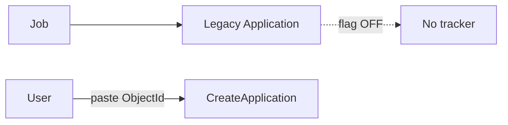
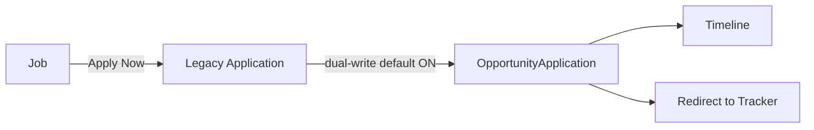
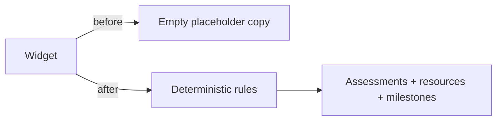

# Sprint L.2.6 — Beta Readiness P0 Experience Completion

**Status:** Complete (implementation)  
**Date:** 2026-07-14  
**Type:** UX completion, workflow integration, deterministic content — **no architecture redesign**  
**Authoritative prior audit:** `docs/L2_5_CAREER_EXPERIENCE_AND_FEATURE_COMPLETENESS_AUDIT.md`

---

## 1. Summary

L.2.6 closes the Beta-critical experience gaps identified in L.2.5 by wiring existing Career OS services (Search, OpportunityApplication, TalentProfile, Resume Builder renderer, Assessments, Credentials, Dashboard, Guidance) into complete user journeys.

**Paid AI remains disabled.** All recommendations and guidance content are rule-based / static.

---

## 2. Completed integrations

| # | Area | What shipped |
|---|------|----------------|
| 1 | Global Search | Hero search unified layout; Admin **Rebuild Search Index**; by-type counts; empty-index messaging; results type filters; seed now rebuilds search index |
| 2 | Apply → Tracker | Dual-write defaults **ON** when OA enabled; apply awaits OA; API returns `opportunityApplicationId`; JobDetail redirects to tracker; Track CTA with platform ID; manual create renamed Advanced/Import |
| 3 | Onboarding | Register / first login → Talent Profile with onboarding banner (Profile → Resume → Readiness → Dashboard) |
| 4 | Resume preview | TalentProfile versions use `ResumePreview` / `ResumeDocument` + ATS/print modes + PDF export (no second renderer) |
| 5 | Assessments seed | 11 published MVP assessments + question banks (`npm run seed:assessments`) |
| 6 | Credentials flow | Already engine-backed; seed assessments have auto-verify credential rules; dashboard/employer consume active credentials; scoring bridge on `AssessmentCompleted` |
| 7 | Recommended Learning | Deterministic provider from goals/skills/gaps/failed assessments (`shared/career/learningRecommendations.js`) |
| 8 | Career Guidance | Degree roadmaps center (`shared/career/degreeRoadmaps.js`) with skills, salary orientation (PK), certs, FAQs, internal links |
| 9 | Assessment UX | Timer, prev/next navigation, auto-submit on timeout |

---

## 3. UX improvements

- Homepage search: category + keyword + province in one responsive control group; full-width search input.
- Admin Global Search: rebuild button, indexed counts, empty-index warning.
- Search Results: type filter chips + clearer empty-state copy (reindex hint).
- Job Detail: Apply Now → tracker; Track application deep-link without ID paste.
- Scholarships / Admissions track: platform `opportunityId` (not external-only).
- Create Application: “Manual import / advanced track” copy + hint that paste is not primary.
- Resume versions: professional / ATS / print + PDF.
- Career Guidance: expandable roadmaps instead of static brochure cards; skill cards → assessments.

---

## 4. Updated user journeys

### Search

```text
Seed / publish content → Admin Rebuild Search Index (or seed auto-reindex)
→ User searches → Filtered results
```

### Apply for job

```text
Open job → Apply Now → Legacy Application + OpportunityApplication (dual-write)
→ Timeline event → Redirect to Application Tracker → Dashboard metrics update
```

### New user

```text
Register → Talent Profile (?onboarding=1)
→ Resume Builder / versions → Dashboard readiness → Assessments
```

### Resume

```text
Talent Profile → Resume version → Professional / ATS / Print preview → PDF export
```

### Assessment → credential

```text
Catalog → Take (timer + nav) → Score → Credential auto-issue/verify (if pass)
→ Verified skills widget → Readiness recompute → Employer candidate card
```

### Learning

```text
Career goal + readiness gaps + failed assessments
→ Deterministic learning plan widget → Assessments / free resources / milestones
```

---

## 5. Migrations / data

| Action | Notes |
|--------|--------|
| Assessment seed | Idempotent by slug; `server/src/seed/assessments.js` |
| Category defaults | Extended in `shared/career/assessmentConstants.js` |
| Search reindex on `npm run seed` | Calls `SearchIndexer.rebuildAll()` after listings |
| Schema changes | **None** |
| Dual-write flag default | Env unset + OA enabled ⇒ dual-write ON; `APPLICATION_DUAL_WRITE=0` disables |

Verified locally: `npm run seed:assessments` → `created=11`.

---

## 6. Before / after workflow diagrams

### Apply (before)



### Apply (after)



### Learning (before → after)



---

## 7. Verification checklist

| Check | How |
|-------|-----|
| Admin rebuild index | Admin → Global Search → Rebuild Search Index → counts rise |
| Public search | Search job/scholarship keywords after index |
| Apply → tracker | Internal job Apply Now lands on `/applications/:id` |
| Track without paste | Job / scholarship / admission Track links prefill IDs |
| Register onboarding | New register → `/talent-profile?onboarding=1` |
| Resume preview | Talent Profile → Resumes → Preview shows CV (not JSON) + PDF |
| Assessment catalog | `/assessments` lists 11 seeded assessments |
| Take + score | Start → navigate → submit → score + optional credential message |
| Dashboard learning | Widget shows scored recommendation items |
| Career guidance | Expand a degree roadmap; links to Jobs/Assessments work |
| Dual-write kill switch | `APPLICATION_DUAL_WRITE=0` disables tracker bridge |

---

## 8. Remaining Beta blockers (non-architecture)

| Item | Severity | Notes |
|------|----------|-------|
| Ops: SMTP / Redis / TLS | From L.1/L.2 | Staging ops, not UX |
| Admin assessment authoring UI | P1 | Staff API + seed enough for Beta demos |
| Rich certificate assets / badges | P2 | Credentials data is live; visual polish later |
| Personalized job matching beyond recent listings | P2 | Deterministic listings already shown |
| Ur/Ar i18n for new strings | P2 | EN shipped; defaults cover missing keys |

---

## 9. Key files touched

| Path | Change |
|------|--------|
| `server/src/config/careerFeatureFlags.js` | Dual-write default |
| `server/src/controllers/applicationsController.js` | Await dual-write + response ids |
| `server/src/controllers/internshipsController.js` | Same for internships |
| `server/src/seed/assessments.js` + `seed/index.js` | MVP assessments + reindex |
| `server/src/services/career/DashboardCompositionService.js` | Learning provider |
| `server/src/services/career/AssessmentService.js` | Dashboard payload categorySlug |
| `shared/career/learningRecommendations.js` | Deterministic learning |
| `shared/career/degreeRoadmaps.js` | Guidance content |
| `shared/career/assessmentConstants.js` | New categories |
| `client/.../GlobalSearch.jsx`, `Home.jsx`, `AdminGlobalSearch.jsx`, `SearchResults.jsx` | Search UX |
| `client/.../JobDetail.jsx`, `CreateApplication.jsx`, Scholarship/Admission detail | Tracker UX |
| `client/.../Register.jsx`, `Login.jsx`, `CareerOnboardingBanner.jsx` | Onboarding |
| `client/.../ResumeVersionsPanel.jsx` | Professional preview |
| `client/.../CareerGuidance.jsx` | Guidance center |
| `client/.../RecommendedLearningWidget.jsx` | Live items |
| `client/.../AssessmentTake.jsx` | Timer + navigation |

---

## 10. Success criteria (L.2.6)

| Journey | Status |
|---------|--------|
| Search + Admin reindex | Done |
| Apply → Tracker → Dashboard | Done |
| Register → Talent Profile → Resume → Readiness → Dashboard | Done |
| Resume version professional preview + PDF | Done |
| Assessment catalog → score → credential → skills | Done (with seed) |
| Deterministic learning plan | Done |
| Career guidance roadmaps | Done |

**Outcome:** Core student journeys no longer depend on raw Opportunity ID paste, empty search after seed, JSON resume preview, empty assessment catalog, or placeholder learning copy — Beta-ready from a user-experience perspective, pending L.1/L.2 ops conditions.

---

## 11. Screenshots

Screenshots were not captured in this automation pass. Manual QA should capture:

1. Homepage search bar (desktop + mobile)
2. Admin Global Search rebuild + counts
3. Job apply redirect to tracker
4. Onboarding banner on Talent Profile
5. Resume professional preview
6. Assessments catalog with 11 items
7. Learning widget with recommendations
8. Career Guidance expanded roadmap
