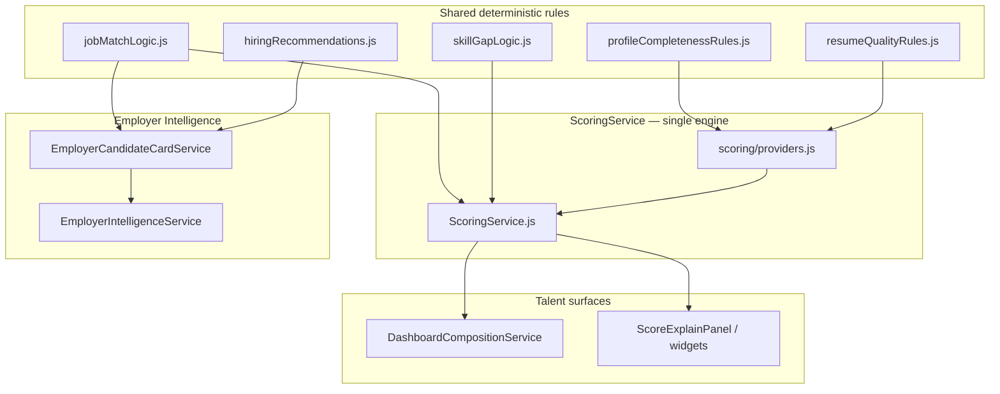
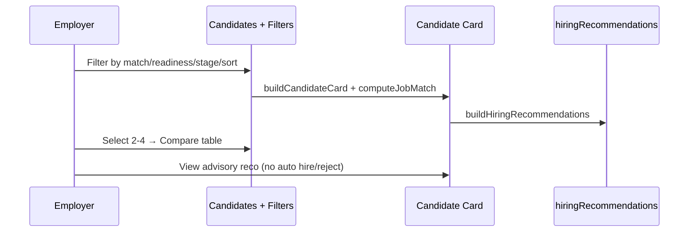
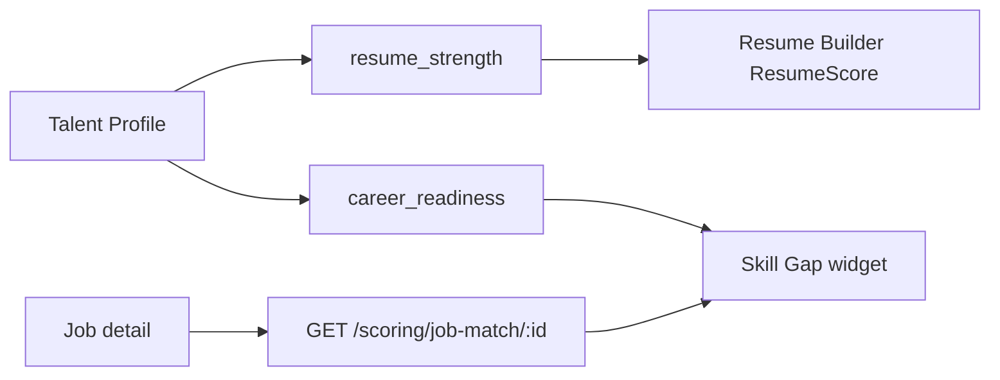

# Sprint L.2.8 — Career Intelligence & Employer Productivity Completion

**Status:** Complete  
**Date:** 22 July 2026  
**Type:** Implementation + verification  
**Authority:** `docs/L2_7_CAREER_INTELLIGENCE_ENHANCEMENT_AUDIT.md`  
**Verifier:** `npm run verify:l2-8` → `scripts/verify-l2-8.mjs`

---

## 1. Executive Summary

L.2.8 completes the remaining Career Intelligence capabilities identified in L.2.7 by **extending** the existing `ScoringService`, `EmployerCandidateCardService`, and `EmployerIntelligenceService` — no duplicate scoring engines, no new talent model, no paid AI.

| Area | Outcome |
|------|---------|
| Job Match Score | Deterministic, explainable, reusable |
| Resume Quality | Single canonical rules (`shared/scoring/resumeQualityRules.js`) |
| Explainability | `ScoreExplainPanel` + `buildUnifiedScoreExplanation` |
| Employer filters | Full UI + extended server filters + sort |
| Hiring recommendations | Advisory only — never Hire/Reject |
| Skill Gap | Dashboard widget + API |
| Vacancy management | Job seats + auto-close + apply block |
| Candidate comparison | 2–4 side-by-side employer view |
| Single source of truth | Profile completion + resume quality unified |

**Verification:** `21/21` static + unit gates PASS (`npm run verify:l2-8`). Client production build PASS.

---

## 2. Architecture Reuse Summary



**Rules honored:**

- One scoring engine (`ScoringService` + `ScoringEngine`)
- One talent model (`TalentProfile`)
- Compose, don't recreate
- Paid AI remains disabled

---

## 3. New / Extended Scoring Providers

| Provider ID | Score types | Source module |
|-------------|-------------|---------------|
| `profile_completeness` | `career_readiness`, `resume_strength` | `shared/scoring/profileCompletenessRules.js` |
| `resume_quality` | `career_readiness`, `resume_strength` | `shared/scoring/resumeQualityRules.js` |
| `job_requirement_match` | `job_match`, `employer_match` | `shared/scoring/jobMatchLogic.js` |

**Weights:** `shared/scoring/weights/v1.json` — added `job_match` / `employer_match`.

**API endpoints:**

| Method | Path | Purpose |
|--------|------|---------|
| GET | `/api/scoring/job-match/:jobId` | Talent job match + explanation |
| GET | `/api/scoring/resume-quality` | Canonical resume quality payload |
| GET | `/api/scoring/skill-gap` | Skill gap analysis |
| POST | `/api/employer/intelligence/candidates/compare` | Employer comparison (2–4) |

---

## 4. Job Match — Explainability Example

```json
{
  "overall": 68,
  "strengths": ["Javascript", "React", "Git", "BS Computer Science", "Verified Javascript"],
  "missing": ["Docker"],
  "explanation": {
    "title": "Job Match",
    "overall": 68,
    "deterministic": true,
    "aiUsed": false,
    "howToImprove": ["Build or verify skill: Docker"]
  }
}
```

Factors: required skills (35%), experience (20%), education (15%), readiness (10%), verified assessments (10%), language (5%), portfolio (5%).

---

## 5. Resume Quality — Single Source

**Before:** Client `ResumeScore.computeScore` (duplicate rules) vs server `resumeQualityProvider`.

**After:** Both use `evaluateResumeQuality()` from `shared/scoring/resumeQualityRules.js`.

Criteria: contact, summary, education, experience, projects, certifications, skills (5+), published, primary, headline.

---

## 6. Employer Workflow



**Filter support (server + UI):** readiness, resume quality, profile completion, job match, experience, stage, skill, city, province, work mode, job type, sort (6 options).

**Recommendations (examples):** Invite for Interview, Request Portfolio, Strong Technical Candidate, Suitable for Internship/Junior, Needs English/Communication Assessment, Complete Profile Recommended.

**Prohibited:** Hire, Reject, automated decisions.

---

## 7. Candidate Workflow



Dashboard widget: `skill-gap` in V2 layout (`SkillGapWidget.jsx`).

---

## 8. Vacancy Management

**Job model fields:** `totalSeats`, `autoCloseWhenFilled` (default true).

**Service:** `JobVacancyService.js`

| Stat | Source |
|------|--------|
| Applications | `Job.applicationsCount` |
| Selected / Filled | Count legacy + OA hired stages |
| Remaining | `totalSeats - filledSeats` |
| Status | open / filling / filled / closed |

**Behaviors:**

- `applyToJob` calls `assertJobAcceptingApplications` → 400 `HIRING_CLOSED` when closed/filled
- Pipeline transition to hired → `syncVacancyAfterHire` auto-closes job when seats exhausted
- Job detail API includes `vacancy` object

---

## 9. Candidate Comparison Example

| Metric | Candidate A | Candidate B |
|--------|-------------|-------------|
| Job Match | 91% | 84% |
| Resume Quality | 88 | 79 |
| Readiness | 90 | 76 |
| Communication | 82 | 95 |
| English | 85 | 92 |
| Verified Skills | 14 | 10 |
| Experience | 2 yrs | 1 yr |

Route: `/employer/intelligence/compare?ids=id1,id2`

---

## 10. Single Source of Truth

| Metric | Canonical source | Removed duplicates |
|--------|------------------|-------------------|
| Profile completion | `evaluateProfileCompleteness` | Dashboard 7-check formula, card inline 7-check |
| Resume quality | `evaluateResumeQuality` | Client `ResumeScore` local rules |
| Job match | `computeJobMatch` | Placeholder regex-only paths for cards |
| Readiness | `ScoringService` providers | Unchanged |
| Skill gap | `buildSkillGapAnalysis` | New composition only |

---

## 11. Key Files

| Path | Change |
|------|--------|
| `shared/scoring/profileCompletenessRules.js` | NEW — canonical profile completion |
| `shared/scoring/resumeQualityRules.js` | NEW — canonical resume quality |
| `shared/scoring/jobMatchLogic.js` | NEW — job match engine |
| `shared/scoring/skillGapLogic.js` | NEW — skill gap |
| `shared/scoring/scoreExplanation.js` | NEW — unified explainability |
| `shared/employer/hiringRecommendations.js` | NEW — advisory recos |
| `server/src/services/career/scoring/providers.js` | Extended providers |
| `server/src/services/career/ScoringService.js` | computeJobMatch, skill gap, resume payload |
| `server/src/services/career/EmployerCandidateCardService.js` | Match, resume, recos on card |
| `server/src/services/career/EmployerIntelligenceService.js` | Filters, sort, compare |
| `server/src/services/career/JobVacancyService.js` | NEW — vacancy stats |
| `server/src/models/Job.js` | totalSeats, autoCloseWhenFilled |
| `client/src/components/career/ScoreExplainPanel.jsx` | NEW |
| `client/src/pages/Employer/EmployerCandidates.jsx` | Full filter UI |
| `client/src/pages/Employer/EmployerCandidateCompare.jsx` | NEW |
| `client/src/dashboard/widgets/SkillGapWidget.jsx` | NEW |
| `scripts/verify-l2-8.mjs` | NEW — verification gate |

---

## 12. Verification Results

```text
npm run verify:l2-8
→ 21 passed, 0 failed (static + deterministic unit tests)

cd client && npm run build
→ ✓ built successfully
```

**Live API checks:** Optional when server on `:5000` (not required for gate pass).

---

## 13. AI Budget Compliance

- No OpenAI / Anthropic / Gemini integrations added
- All new intelligence is rule-based with `deterministic: true`, `aiUsed: false`
- Hiring recommendations explicitly exclude automated hire/reject

---

## 14. Remaining Technical Debt (P2)

| Item | Notes |
|------|-------|
| Persist job_match snapshots per jobId | Currently computed on demand |
| Fuzzy search | Out of L.2.8 scope |
| Employer talent discovery via search index | Applicant list only for now |
| Full ATS parseability checks | Template + rules only |
| Urdu strings for new employer filter labels | EN + defaultValue fallbacks |

---

## 15. Success Criteria

| Criterion | Met |
|-----------|-----|
| Job Match deterministic + reusable | ✅ |
| Single canonical Resume Quality | ✅ |
| Explainability panels | ✅ |
| Employer filters + sort UI | ✅ |
| Advisory hiring recommendations only | ✅ |
| Skill Gap integrated | ✅ |
| Vacancy seats + auto-close | ✅ |
| Candidate comparison 2–4 | ✅ |
| Single source of truth for scores | ✅ |
| No paid AI | ✅ |
| Verification + build pass | ✅ |

---

## 16. Recommended Next Steps

1. **Production deployment** (Vercel + Render) per L.1/L.2  
2. **Manual QA** on staging: apply → match score → employer filter → compare → hire → vacancy close  
3. **Beta cohort** (25–50 users)  
4. Collect feedback; address P2 debt post-launch

**End of L.2.8 Implementation Report.**
