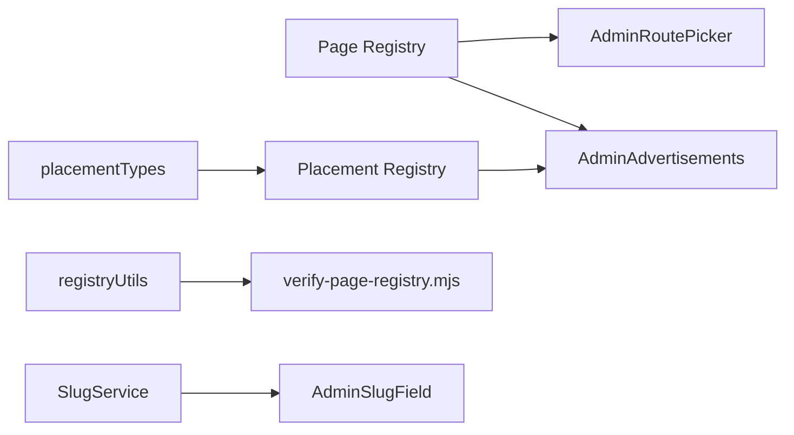

# Sprint C.6.4.3 — Platform Registry Foundation (Implementation Report)

**Date:** 2026-07-13  
**Status:** Implemented  
**Scope:** Page Registry, Placement Registry, admin pickers, missing slug integrations  
**Out of scope honored:** No AdHost, no route changes, no public ad rendering changes, no page builder

---

## Summary

Introduced a **shared registry layer** describing all platform pages and advertisement placements, plus admin UX to consume it. Existing data, APIs, routes, and public rendering remain unchanged.

| Deliverable | Status |
|-------------|--------|
| Page Registry (`shared/pageRegistry.js`) | ✅ 71 pages |
| Placement Registry (`shared/placementRegistry.js`) | ✅ 16 placements |
| Registry verification (`npm run verify:registry`) | ✅ PASS |
| `AdminRoutePicker` | ✅ Searchable, grouped |
| `AdminAdvertisements` Page → Placement → Slot | ✅ |
| AdminSlugField: Universities, Intl Scholarships, Career Guidance | ✅ |
| SlugService extended (3 additive resource types) | ✅ |

---

## Architecture

```
shared/
  pageRegistry.js       ← pageId, route, metadata, placement types
  placementRegistry.js  ← slotId, pageId, visual metadata, wired flags
  placementTypes.js     ← logical placement types ↔ AdSlotConfig enum
  registryUtils.js      ← validation + report formatter
  package.json          ← ESM module boundary

client/
  vite.config.js        ← @shared alias
  components/admin/
    AdminRoutePicker.jsx  ← searchable internal route picker
  pages/Admin/
    AdminAdvertisements.jsx  ← registry-driven slot workflow

scripts/
  verify-page-registry.mjs
```



---

## Page Registry

**File:** `shared/pageRegistry.js`

Each page includes stable `id`, `name`, `category`, `route`, flags (`dynamic`, `cmsControlled`, `adCapable`, `widgetCapable`, `protected`), optional `slugResourceType`, and logical `placements[]`.

**Categories:** Home, Jobs, Scholarships, Admissions, Institutions, Foreign Studies, Blog, Career Guidance, Internships, Webinars, Exam Prep, Tools, Static Pages, Companies, Universities, Employer, Student, Authentication, Admin, SEO, Support, Public Profiles.

**Helpers:** `getPageById`, `getPageByRoute`, `getAdCapablePages`, `getPickablePages`, `getPageCategories`.

**Count:** **71 pages**

---

## Placement Registry

**File:** `shared/placementRegistry.js`

Each placement includes:

- `id`, `pageId`, `displayName`, `slotType`, `slotId`
- `componentHint`, `maxSlots`, ad capability flags
- **Visual metadata:** `visualArea`, `description`, `previewRoute`, optional `width`/`height`
- `wiredInFrontend` — marks slots currently hardcoded in `Home.jsx` / `Jobs.jsx`

**Wired slots (unchanged on public site):**

| Placement ID | slotId | Page |
|--------------|--------|------|
| `home-top` | `home-top` | Home |
| `home-mid-1` | `home-mid-1` | Home |
| `jobs-header` | `jobs-header` | Jobs listing |
| `jobs-sidebar` | `jobs-sidebar` | Jobs listing |
| `jobs-infeed` | `jobs-infeed` | Jobs listing |

**Count:** **16 placements** (8 wired + 8 future/CMS)

**Helpers:** `getPlacementById`, `getPlacementBySlotId`, `getAdPlacementsForPage`, `resolveSlotFromPlacement`, `resolvePlacementFromSlotId`.

---

## Registry Verification

```bash
npm run verify:registry
```

**Checks:** duplicate page IDs, duplicate placement IDs, duplicate routes, orphan placements, invalid placement types, missing wired slots, SlugService cross-reference.

**Result (2026-07-13):** PASS — 71 pages, 16 placements, 8 wired slots, 0 errors, 0 warnings.

---

## AdminRoutePicker

**File:** `client/src/components/admin/AdminRoutePicker.jsx`

- Searchable combobox grouped by page category
- Internal route selection from `getPickablePages()`
- Optional external URL toggle
- Live preview URL (`VITE_APP_URL` + route)
- Props: `includeProtected`, `includeAdmin`, `allowExternal`

**Used in:** `AdminAdvertisements` (target URL field).

Ready for Site CMS nav paths, banner CTAs, notification links in a future slice.

---

## AdminAdvertisements Workflow

**File:** `client/src/pages/admin/AdminAdvertisements.jsx`

**Create flow:**

1. **Select page** — ad-capable pages from registry (grouped by category)
2. **Select placement type** — filtered by page’s `placements[]` with available slots
3. **Select slot** — auto-fills `slotId`, `placement` (AdSlotConfig enum), and `name`

**Edit flow:**

- Resolves existing `slotId` back to registry when possible
- **Slot ID remains immutable on edit** (existing API behavior)
- Legacy/custom slot IDs show backward-compatible hint; all fields preserved

**Preview panel:** page name, placement description, preview route.

**Not changed:** API payloads, DB schema, public `AdBanner` components.

---

## AdminSlugField Integrations

| Admin page | resourceType | Backend |
|------------|--------------|---------|
| `AdminContentUniversities.jsx` | `university` | `applyResolvedSlug` in intl controller |
| `AdminIntlScholarships.jsx` | `intl-scholarship` | `applyResolvedSlug` |
| `AdminCareerGuidance.jsx` | `career-article` | `applyResolvedSlug` |

**SlugService additions (additive only):**

- `university` → `/university/:slug`
- `career-article` → `/career-guidance/:slug`
- `intl-scholarship` → `/intl-scholarships/:slug`

**Model pre-save:** `University.js`, `CareerArticle.js` — slug only generated when empty (published lock parity with C.6.4.2).

---

## Files Created

| File | Purpose |
|------|---------|
| `shared/pageRegistry.js` | Page registry |
| `shared/placementRegistry.js` | Placement & slot registry |
| `shared/placementTypes.js` | Placement type labels + AdSlot enum map |
| `shared/registryUtils.js` | Validation utilities |
| `shared/package.json` | ESM module marker |
| `client/src/components/admin/AdminRoutePicker.jsx` | Route picker component |
| `scripts/verify-page-registry.mjs` | Verification script |
| `docs/SPRINT_C6_4_3_IMPLEMENTATION_REPORT.md` | This report |

## Files Modified

| File | Change |
|------|--------|
| `package.json` | `verify:registry` script |
| `client/vite.config.js` | `@shared` alias |
| `client/src/pages/Admin/AdminAdvertisements.jsx` | Registry workflow |
| `client/src/pages/Admin/AdminContentUniversities.jsx` | AdminSlugField |
| `client/src/pages/Admin/AdminIntlScholarships.jsx` | AdminSlugField |
| `client/src/pages/Admin/AdminCareerGuidance.jsx` | AdminSlugField |
| `client/src/components/admin/AdminSlugField.jsx` | 3 new RESOURCE_PATHS |
| `client/src/i18n/locales/en/admin.json` | Route picker + ad slot strings |
| `server/src/services/slugService.js` | 3 resource types |
| `server/src/models/University.js` | Pre-save slug lock |
| `server/src/models/CareerArticle.js` | Pre-save slug lock |
| `server/src/controllers/admin/adminCareerArticlesController.js` | applyResolvedSlug |
| `server/src/controllers/admin/adminIntlScholarshipsController.js` | applyResolvedSlug (scholarships + universities) |

---

## Verification Results

| Check | Result |
|-------|--------|
| `npm run verify:registry` | ✅ PASS |
| `npm run build` (client) | ✅ PASS |
| `verify-sprint-c6-4-2.mjs` | ✅ 8/8 (SlugService unchanged behavior) |
| Duplicate page IDs | ✅ None |
| Duplicate placements | ✅ None |
| Public routes | ✅ Unchanged |
| AdSlotConfig API | ✅ Unchanged |
| Public ad rendering | ✅ Unchanged |

---

## Backward Compatibility

- Existing `AdSlotConfig` records load and edit normally
- Unknown slot IDs → legacy mode with preserved fields
- SlugService existing 10 types unchanged; 3 types added
- No MongoDB migrations
- No React Router changes

---

## Future Extension Notes

| Next slice | Registry support |
|------------|------------------|
| C.6.4.3.4 AdHost | Use `wiredInFrontend` + `slotId` from placement registry |
| CMS route picker | Wire `AdminRoutePicker` into `AdminSiteCms.jsx` nav/banner CTAs |
| Page builder | Assign blocks to `placementId` on `pageId` |
| Widgets | Extend placement registry with `supportsWidget` metadata |
| CI guard | Add `verify:registry` to CI pipeline |

---

## Manual QA Checklist

- [ ] `/admin/advertisements` → Add slot → Home → Header Banner → Home Top → slotId auto-fills `home-top`
- [ ] Edit existing slot → fields populate; slotId disabled
- [ ] Edit legacy slot (unknown ID) → legacy hint shown
- [ ] Save/create ad slot → same API behavior as before
- [ ] Universities admin → slug preview, duplicate/reserved checks
- [ ] Intl scholarships admin → slug field parity with jobs
- [ ] Career guidance admin → published slug locked on title change
- [ ] Home/Jobs public pages → ads still render (unchanged)

---

*Foundation complete. Public rendering and routing intentionally untouched.*
