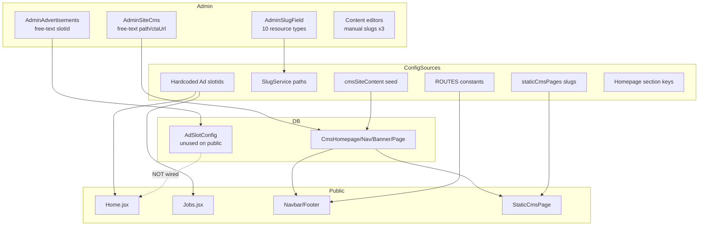
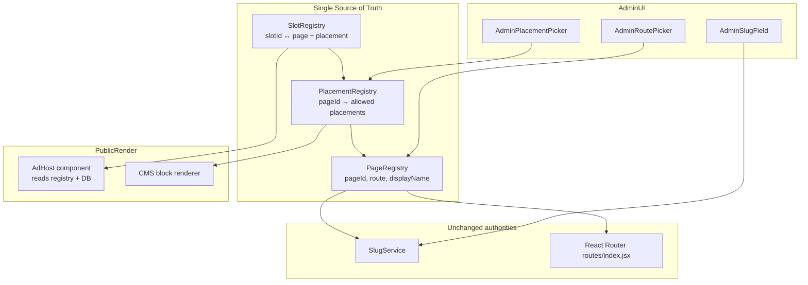

# Sprint C.6.4.3 — Platform Registry & Placement Architecture Audit (Pre-Implementation)

**Date:** 2026-07-13  
**Status:** Read-only audit — no code, schema, route, or database changes  
**Auditor:** Cursor (codebase inspection)  
**Related completed work:** C.6.4.1 (Admin sidebar), C.6.4.2 (SlugService)

---

## Executive Summary

The EDU-E-Portal platform **does not have a unified Page Registry or Placement Registry today**. Content placement, navigation paths, ad slots, homepage sections, and CMS references are spread across **at least six disconnected sources**:

| Artifact | Location | Role today |
|----------|----------|------------|
| `ROUTES` | `client/src/constants/index.js` | ~59 static path constants |
| `SLUG_RESOURCE_CONFIG` | `server/src/services/slugService.js` | 10 dynamic content types + public paths |
| `RESOURCE_PATHS` | `client/src/components/admin/AdminSlugField.jsx` | Client duplicate of slug paths |
| `staticCmsPages.jsx` + seed | Client + `server/src/seed/cmsSiteContent.js` | 14 static CMS pages (slug ↔ route triple-mapping) |
| `PLACEMENTS` + hardcoded slot IDs | `AdminAdvertisements.jsx`, `Home.jsx`, `Jobs.jsx` | Ad placement enum vs free-text slot IDs |
| CMS section keys | `CmsHomepage.js`, `AdminSiteCms.jsx` | Hardcoded homepage section identifiers |

**Key finding:** Two separate systems are often conflated:

1. **Monetization / Ads** — `AdSlotConfig` model + Google AdSense components (`AdBanner`, `AdSidebar`, `AdInFeed`). Admin manages slots in DB; **public frontend ignores DB and uses hardcoded slot string props**.
2. **Site CMS** — `CmsHomepage`, `CmsNavigation`, `CmsStaticPage`, `CmsBanner`. Homepage hero, nav, static pages, promotional banners. **`CmsBanner.placement` exists in schema but has no admin UI and no public filter**.

**Recommendation:** A **Page Registry + Placement Registry** can be introduced incrementally without route changes or SlugService redesign. Safest path: config-first registries (shared JSON/JS module), then admin dropdowns, then optional DB-backed overrides. SlugService remains the slug authority; registry composes atop `ROUTES` + slug paths.

**Risk level:** Medium — mostly additive; highest regression risk is ad slot wiring and CMS nav path validation.

---

## Architecture Diagrams

### Current State (Fragmented)



### Proposed Future State (Target)



---

## Section 1 — Platform Page Inventory

Source: `client/src/routes/index.jsx`, `client/src/constants/index.js`, page components, ad imports.

**Legend:** CMS = page body driven by site CMS; Ads = direct `AdBanner`/`AdSidebar`/`AdInFeed` usage detected; Widget = structured CMS section or notification UI (no generic widget model exists).

### Public content — listings & detail

| Page | Route | Type | Component | CMS | Ads | Widget |
|------|-------|------|-----------|-----|-----|--------|
| Home | `/` | Static | `pages/Home/Home.jsx` | Yes (homepage + banners) | Yes (`home-top`, `home-mid`) | Yes (featured sections, newsletter) |
| Jobs listing | `/jobs` | Static | `pages/Jobs/Jobs.jsx` | No | Yes (`jobs-header`, `jobs-sidebar`, `jobs-infeed`) | No |
| Job detail | `/jobs/:slug` | Dynamic | `pages/Jobs/JobDetail.jsx` | No | No | No |
| Jobs province landing | `/jobs/province/:slug` | Dynamic | `pages/Landing/JobsProvinceLanding.jsx` | No | No | No |
| Jobs category landing | `/jobs/category/:slug` | Dynamic | `pages/Landing/JobsCategoryLanding.jsx` | No | No | No |
| SEO jobs pages | `/jobs-in-:slug`, `/fpsc-jobs`, `/nts-jobs`, `/ppsc-jobs`, `/wapda-jobs`, `/latest-government-jobs`, `/government-jobs`, `/private-jobs`, `/internship-jobs` | Dynamic/static mix | `pages/SEO/SEOJobsPage.jsx` | No | No | No |
| Scholarships listing | `/scholarships` | Static | `pages/Scholarships/Scholarships.jsx` | No | No | No |
| Scholarship detail | `/scholarships/:slug` | Dynamic | `pages/Scholarships/ScholarshipDetail.jsx` | No | No | No |
| SEO scholarships | `/scholarships-in-:country` | Dynamic | `pages/SEO/SEOScholarshipsPage.jsx` | No | No | No |
| Admissions listing | `/admissions` | Static | `pages/Admissions/Admissions.jsx` | No | No | No |
| Admission detail | `/admissions/:slug` | Dynamic | `pages/Admissions/AdmissionDetail.jsx` | No | No | No |
| Schools & colleges | `/schools-and-colleges` | Static | `pages/SchoolsAndColleges/SchoolsAndColleges.jsx` | No | No | No |
| Institution detail | `/schools-and-colleges/:slug` | Dynamic | `pages/SchoolsAndColleges/InstitutionDetail.jsx` | No | No | No |
| Foreign studies | `/foreign-studies` | Static | `pages/ForeignStudies/ForeignStudies.jsx` | No | No | No |
| Foreign study detail | `/foreign-studies/:slug` | Dynamic | `pages/ForeignStudies/ForeignStudyDetail.jsx` | No | No | No |
| Blog listing | `/blog` | Static | `pages/Blog/Blog.jsx` | No (API content) | No | No |
| Blog post | `/blog/:slug` | Dynamic | `pages/Blog/BlogPost.jsx` | No | No | No |
| Career guidance | `/career-guidance` | Static | `pages/CareerGuidance/CareerGuidance.jsx` | No | No | No |
| Career article | `/career-guidance/:slug` | Dynamic | `pages/CareerGuidance/CareerArticleDetail.jsx` | No | No | No |
| Internships | `/internships` | Static | `pages/Internships/Internships.jsx` | No | No | No |
| Internship detail | `/internships/:idOrSlug` | Dynamic | `pages/Internships/InternshipDetail.jsx` | No | No | No |
| Webinars | `/webinars` | Static | `pages/Webinars/Webinars.jsx` | No | No | No |
| Intl scholarships | `/intl-scholarships` | Static | `pages/IntlScholarships/IntlScholarships.jsx` | No | No | No |
| Intl scholarship detail | `/intl-scholarships/:id` | Dynamic | `pages/IntlScholarships/IntlScholarshipDetail.jsx` | No | No | No |
| Company profile | `/company/:slug` | Dynamic | `pages/Public/CompanyProfile.jsx` | No | No | No |
| University profile | `/university/:slug` | Dynamic | `pages/Public/UniversityProfile.jsx` | No | No | No |
| Employer public profile | `/employer/:slug` | Dynamic | `pages/Public/EmployerPublicProfile.jsx` | No | No | No |

### Static / legal (CMS-backed)

All use `StaticCmsPage` via `pages/Static/staticCmsPages.jsx` with i18n fallback components.

| Page | Route | CMS slug | CMS | Ads | Widget |
|------|-------|----------|-----|-----|--------|
| About | `/about` | `about` | Yes | No | No |
| Services | `/services` | `services` | Yes | No | No |
| Advertise | `/advertise` | `advertise` | Yes | No | No |
| Help center | `/help-center` | `help-center` | Yes | No | No |
| FAQ | `/faq` | `faq` | Yes | No | No |
| Privacy | `/privacy-policy` | `privacy-policy` | Yes | No | No |
| Terms | `/terms` | `terms` | Yes | No | No |
| Cookies | `/cookies` | `cookies` | Yes | No | No |
| License | `/license` | `license` | Yes | No | No |
| Disclaimer | `/disclaimer` | `disclaimer` | Yes | No | No |
| Refund policy | `/refund-policy` | `refund-policy` | Yes | No | No |
| Careers | `/careers` | `careers` | Yes | No | No |
| Support | `/support` | `support` | Yes | No | No |
| Support tickets | `/support/tickets` | — | No | No | No |

### Tools & forms

| Page | Route | Type | Component | CMS | Ads | Widget |
|------|-------|------|-----------|-----|-----|--------|
| Contact | `/contact` | Static | `pages/Contact/Contact.jsx` | No | No | No |
| Submit opportunity | `/submit-opportunity` | Static | `pages/Static/SubmitOpportunity.jsx` | No | No | No |
| Resume builder | `/resume-builder` | Static | `pages/ResumeBuilder/ResumeBuilder.jsx` | No | No | No |
| Resume analyzer | `/resume-analyzer` | Protected | `pages/ResumeAnalyzer/ResumeAnalyzer.jsx` | No | No | No |
| Exam prep hub | `/exam-prep` | Static | `pages/ExamPrep/ExamPrep.jsx` | No | No | No |
| Exam detail | `/exam-prep/:slug` | Dynamic | `pages/ExamPrep/ExamDetail.jsx` | No | No | No |
| Quiz take | `/exam-prep/quiz/:quizId` | Dynamic | `pages/ExamPrep/QuizTake.jsx` | No | No | No |
| Badges | `/badges` | Protected | `pages/Badges/Badges.jsx` | No | No | No |

### Auth

| Page | Route | Component |
|------|-------|-----------|
| Login | `/auth/login` | `pages/Auth/Login.jsx` |
| Register | `/auth/register` | `pages/Auth/Register.jsx` |
| Forgot password | `/auth/forgot-password` | `pages/Auth/ForgotPassword.jsx` |
| Reset password | `/auth/reset-password` | `pages/Auth/ResetPassword.jsx` |
| Verify email | `/auth/verify-email` | `pages/Auth/VerifyEmail.jsx` |
| Accept invitation | `/auth/accept-invitation` | `pages/Auth/AcceptInvitation.jsx` |
| Employer login | `/employer/login` | `pages/Employer/EmployerLogin.jsx` |
| Employer register | `/employer/register` | `pages/Employer/EmployerRegister.jsx` |

### Student area (protected)

| Page | Route | Component | CMS | Ads |
|------|-------|-----------|-----|-----|
| Dashboard | `/dashboard` | `pages/Dashboard/Dashboard.jsx` | No | No |
| Profile | `/profile` | `pages/Profile/Profile.jsx` | No | No |
| Saved jobs | `/saved-jobs` | `pages/SavedJobs/SavedJobs.jsx` | No | No |
| Notifications | `/notifications` | `pages/Notifications/NotificationsPage.jsx` | No | No |

### Employer dashboard (protected)

Nested under `/employer` → `EmployerLayout.jsx`:

| Page | Route | Component |
|------|-------|-----------|
| Dashboard | `/employer` | `EmployerDashboard.jsx` |
| Jobs | `/employer/jobs` | `EmployerJobs.jsx` |
| Post job | `/employer/jobs/new` | `EmployerPostJob.jsx` |
| Applications | `/employer/applications` | `EmployerApplications.jsx` |
| Analytics | `/employer/analytics` | `EmployerAnalytics.jsx` |
| Settings | `/employer/settings` | `EmployerSettings.jsx` |

### Admin (staff, `/admin/*`)

33 child routes under `pages/Admin/Admin.jsx` — see `client/src/config/adminNavConfig.js`. Not advertisement-capable; CMS managed via `/admin/site-cms`.

### Not found / search

| Page | Route | Notes |
|------|-------|-------|
| 404 | `*` | `pages/Static/NotFound.jsx` |
| Dedicated search page | **None** | Search is inline (e.g. Home hero, Jobs filters) — no `/search` route in `routes/index.jsx` |

### Ad-capable pages today (actual implementation)

Only **Home** and **Jobs listing** render ad components. All other pages are **ad-capable in principle** (layout exists) but have **no ad slots wired**.

---

## Section 2 — Current Advertisement Architecture

### Models

**`server/src/models/AdSlotConfig.js`** — the only ad-related model. No `Advertisement` model.

| Field | Type | Used on public site? |
|-------|------|-------------------|
| `slotId` | String, unique, required | **No** — JSX hardcodes different strings |
| `name` | String, required | Admin only |
| `placement` | Enum: `banner_top`, `sidebar`, `in_feed`, `banner_bottom`, `header` | Admin only |
| `dimensions` | String | **Not in admin UI** |
| `active` | Boolean | Public API filters `{ active: true }` but frontend doesn't call it |
| `imageUrl`, `targetUrl` | String | **Stored, never rendered** |
| `startDate`, `endDate` | Date | Stored; no public schedule enforcement in components |
| `priority` | Number | Unused on public |
| `clickLimit`, `impressionLimit`, `clickCount`, `impressionCount` | Number | **No tracking pipeline** |
| `status` | Enum: `draft`, `active`, `paused`, `expired` | Admin only |

### Controllers & routes

- **`server/src/controllers/monetizationController.js`** — CRUD + public `getAdSlots`
- **`server/src/routes/monetization.js`** — mounted at `/api`
  - Public: `GET /api/monetization/ad-slots`
  - Admin: `/api/monetization/admin/ad-slots` (requires `moderate:ads`)

**Create validation:** `slotId` required; `placement` defaults to `sidebar`; Mongoose enum on save. **No validation** that `slotId` matches a known frontend slot or that `placement` matches page context.

### Admin UI — `/admin/advertisements`

**File:** `client/src/pages/Admin/AdminAdvertisements.jsx`

| Field | Input | Notes |
|-------|-------|-------|
| `slotId` | **Free text** | Disabled on edit; no dropdown of known slots |
| `name` | Free text | Required |
| `placement` | **Dropdown** | Hardcoded `PLACEMENTS` array (matches model enum) |
| `imageUrl` | URL field | Orphaned — not rendered publicly |
| `targetUrl` | **Free text** | Orphaned — not rendered publicly |
| Dates, priority, limits, status | Form inputs | Admin-only metadata |

**Missing from UI vs model:** `dimensions`, click/impression counters.

### Public ad components

**Directory:** `client/src/components/ads/`

| Component | Default slotId | Pages using custom IDs |
|-----------|----------------|------------------------|
| `AdBanner.jsx` | `banner-top` | `home-top`, `jobs-header` |
| `AdSidebar.jsx` | `sidebar` | `jobs-sidebar` |
| `AdInFeed.jsx` | `in-feed` | `home-mid`, `jobs-infeed-{index}` |

**Behavior:** Google AdSense via `VITE_ADSENSE_CLIENT_ID` + cookie consent (`CookieConsent.jsx`). **`GET /api/monetization/ad-slots` is never consumed** by ad components (`listingsService.js` defines `monetizationApi.adSlots()` but it is unused in render path).

### Placement vs slot disconnect

| Concept | Definition | Problem |
|---------|------------|---------|
| **Placement** | Category enum on `AdSlotConfig` | Describes *shape* (sidebar, in_feed), not *page* |
| **Slot ID** | AdSense unit identifier | Free-form in admin; hardcoded in JSX — **no shared registry** |
| **Page reference** | — | **Does not exist** — admin cannot pick "Jobs listing" vs "Home" |

### Moderation integration

`ModerationQueue.jsx` lists all `AdSlotConfig` records as "advertisements" — not a true pending-approval queue (no `approvalStatus` on model).

---

## Section 3 — Current CMS Architecture

### Models

| Model | File | Unique key | Purpose |
|-------|------|------------|---------|
| `CmsHomepage` | `server/src/models/CmsHomepage.js` | `{ locale }` | Homepage hero, stats, sections |
| `CmsNavigation` | `server/src/models/CmsNavigation.js` | `{ placement, locale }` | Header/footer nav |
| `CmsStaticPage` | `server/src/models/CmsStaticPage.js` | `{ slug, locale }` | Static/legal pages |
| `CmsBanner` | `server/src/models/CmsBanner.js` | — | Promotional banners |

**No `CmsWidget` model exists.**

### Homepage sections (`CmsHomepage.sections`)

Hardcoded schema keys:

| Section key | Schema shape | Admin editable? | Public reads? |
|-------------|--------------|-----------------|---------------|
| `featuredJobs` | `{ enabled, title, limit }` | Toggle only | Yes |
| `featuredScholarships` | same | Toggle only | Yes |
| `featuredAdmissions` | same | Toggle only | Yes |
| `testimonials` | `{ enabled, title, items[] }` | Yes | Yes |
| `partners` | `{ enabled, title, logos[] }` | Yes | Yes |
| `studentResources` | `{ enabled, items[] }` | **No** | **No** — Home.jsx uses i18n hardcode |
| `foreignStudyCountries` | `{ enabled, items[] }` | **No** | **No** — Home.jsx uses constant array |
| `newsletter` | `{ enabled, title, subtitle }` | Partial | Yes (title/subtitle) |

**Section identifiers exist in the model** but are not centralized as a registry file — they are Mongoose schema keys + a hardcoded array in `AdminSiteCms.jsx` (~line 322).

### Navigation

- **Placements:** `header` | `footer` (enum in model + `cmsHelpers.js` `NAV_PLACEMENTS`)
- **Header items:** `{ label, labelUr, labelAr, path, external, icon, visible, order, children[] }`
- **Footer:** columns, social links, contact, newsletter text, copyright
- **Admin:** Header paths are **free text**; footer columns **not editable in UI** (note in `AdminSiteCms.jsx`: "edit via API seed or extend this form")

### Banners (`CmsBanner`)

| Field | Notes |
|-------|-------|
| `placement` | String, default `'homepage'` — **no enum**, **no admin field**, **not filtered on public API** |
| Public API | `GET /api/cms/site/banners?locale=` — returns all published banners for locale |
| Public render | `Home.jsx` renders **all** banners above hero, sorted by `order` |

**Banner attachment today:** locale + publish schedule only — placement field is effectively dead.

### Static pages

- `pageType` enum in model (15 values + `custom`)
- Admin uses `PAGE_TYPES` constant in `AdminSiteCms.jsx`
- `sections[]` on model (multi-section body) — **admin UI only has single `content` textarea**
- Slug via `AdminSlugField` (`cms-page` resource type) — integrated in C.6.4.2

### CMS public consumption

- **`SiteContentContext.jsx`** — loads homepage, header nav, footer nav, banners on locale change
- **`useHeaderNavItems.js`** — CMS-first, fallback to hardcoded `Navbar.jsx` / `DrawerMenu.jsx` arrays
- **`Footer.jsx`** — CMS-first, fallback to four hardcoded link arrays

### Seed

**`server/src/seed/cmsSiteContent.js`** — insert-only defaults for `en`: homepage (draft), header, footer, 14 static pages. **No banner seeds.**

---

## Section 4 — Slug Architecture (C.6.4.2)

### SlugService (`server/src/services/slugService.js`)

**Resource types (10):** `job`, `scholarship`, `admission`, `blog`, `company`, `institution`, `webinar`, `cms-page`, `foreign-study`, `internship`

Each entry: `model`, `path`, `draftStatuses`, `generate()`.

**API:** `GET /api/admin/slugs/check?type=&slug=&excludeId=&locale=`

**Functions:** `normalizeSlug`, `validateSlug`, `ensureSlugUnique`, `previewUrl`, `resolveSlugForSave`, `checkSlugAvailability`

**Reserved words:** `server/src/config/reservedSlugs.js`

### AdminSlugField (`client/src/components/admin/AdminSlugField.jsx`)

- Live preview, copy URL, debounced availability check
- Duplicates paths in client `RESOURCE_PATHS` (mirrors server — **duplication risk**)
- Wired in 10 admin pages

**Not in SlugService:** `career-guidance`, `university`, `intl-scholarships` (uses `:id` route), exam prep slugs

### Registry reuse assessment

| Question | Answer |
|----------|--------|
| Can Page Registry reuse SlugService? | **Partially** — SlugService covers dynamic *content detail* URLs, not static routes or dashboards |
| Can preview URLs become placement previews? | **Yes, with extension** — `previewUrl(resourceType, slug)` pattern can generalize to `previewPage(pageId)` |
| Can routes auto-generate page references? | **Yes** — compose `ROUTES` + `SLUG_RESOURCE_CONFIG.path` + static CMS slugs into one registry |
| Should SlugService be modified for registry? | **No in first slice** — registry imports slug paths; SlugService stays slug authority |

---

## Section 5 — Navigation Architecture

### Centralization status: **Partial**

| Layer | File | Centralized? |
|-------|------|--------------|
| Route constants | `client/src/constants/index.js` (`ROUTES`) | Yes — but incomplete (SEO routes hardcoded in `routes/index.jsx`) |
| React routes | `client/src/routes/index.jsx` | Authoritative for routing |
| Header nav fallback | `Navbar.jsx` + `DrawerMenu.jsx` | **Duplicated** identical arrays |
| Header nav runtime | `useHeaderNavItems.js` | CMS override when published |
| Footer fallback | `Footer.jsx` (4 arrays) | Hardcoded |
| Footer runtime | CMS `footerNav.columns` | CMS override when published |
| Footer admin | `AdminSiteCms.jsx` | **Columns not editable** |
| CMS seed | `cmsSiteContent.js` | **Third copy** of nav paths (raw strings) |
| Static pages | `staticCmsPages.jsx` | Slug + `ROUTES.*` pairs |
| Admin sidebar | `adminNavConfig.js` | Centralized (C.6.4.1) |

### Page identifiers in use today

- Route path strings (`/jobs`, `/about`)
- CMS static slugs (`privacy-policy`, `help-center`)
- CMS `pageType` enum
- i18n label keys (`navbar:jobs`)
- Ad slot IDs (`home-top`, `jobs-header`)
- Homepage section keys (`featuredJobs`, etc.)
- Nav placement (`header`, `footer`)
- Ad placement enum (`banner_top`, `sidebar`, …)

**No stable `pageId` identifier** (e.g. `jobs-listing`, `home`) exists across systems.

### Route duplication examples

1. Navbar ≡ DrawerMenu fallback arrays
2. Footer fallback ≡ CMS seed footer columns (seed uses raw strings; Footer uses `ROUTES.*`)
3. Static pages triple-mapped: `routes/index.jsx` + `staticCmsPages.jsx` + `STATIC_PAGE_SEEDS`
4. `'/career-guidance/:slug'` hardcoded in routes vs `ROUTES.CAREER_ARTICLE`
5. SEO landing routes only in `routes/index.jsx`, not in `ROUTES`

---

## Section 6 — Admin Forms: Manual Text Fields

Every admin location where operators type URLs, paths, placements, or slugs manually — **dropdown replacement candidates**.

### High priority

**`AdminSiteCms.jsx`**

| Context | Field | Current input | Registry dropdown |
|---------|-------|---------------|-------------------|
| Homepage hero CTAs | `url` | Free text | Route/page picker |
| Partner logos | `url` | Free text | Route picker |
| Header nav items | `path` | Free text | **Route/page picker** |
| Header nav items | `icon` | Free text | Icon picker (optional) |
| Banners | `ctaUrl` | Free text | Route picker |
| Banners | `placement` | **Missing from UI** | Placement picker |
| Homepage sections | section keys | Hardcoded checkboxes | Section registry |
| Footer social | `url`, `platform` | Free text | Platform enum + URL |
| Static pages | `pageType` | Select (15 values) | Align with page registry |
| Static pages | `slug` | AdminSlugField | Already integrated |

**`AdminAdvertisements.jsx`**

| Field | Current | Registry dropdown |
|-------|---------|-------------------|
| `slotId` | Free text | Known slot registry |
| `placement` | Enum dropdown | Keep; link to page+placement registry |
| `targetUrl` | Free text | Route picker |
| **Page** | **Does not exist** | **Page picker (new field)** |

**`AdminNotifications.jsx`**

| Field | Current | Registry |
|-------|---------|----------|
| `link` | Free text | Route/page picker |

### Content editors — slugs

| Admin page | AdminSlugField? | Other URL fields |
|------------|-----------------|------------------|
| `AdminContentJobs.jsx` | Yes | `applicationLink` |
| `AdminContentScholarships.jsx` | Yes | `link` |
| `AdminContentAdmissions.jsx` | Yes | `applyLink`, `brochureUrl` |
| `AdminContentBlogs.jsx` | Yes | `canonicalUrl`, `ogImageUrl` |
| `AdminContentInternships.jsx` | Yes | `applicationLink` |
| `AdminForeignStudies.jsx` | Yes | `link` |
| `AdminCompanies.jsx` | Yes | `website` |
| `AdminInstitutions.jsx` | Yes | `website` |
| `AdminWebinars.jsx` | Yes | `meetingUrl`, `registrationUrl`, `recordingUrl` |
| `AdminContentUniversities.jsx` | **No** — plain input | `website` |
| `AdminIntlScholarships.jsx` | **No** — plain input | `link` |
| `AdminCareerGuidance.jsx` | **No** — plain input | — |

**`AdminExamPreparation.jsx`:** `code` (exam slug-like), `subject`, `fileUrl` — could tie to exam-prep page registry.

**`AdminCmsFields.jsx`:** `canonicalUrl`, `ogImageUrl` — manual; canonical could default from registry.

### Admin pages with no registry-relevant fields

ExecutiveDashboard, Analytics, Growth, Moderation, Audit, AI Job Generator, Users, Invitations, Payments, Import, Contact Messages, Employers, Newsletter, Platform Ops, Support, Monitoring, Alerts — display/CRUD without placement/path pickers.

---

## Section 7 — Advertisement UX (`/admin/advertisements`)

### Current administrator flow

1. Click **Add ad slot**
2. Type **Slot ID** manually (e.g. `home-top`) — no suggestions, no validation against frontend
3. Type **name**
4. Select **placement** from 5-value enum (`banner_top`, `sidebar`, `in_feed`, `banner_bottom`, `header`)
5. Optionally set image URL, target URL, schedule, limits, status
6. Save → stored in `AdSlotConfig` MongoDB collection

### Gaps

| Capability | Status |
|------------|--------|
| Select page/location context | **Missing** — no page field |
| Placement tied to page | **Missing** — placement is global shape only |
| Placement validated against page | **No** |
| Placement preview | **No** |
| Page preview | **No** |
| Slot ID validated against known slots | **No** |
| Direct-sold ad preview (`imageUrl`/`targetUrl`) | **No** — fields unused on public site |
| Connection to public render | **Broken** — DB slots not read by `AdBanner` |

### What admin sees vs what users see

Admin configures `AdSlotConfig` records that **do not affect** the live site. Live ads come from hardcoded `slotId` props in `Home.jsx` and `Jobs.jsx` plus AdSense client ID env var.

---

## Section 8 — Future Registry Fit Assessment

### Proposed PageRegistry

```javascript
// Conceptual — NOT implemented
{
  pageId: 'jobs-listing',
  route: '/jobs',
  displayName: 'Jobs',
  category: 'content',
  dynamic: false,
  cmsControlled: false,
  slugResourceType: null,        // or 'job' for detail pages
  allowedPlacements: ['hero', 'sidebar', 'in-feed', 'footer'],
  adCapable: true,
}
```

### Proposed PlacementRegistry

```javascript
// Conceptual — NOT implemented
{
  placementId: 'jobs-sidebar',
  pageId: 'jobs-listing',
  slotType: 'sidebar',           // maps to AdSlotConfig.placement enum
  displayName: 'Jobs — Sidebar',
  componentHint: 'AdSidebar',
  maxSlots: 1,
}
```

### Can this become single source of truth?

| Requirement | Feasible? | Notes |
|-------------|-----------|-------|
| Replace manual page/placement typing | **Yes** | Highest value in Site CMS nav + Advertisements |
| Unify ad slot IDs | **Yes** | Requires wiring public `AdHost` to registry + optional DB |
| Preserve existing routes | **Yes** | Registry references routes; does not define router |
| Preserve SlugService | **Yes** | Registry imports slug paths; no overlap |
| CMS banner placement | **Yes** | Activate dormant `CmsBanner.placement` field |
| Homepage section keys | **Yes** | Promote schema keys to registry constants |
| Employer/student dashboards | **Yes** | Register as non-ad pages with empty placements |

### Naming collision to resolve in registry design

| Term | Meaning today |
|------|---------------|
| `CmsBanner` | CMS promotional strip |
| `AdSlotConfig.placement: banner_top` | Ad shape category |
| Entity `bannerUrl` | Company/University/Webinar profile images |

Registry should use explicit namespaces: `cms-banner`, `ad-slot`, `profile-banner`.

---

## Section 9 — Future CMS / Page Builder Fit

### Can Page Registry + Placement Registry power later features?

| Future feature | Supported without redesign? | How |
|----------------|----------------------------|-----|
| Page builder blocks | **Yes** | Blocks assigned to `pageId` + `placementId` |
| Widgets | **Yes** | Widget type registry extends placement registry |
| Homepage builder | **Yes** | Section keys become ordered placement list on `home` pageId |
| Announcements / popups | **Yes** | New placement types on global or page scope |
| Hero sections | **Partially exists** | `CmsHomepage.hero` + `CmsBanner` — unify under placements |
| Featured cards | **Partially exists** | `featuredJobs` etc. — registry-driven toggles |
| Advertisement placement | **Yes** | Primary motivation for this audit |
| CMS block assignment | **Yes** | Static pages gain block arrays keyed by placement |

**Prerequisite:** A renderer abstraction (`<PlacementHost pageId={} placementId={} />`) that today only exists implicitly in `Home.jsx` / `Jobs.jsx`.

**Not required for foundation slice:** Full block editor, drag-and-drop, new MongoDB collections (can start config-only).

---

## Section 10 — Backward Compatibility

### What existing data must migrate?

| Data | Migration needed? | Strategy |
|------|-------------------|----------|
| `AdSlotConfig` records | **Soft** | Map existing `slotId` + `placement` to registry IDs; unknown slots flagged in admin |
| `AdSlotConfig.placement` enum values | **None** | Keep enum; registry maps placementId → enum |
| `CmsNavigation` paths | **None** | Validate against registry; invalid paths warned, not deleted |
| `CmsBanner.placement` | **Soft** | Default `'homepage'` remains valid; new UI exposes field |
| `CmsHomepage.sections` keys | **None** | Keys unchanged; registry documents them |
| `CmsStaticPage.slug` | **None** | SlugService unchanged |
| Content slugs (jobs, blogs, …) | **None** | SlugService unchanged |
| Public routes | **None** | Registry is descriptive, not router |
| Hardcoded ad slotIds in JSX | **Gradual** | Replace with registry constants first, then dynamic host |

### Old advertisement placements remain valid?

**Yes**, if registry **includes** existing enum values (`banner_top`, `sidebar`, `in_feed`, `banner_bottom`, `header`) and documents known slot IDs:

- `home-top`, `home-mid`
- `jobs-header`, `jobs-sidebar`, `jobs-infeed-{n}`

### Current CMS references remain valid?

**Yes** — registry is additive. Free-text paths that match valid routes continue working. Validation becomes advisory → strict in later slices.

### Routes remain untouched?

**Yes** — recommended constraint for all C.6.4.3.x slices.

### SlugService remains untouched?

**Yes** — registry consumes `SLUG_RESOURCE_CONFIG.path` and `previewUrl()`; does not replace slug logic.

---

## Section 11 — Implementation Plan (Recommended Slices)

### C.6.4.3.1 — Page Registry (config module)

**Scope:** Create shared `pageRegistry` (server + client re-export or generated JSON).

**Deliverables:**
- `pageId`, `route`, `displayName`, `category`, `dynamic`, `cmsControlled`, `slugResourceType`, `adCapable`
- Cover all Section 1 public pages + key protected pages
- Unit test: every `ROUTES.*` entry appears; every `SLUG_RESOURCE_CONFIG.path` mapped

| Metric | Estimate |
|--------|----------|
| Complexity | Low |
| Risk | Low |
| Files affected | 2–4 new config files, 0 route changes |
| Regression risk | None (read-only config) |

---

### C.6.4.3.2 — Placement Registry (config module)

**Scope:** Define `placementId`, `pageId`, `slotType`, `displayName`, `componentHint`, `maxSlots`.

**Include:** All current ad slots + CMS banner placement + homepage section keys.

| Metric | Estimate |
|--------|----------|
| Complexity | Low–Medium |
| Risk | Low |
| Files affected | 2–4 config files |
| Regression risk | None until consumed |

---

### C.6.4.3.3 — Admin Route Picker + Advertisement dropdowns

**Scope:**
- `AdminRoutePicker` component (internal routes + external URL toggle)
- Replace free-text in Site CMS nav paths, CTA URLs, banner `ctaUrl`, notification `link`
- Advertisements: page dropdown + slot dropdown from registry; validate `slotId`

| Metric | Estimate |
|--------|----------|
| Complexity | Medium |
| Risk | Medium |
| Files affected | `AdminSiteCms.jsx`, `AdminAdvertisements.jsx`, `AdminNotifications.jsx`, new picker component |
| Regression risk | Medium — invalid paths blocked if validation strict; use warn-first |

---

### C.6.4.3.4 — Public Ad Host + DB slot wiring

**Scope:**
- `PlacementHost` / `AdHost` reads registry + optional `GET /monetization/ad-slots`
- Replace hardcoded slotIds in `Home.jsx`, `Jobs.jsx`
- Optional: render `imageUrl`/`targetUrl` for direct-sold ads when no AdSense

| Metric | Estimate |
|--------|----------|
| Complexity | Medium–High |
| Risk | **High** (revenue-facing) |
| Files affected | `components/ads/*`, `Home.jsx`, `Jobs.jsx`, monetization controller |
| Regression risk | **High** — test AdSense + consent + fallback |

---

### C.6.4.3.5 — CMS Block Picker foundation

**Scope:**
- Banner `placement` field in admin UI
- Public banner API filter by `placement`
- Homepage section admin parity (`studentResources`, `foreignStudyCountries`)
- Footer column editor

| Metric | Estimate |
|--------|----------|
| Complexity | Medium |
| Risk | Medium |
| Files affected | `AdminSiteCms.jsx`, `cmsController.js`, `Home.jsx`, `CmsBanner` public query |
| Regression risk | Medium — homepage layout order |

---

### C.6.4.3.6 — Page Builder foundation (deferred)

**Scope:** Block schema on `CmsStaticPage` / homepage; placement-assigned blocks; renderer.

| Metric | Estimate |
|--------|----------|
| Complexity | High |
| Risk | High |
| Files affected | Models, CMS controller, new block components |
| Regression risk | High |

**Recommend:** Defer until 3.1–3.5 stable.

---

## Risk Matrix

| Risk | Likelihood | Impact | Mitigation |
|------|------------|--------|------------|
| Ad slot regression after DB wiring | Medium | High | Feature flag; keep hardcoded fallback |
| Invalid nav paths after picker | Medium | Medium | Warn-first validation; don't block save initially |
| Registry drift from routes | Medium | Medium | CI test comparing registry ↔ `routes/index.jsx` |
| SlugService coupling | Low | Medium | Registry imports paths; no circular deps |
| CMS banner placement filter breaks home | Low | Medium | Default `homepage` matches current behavior |
| Admin UX overload | Low | Low | Progressive disclosure (page → placement → slot) |
| Naming confusion (banner vs ad) | Medium | Low | Namespace prefixes in registry |

---

## Migration Plan

### Phase 0 — Documentation only (this audit)
No code changes.

### Phase 1 — Config registries (C.6.4.3.1–3.2)
- Add registry modules
- Add verify script comparing registry to routes/slots
- No runtime behavior change

### Phase 2 — Admin UX (C.6.4.3.3)
- Route picker behind existing text fields (optional override)
- Advertisement slot dropdown
- Validate but don't migrate DB

### Phase 3 — Public wiring (C.6.4.3.4)
- AdHost component
- Migrate Home + Jobs to registry-driven slots
- Log mismatches between DB and registry

### Phase 4 — CMS placements (C.6.4.3.5)
- Banner placement UI + API filter
- Homepage section parity
- Footer column admin

### Phase 5 — Page builder (C.6.4.3.6+)
- Block model + renderer (separate sprint)

**No mandatory MongoDB migration scripts in Phases 1–3.** Existing documents remain valid.

---

## File Touch List (Future Implementation)

### New files (anticipated)

| File | Slice |
|------|-------|
| `shared/pageRegistry.js` or `server/src/config/pageRegistry.js` | 3.1 |
| `shared/placementRegistry.js` | 3.2 |
| `client/src/components/admin/AdminRoutePicker.jsx` | 3.3 |
| `client/src/components/admin/AdminPlacementPicker.jsx` | 3.3 |
| `client/src/components/ads/AdHost.jsx` | 3.4 |
| `scripts/verify-page-registry.mjs` | 3.1 |

### Modify (anticipated)

| File | Slice | Change |
|------|-------|--------|
| `AdminAdvertisements.jsx` | 3.3 | Page + slot dropdowns |
| `AdminSiteCms.jsx` | 3.3, 3.5 | Route picker, banner placement, footer columns |
| `AdminNotifications.jsx` | 3.3 | Link picker |
| `Home.jsx`, `Jobs.jsx` | 3.4 | Registry-driven ad hosts |
| `components/ads/AdBanner.jsx` | 3.4 | Optional DB-driven direct ads |
| `cmsController.js` | 3.5 | Banner placement query param |
| `SiteContentContext.jsx` | 3.5 | Placement-scoped banners |

### Do not touch (constraints)

- `client/src/routes/index.jsx` (route paths)
- `server/src/services/slugService.js` (behavior)
- Public navbar/footer visual design (C.6.4.1 constraint)
- `reservedSlugs.js` unless adding registry-reserved IDs

---

## Regression Checklist (For Future Slices)

- [ ] All public routes in Section 1 still resolve (smoke test)
- [ ] SlugService check API unchanged
- [ ] AdminSlugField preview URLs unchanged
- [ ] CMS-published header/footer still render
- [ ] CMS homepage hero + featured sections render
- [ ] AdSense loads on Home + Jobs when consent granted
- [ ] Cookie consent gating still works
- [ ] Existing `AdSlotConfig` CRUD still works
- [ ] Moderation queue ad approve flow unchanged
- [ ] No new reserved slug collisions
- [ ] i18n nav labels still resolve (ur/ar)
- [ ] Static CMS pages fallback when CMS empty
- [ ] Employer/student dashboards unaffected

---

## Manual QA Checklist (For Future Slices)

### Page Registry
- [ ] Registry lists all pages from Section 1
- [ ] Each `pageId` has unique route pattern
- [ ] Dynamic pages reference correct `slugResourceType`

### Placement Registry
- [ ] Every hardcoded ad slotId maps to a placement
- [ ] Homepage section keys documented
- [ ] CMS banner placement `homepage` documented

### Admin Route Picker
- [ ] CMS header nav: pick `/jobs` from dropdown → saves correctly
- [ ] External URL still works with toggle
- [ ] Banner CTA URL picker works
- [ ] Notification link picker works

### Advertisements
- [ ] Create slot by selecting page + placement (not free-text)
- [ ] Duplicate slotId rejected
- [ ] Unknown slotId warned against registry
- [ ] Preview shows target page URL (when implemented)

### Public ads
- [ ] Home top + mid ads render (AdSense or fallback)
- [ ] Jobs header, sidebar, in-feed render
- [ ] Direct-sold ad (imageUrl/targetUrl) renders when configured

### CMS
- [ ] Banner with `placement=homepage` shows on home only (after 3.5)
- [ ] Banner with other placement does not show on home
- [ ] studentResources / foreignStudyCountries editable and rendered

---

## Appendix A — Known Slot IDs (Hardcoded Today)

| slotId pattern | Page | Component | File |
|----------------|------|-----------|------|
| `home-top` | Home | AdBanner | `Home.jsx` |
| `home-mid-1` | Home | AdInFeed | `Home.jsx` |
| `jobs-header` | Jobs | AdBanner | `Jobs.jsx` |
| `jobs-sidebar` | Jobs | AdSidebar | `Jobs.jsx` |
| `jobs-infeed-{n}` | Jobs | AdInFeed | `Jobs.jsx` |

---

## Appendix B — Closest Existing “Registry” Artifacts

| Artifact | Path | Completeness |
|----------|------|--------------|
| Route constants | `client/src/constants/index.js` | Static paths only |
| Slug resource config | `server/src/services/slugService.js` | 10 content types |
| Static CMS map | `client/src/pages/Static/staticCmsPages.jsx` | 14 pages |
| CMS page types | `AdminSiteCms.jsx` `PAGE_TYPES` | 15 types |
| Ad placements | `AdSlotConfig` schema enum | 5 shapes, no pages |
| Homepage sections | `CmsHomepage` schema | 8 keys, partial admin |
| Reserved slugs | `server/src/config/reservedSlugs.js` | Collision guard |
| Admin nav | `client/src/config/adminNavConfig.js` | Admin only |

**No file named PageRegistry, PlacementRegistry, or equivalent exists** (confirmed via codebase search).

---

## Appendix C — Executive Decision Points

Before implementing C.6.4.3.1, product/engineering should confirm:

1. **Registry location:** Monorepo shared package vs duplicated server/client config vs build-time JSON generation?
2. **Ad strategy:** AdSense-only vs hybrid direct-sold (`imageUrl`/`targetUrl`) — affects C.6.4.3.4 scope.
3. **Validation strictness:** Block save on invalid paths vs warn-only during transition?
4. **Page ID naming convention:** kebab-case slugs (`jobs-listing`) vs route-derived (`jobs`)?
5. **SEO landing pages:** Include in registry as separate pageIds or grouped under `jobs-listing`?

---

*End of audit. No code, schema, route, or database changes were made during this inspection.*
