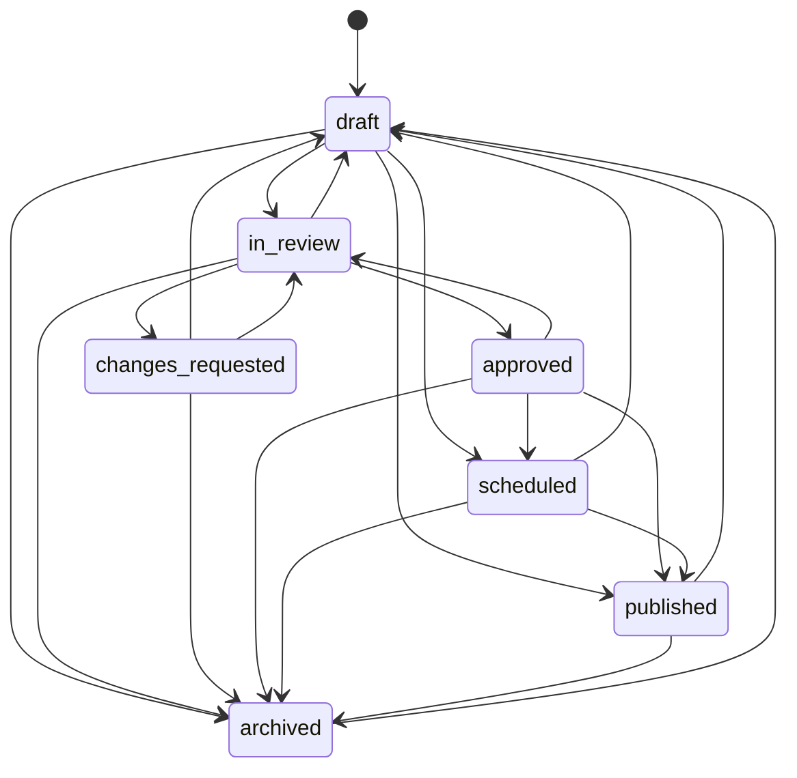

# Sprint C.7.0.6 — Workflow, Permissions & Editorial Approvals

**Status:** Implemented  
**Date:** July 2026  
**Milestone:** C.7.0 — Multi-Editor Publishing Platform

## Summary

Transformed EduRozgaar from a single-admin CMS into a **multi-editor publishing platform** with a canonical permission engine, unified editorial workflow, review queue, approvals, scheduling, content locking, comments, audit trail, and notifications. All changes are **fully additive and backward compatible** — no runtime changes to Page Builder, search, ads, analytics, forms runtime, media storage, slugs, or dynamic block rendering.

## Architecture

```
┌─────────────────────────────────────────────────────────────────┐
│                     Admin Content Modules                        │
│  Jobs · Blogs · Scholarships · Admissions · Career · Universities │
│  Forms · Media · Page Builder (admin save hooks only)            │
└────────────────────────────┬────────────────────────────────────┘
                             │ syncWorkflowAfterSave (additive)
                             ▼
┌─────────────────────────────────────────────────────────────────┐
│              EditorialWorkflow (overlay collection)              │
│  entityType + entityId → status, reviewer, schedule, round       │
└────────────────────────────┬────────────────────────────────────┘
                             │
        ┌────────────────────┼────────────────────┐
        ▼                    ▼                    ▼
 PermissionService    WorkflowService      ContentLockService
 (action matrix +      (transitions,        (TTL locks,
  multi-role RBAC)     queue, bulk)         take-over)
        │                    │                    │
        └────────────────────┼────────────────────┘
                             ▼
              EditorialNotificationService → UserNotification
                             │
              BackgroundJob (scheduled_publish) + cron fallback
                             │
                        AuditLog (reuse)
                             ▼
                   /admin/review  (Review Queue UI)
```

## Workflow State Diagram



## Permission Model

### Concepts

| Concept | Implementation |
|---------|----------------|
| **Role** | Existing `User.role` + additive `UserRoleAssignment.roles[]` |
| **Permission** | Existing `PERMISSIONS` in `rbac.js` + new `WORKFLOW_*` strings |
| **RolePermission** | `ROLE_PERMISSIONS` map (server + client mirror) |
| **PermissionService** | `resource` + `action` → required permission strings via shared matrix |

### Workflow Actions

`view` · `create` · `edit` · `review` · `approve` · `publish` · `schedule` · `delete` · `restore` · `manage`

### Workflow Resources

`page-builder` · `blogs` · `jobs` · `scholarships` · `admissions` · `career-guidance` · `universities` · `forms` · `media` · `cms-page`

### New Permissions (additive)

| Permission | String | Typical roles |
|------------|--------|---------------|
| WORKFLOW_VIEW | `workflow:view` | Editor+ |
| WORKFLOW_REVIEW | `workflow:review` | Moderator+ |
| WORKFLOW_APPROVE | `workflow:approve` | Moderator+ |
| WORKFLOW_PUBLISH | `workflow:publish` | Moderator+ |
| WORKFLOW_SCHEDULE | `workflow:schedule` | Moderator+ |
| WORKFLOW_MANAGE | `workflow:manage` | Admin+ |

Resource actions map to existing content permissions where possible (e.g. `jobs` + `edit` → `content:jobs`, `jobs` + `approve` → `moderate:jobs`).

## Part Coverage

| Part | Deliverable |
|------|-------------|
| 1 Permission system | `PermissionService`, shared matrix, multi-role via `UserRoleAssignment` |
| 2 Editorial workflow | Canonical 7-state machine in `shared/workflow/states.js` |
| 3 Review queue | `GET /api/admin/review`, `/admin/review` UI |
| 4 Approval process | Assign, approve, reject, request changes, comments, multi-round |
| 5 Scheduled publishing | `BackgroundJob` type `scheduled_publish` + cron fallback |
| 6 Content locking | `ContentLock` model, acquire/release/take-over, 30min TTL |
| 7 Comments | Page/block/field scope, resolved status |
| 8 Audit trail | Reuses `auditService` — workflow_*, lock, comment, role events |
| 9 Notifications | `EditorialNotificationService` — in-app + queued email abstraction |
| 10 Dashboard | KPI cards on review page (pending, assigned, scheduled, etc.) |
| 11 Integrations | `syncWorkflowAfterSave` hooks on 10 admin modules |
| 12 Accessibility & UX | Keyboard tabs, confirmation dialogs, bulk actions, responsive table |
| 13 Verification | `npm run verify:workflow` (39 checks) |

## Admin APIs

| Method | Path | Purpose |
|--------|------|---------|
| GET | `/api/admin/workflow/permissions` | Permission model + matrix |
| GET | `/api/admin/workflow/dashboard` | Workflow KPIs |
| GET | `/api/admin/review` | Review queue (tab, pagination) |
| GET | `/api/admin/workflow/:type/:id` | Workflow + lock + comments |
| POST | `/api/admin/workflow/:type/:id/submit` | Submit for review |
| POST | `/api/admin/workflow/:type/:id/assign` | Assign reviewer |
| POST | `/api/admin/workflow/:type/:id/approve` | Approve |
| POST | `/api/admin/workflow/:type/:id/reject` | Reject |
| POST | `/api/admin/workflow/:type/:id/request-changes` | Request changes |
| POST | `/api/admin/workflow/:type/:id/schedule` | Schedule publish/archive |
| POST | `/api/admin/workflow/:type/:id/publish` | Publish now |
| POST | `/api/admin/workflow/:type/:id/archive` | Archive |
| POST | `/api/admin/workflow/bulk/approve` | Bulk approve |
| POST | `/api/admin/workflow/bulk/reject` | Bulk reject |
| POST | `/api/admin/workflow/bulk/assign` | Bulk assign |
| GET/POST/DELETE | `/api/admin/workflow/:type/:id/lock` | Content locking |
| GET/POST | `/api/admin/workflow/:type/:id/comments` | Review comments |
| PATCH | `/api/admin/users/:userId/workflow-roles` | Additional roles |

## Files Created

### Shared
- `shared/workflow/states.js`
- `shared/workflow/resources.js`
- `shared/workflow/permissions.js`
- `shared/workflow/validation.js`

### Server — Models
- `server/src/models/EditorialWorkflow.js`
- `server/src/models/ContentLock.js`
- `server/src/models/EditorialComment.js`
- `server/src/models/UserRoleAssignment.js`

### Server — Services
- `server/src/services/workflow/PermissionService.js`
- `server/src/services/workflow/WorkflowService.js`
- `server/src/services/workflow/ContentLockService.js`
- `server/src/services/workflow/EditorialNotificationService.js`
- `server/src/services/workflow/workflowEntitySync.js`
- `server/src/services/workflow/workflowSchedulerService.js`
- `server/src/services/workflow/workflowIntegration.js`

### Server — Controller
- `server/src/controllers/admin/editorialWorkflowController.js`

### Client
- `client/src/pages/Admin/AdminReviewQueue.jsx`
- `client/src/components/admin/workflow/ContentLockBanner.jsx`

### Tooling & Docs
- `scripts/verify-workflow.mjs`
- `docs/SPRINT_C7_0_6_IMPLEMENTATION_REPORT.md`

## Files Modified

### Server
- `server/src/config/rbac.js` — WORKFLOW_* permissions for Editor/Moderator
- `server/src/routes/admin.js` — workflow + review routes
- `server/src/services/jobQueueService.js` — `scheduled_publish` handler
- `server/src/scheduler/cron.js` — workflow scheduler fallback
- `server/src/controllers/admin/usersController.js` — effective permissions + roles
- `server/src/controllers/pageLayoutController.js` — workflow sync hook
- `server/src/controllers/admin/adminBlogsController.js`
- `server/src/controllers/admin/adminJobsController.js`
- `server/src/controllers/admin/adminScholarshipsController.js`
- `server/src/controllers/admin/adminAdmissionsController.js`
- `server/src/controllers/admin/adminCareerArticlesController.js`
- `server/src/controllers/admin/adminInstitutionsController.js`
- `server/src/controllers/admin/formAdminController.js`
- `server/src/controllers/admin/mediaController.js`

### Client
- `client/src/config/rbac.js` — WORKFLOW_* mirror
- `client/src/config/adminNavConfig.js` — Editorial Review nav
- `client/src/routes/index.jsx` — `/admin/review` route
- `client/src/services/listingsService.js` — workflow API methods
- `client/src/i18n/locales/en/admin.json` — `editorialReview` label

### Root
- `package.json` — `verify:workflow` script

## Backward Compatibility

- Existing `User.role` unchanged; additional roles are optional via `UserRoleAssignment`
- Workflow state stored in separate `EditorialWorkflow` collection (no content model migrations)
- Existing job moderation (`/admin/moderation`) preserved; workflow is parallel/canonical overlay
- Public runtimes untouched; only admin write paths call `syncWorkflowAfterSave`
- `GET /admin/permissions` now returns `roles[]` + merged permissions (additive response fields)

## Verification Output

```
npm run verify:workflow
Workflow verification: 39 passed, 0 failed
All workflow checks passed.
```

## Build Output

```
cd client && npm run build
✓ 895 modules transformed.
✓ built in 7.93s
```

## Usage

1. **Review queue:** Navigate to `/admin/review` (Moderator+ with workflow permissions)
2. **Submit content:** Save in any integrated admin module → workflow overlay auto-created
3. **Approve/publish:** Use review queue actions or workflow API
4. **Schedule:** `POST .../schedule` with `scheduledPublishAt`, optional `scheduledArchiveAt`, `timezone`
5. **Locking:** `ContentLockBanner` component for editor UIs; API for acquire/take-over
6. **Multi-role:** `PATCH /api/admin/users/:userId/workflow-roles` with `{ roles: ["Editor","Moderator"] }`

## Constraints Respected

- Page Builder **runtime** — not modified (admin save hook only)
- Search engine — not modified
- Advertisement rendering — not modified
- Analytics — not modified
- Forms **runtime** — not modified (admin form CRUD hook only)
- Media **storage** — not modified (metadata workflow hook only)
- Slug system — not modified
- Dynamic Block **rendering** — not modified
