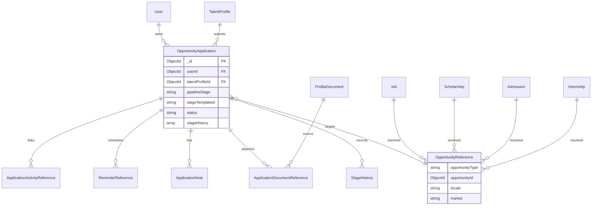

# Sprint C.8.0.3A — OpportunityApplication Backend Foundation

**Status:** Complete  
**Date:** 2026-07-13  
**Scope:** Backend only — no tracker UI, dashboard, employer CRM, Kanban, timeline, reminders, or notifications UI.

---

## Summary

Introduced the canonical **OpportunityApplication** aggregate as the platform's unified application tracker backend. Listings (Job, Scholarship, Admission, Internship, etc.) are referenced via **OpportunityReference** (`type` + `id`) — never duplicated. A dedicated **13-stage state machine** validates all pipeline transitions. Every mutation emits exactly one domain event through **CareerEventBus**, with analytics/cache reactions delegated to **careerApplicationBridge** (not controllers).

---

## Architecture

```
TalentProfile
      │
      ▼
OpportunityApplication ──► OpportunityReference { opportunityType, opportunityId }
      │
      ├── stageHistory[]        (StageHistory)
      ├── notes[]               (ApplicationNote)
      ├── documentReferences[]  (ApplicationDocumentReference → ProfileDocument)
      ├── reminderReferences[]  (ReminderReference → queue job)
      └── activityReferences[]  (ApplicationActivityReference — timeline hook in C.8.0.4)

Listing models (Job, Scholarship, Admission, Internship) — read-only via OpportunityResolverService
```

### ER Diagram



---

## State Machine (13 Stages)

| # | Stage | Terminal |
|---|-------|----------|
| 1 | `interested` | |
| 2 | `preparing` | |
| 3 | `applied` | |
| 4 | `viewed` | |
| 5 | `screening` | |
| 6 | `assessment` | |
| 7 | `interview` | |
| 8 | `offer` | |
| 9 | `negotiation` | |
| 10 | `accepted` | |
| 11 | `joined` | ✓ |
| 12 | `rejected` | ✓ |
| 13 | `withdrawn` | ✓ |

**Implementation:** `shared/career/applicationStageMachine.js` + `ApplicationStageMachineService`

### Stage Templates

| Template ID | Opportunity types | Notes |
|-------------|-------------------|-------|
| `job_default` | `job` | Full 13-stage job pipeline |
| `internship_default` | `internship` | Skips negotiation; interview can go direct to offer/accepted |
| `scholarship_default` | `scholarship`, `fellowship` | Ends at `accepted` — no interview/offer/negotiation/joined |
| `admission_default` | `admission`, `graduate_program` | Same simplified path as scholarship |
| `graduate_default` | `graduate_program` | Alias of admission path |
| `fellowship_default` | `fellowship` | Alias of scholarship path |

### Example Job Flow

```
interested → preparing → applied → viewed → screening → assessment
    → interview → offer → negotiation → accepted → joined

Terminal exits: rejected | withdrawn (from most active stages)
```

---

## Event Matrix

| Mutation | Domain Event | Analytics |
|----------|--------------|-----------|
| Create application | `ApplicationCreated` | `application_created` |
| Update metadata | `ApplicationUpdated` | `application_updated` |
| Stage transition (general) | `StageChanged` | `application_stage_changed` |
| Stage → `withdrawn` | `ApplicationWithdrawn` | `application_withdrawn` |
| Stage → `accepted` | `OfferAccepted` | `application_offer_accepted` |
| Add note | `NoteAdded` | `application_note_added` |
| Attach document | `DocumentAttached` | `application_document_attached` |
| Create reminder | `ReminderCreated` | `application_reminder_created` |
| Archive | `ApplicationArchived` | `application_archived` |

All events flow through `CareerEventBus.emit()` → `careerApplicationBridge.trackApplicationAnalyticsFromEvent()` → cache invalidation + `scheduleAnalyticsEvent`. Controllers never call analytics, search, notifications, or timeline directly.

---

## APIs

Base path: `/api/applications` (requires auth + `OPPORTUNITY_APPLICATION_ENABLED`)

| Method | Endpoint | Description |
|--------|----------|-------------|
| GET | `/applications/stage-templates` | List stage templates |
| GET | `/applications` | List user's active applications |
| POST | `/applications` | Create application |
| GET | `/applications/:id` | Get application + `allowedTransitions` |
| PATCH | `/applications/:id` | Update metadata (title, external URL, etc.) |
| DELETE | `/applications/:id` | Archive application |
| POST | `/applications/:id/stage` | Transition pipeline stage |
| POST | `/applications/:id/notes` | Add note |
| POST | `/applications/:id/documents` | Attach document reference |
| DELETE | `/applications/:id/documents/:documentId` | Remove document reference |
| POST | `/applications/:id/reminders` | Schedule reminder |
| PATCH | `/applications/:id/reminders/:reminderId` | Update reminder |
| DELETE | `/applications/:id/reminders/:reminderId` | Remove reminder |

**No client UI consumes these endpoints yet** (C.8.0.3B).

---

## Feature Flags

| Flag | Default | Purpose |
|------|---------|---------|
| `OPPORTUNITY_APPLICATION_ENABLED` | on (`!== '0'`) | Gate `/api/applications` routes |

---

## Platform Integration

| Platform service | Integration |
|------------------|-------------|
| **TalentProfile** | Required `talentProfileId`; auto-creates profile if missing |
| **Documents** | `ProfileDocumentRepository` validates document ownership on attach |
| **Notifications** | Reminder jobs enqueued via `jobQueueService` (`application_reminder`) |
| **Analytics** | `careerApplicationBridge` → `scheduleAnalyticsEvent` |
| **Search** | `opportunity-application` registered in `CAREER_TO_SEARCH_ENTITY` (private; cache invalidation) |
| **Localization** | `normalizeLocale` on create; `locale`/`market` on aggregate |
| **Workflow** | Not used (editorial workflow is for assessments/credentials) |
| **Queue** | `enqueueJob` for scheduled reminders |
| **Permissions** | `requireAuth` + `requireUserAuth`; ownership enforced in service layer |

---

## New Files

### Shared
- `shared/career/applicationStageMachine.js`
- Extended `shared/career/constants.js`, `shared/career/validation.js`

### Server
- Models: `OpportunityApplication`, `OpportunityReference`, `StageHistory`, `ApplicationNote`, `ApplicationDocumentReference`, `ReminderReference`, `ApplicationActivityReference`
- `OpportunityApplicationRepository.js`
- `ApplicationValidationService.js` (includes `ApplicationStageMachineService`)
- `OpportunityApplicationService.js`
- `OpportunityResolverService.js`
- `careerApplicationBridge.js`
- `opportunityApplicationController.js`
- `routes/opportunityApplications.js`

### Verification
- `scripts/verify-opportunity-application.mjs`

---

## Verification Results

| Command | Result |
|---------|--------|
| `npm run verify:opportunity-application` | **PASS** (58 checks) |
| `npm run verify:career-domain` | **PASS** (23 checks) |
| `npm run verify:profile-adoption` | **PASS** (28 checks) |
| `npm run verify:talent-profile` | **PASS** (53 checks) |
| `cd client && npm run build` | **PASS** |

---

## Implementation Checklist

### OpportunityApplication Domain
- [x] Canonical OpportunityApplication model created
- [x] OpportunityReference (type, id) implemented
- [x] StageHistory model/service implemented
- [x] Notes support implemented
- [x] Document references implemented
- [x] Reminder references implemented

### State Machine
- [x] 13-stage workflow implemented
- [x] Transition validation service added
- [x] Invalid transitions blocked
- [x] Opportunity-specific stage templates supported

### Event Architecture
- [x] One domain event per mutation
- [x] CareerEventBus integration
- [x] No controller-side cross-cutting logic

### APIs
- [x] CRUD endpoints
- [x] Stage transition endpoint
- [x] Notes endpoint
- [x] Documents endpoint
- [x] Reminders endpoint

### Platform Integration
- [x] TalentProfile integration
- [x] Documents service integration
- [x] Notifications integration (queue)
- [x] Analytics integration
- [x] Search integration (registry + cache)
- [x] Localization preserved
- [x] Permissions enforced

### Verification
- [x] verify:career-domain PASS
- [x] verify:profile-adoption PASS
- [x] verify:opportunity-application PASS
- [x] Client build PASS

---

## Manual Backend QA

1. **Enable API** — Ensure `OPPORTUNITY_APPLICATION_ENABLED` is not `0`.
2. **Create (platform job)** — `POST /api/applications` with `{ "opportunityType": "job", "opportunityId": "<validJobId>" }` → `201`, `pipelineStage: interested`.
3. **Create (external)** — `POST /api/applications` with `{ "opportunityType": "job", "title": "Acme Role", "externalUrl": "https://...", "source": "external" }` → `201`.
4. **List** — `GET /api/applications` → returns created apps.
5. **Stage transition** — `POST /api/applications/:id/stage` `{ "toStage": "preparing" }` → updates stage + appends `stageHistory`.
6. **Invalid transition** — `POST .../stage` `{ "toStage": "offer" }` from `interested` → `400`.
7. **Note** — `POST /api/applications/:id/notes` `{ "body": "Follow up next week" }` → note appended.
8. **Document** — `POST /api/applications/:id/documents` `{ "profileDocumentId": "<id>" }` → reference attached.
9. **Reminder** — `POST /api/applications/:id/reminders` `{ "title": "Deadline", "remindAt": "2026-08-01T09:00:00Z" }` → reminder + queue job.
10. **Archive** — `DELETE /api/applications/:id` → `status: archived`.
11. **Templates** — `GET /api/applications/stage-templates` → lists templates per opportunity type.
12. **Flag off** — `OPPORTUNITY_APPLICATION_ENABLED=0` → `503` on all routes.

---

## Known Limitations

1. **No UI** — Endpoints exist but no client consumes them (C.8.0.3B).
2. **No dual-write** — Legacy `Application` / `InternshipApplication` not yet mirrored (C.8.0.7 migration layer).
3. **No employer APIs** — Employer stage changes and inbox deferred to C.8.1+.
4. **No Timeline Service** — `activityReferences` stored; append to Timeline Service in C.8.0.4.
5. **Reminder delivery** — Jobs enqueued; worker handler for `application_reminder` type needs C.8.0.4+ wiring.
6. **Public search** — Applications are private; not indexed in public search (by design).
7. **Stage naming** — Sprint uses simplified 13-stage names (`viewed`, `screening`, `interview`) vs. canonical contract's `acknowledged`/`interview_1` variants; templates align with sprint spec.

---

## What Comes Next

| Sprint | Focus |
|--------|-------|
| **C.8.0.3B** | OpportunityApplication UI integration |
| **C.8.0.4** | Timeline Platform |
| **C.8.0.5** | Documents & Credentials Platform |
| **C.8.0.6** | Career Dashboard Foundation |
| **C.8.0.7** | Migration Layer & dual-write from legacy Application |
| **C.8.1** | Full Job Application Tracker |

---

## Related Documents

- `docs/C8_CAREER_DOMAIN_CANONICAL_CONTRACTS.md`
- `docs/C8_CAREER_DOMAIN_EVENT_WORKFLOW_ARCHITECTURE.md`
- `docs/SPRINT_C8_0_2A_IMPLEMENTATION_REPORT.md`
- `docs/SPRINT_C8_0_2B_2_IMPLEMENTATION_REPORT.md`
