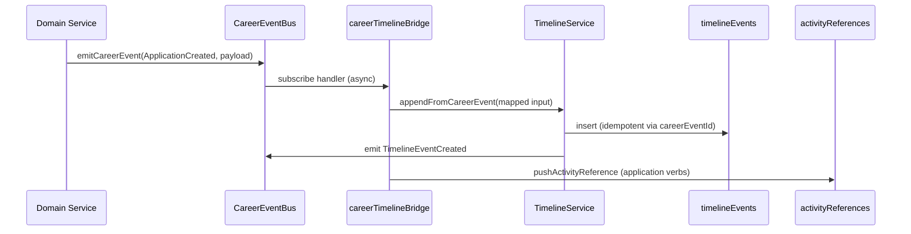

# Sprint C.8.0.4 — Timeline Platform

**Status:** Complete  
**Date:** 2026-07-13  
**Scope:** Unified career timeline backend + reusable read-only widgets. No editable entries, comments, collaboration, AI summaries, notifications UI, or dashboard redesign.

---

## Summary

Introduced the canonical **TimelineEvent** aggregate (`timelineEvents` collection) as the single write path for career activity. **CareerEventBus** subscribers asynchronously append timeline entries from TalentProfile and OpportunityApplication domain events. Read-only APIs expose paginated, filterable feeds. The **ActivityFeed** widget renders localized verb labels on Application Detail (and is reusable for Talent Profile and future dashboards).

---

## Timeline Architecture

```
TalentProfileService ──┐
ResumeVersionService ├──► emitCareerEvent()
OpportunityApplicationService ──┘
              │
              ▼
       CareerEventBus
              │
              ▼ subscribeCareerEvent (registered at startup)
       careerTimelineBridge.handleCareerEventForTimeline()
              │
              ├──► TimelineService.appendFromCareerEvent()
              │         └──► timelineEvents (canonical store)
              │         └──► emit TimelineEventCreated
              │
              └──► OpportunityApplication.activityReferences (denormalized pointer)

Readers:
  GET /api/timeline
  GET /api/timeline/applications/:applicationId
  ActivityFeed.jsx (client)
```

### Event flow diagram



---

## Canonical Model

**Collection:** `timelineEvents`  
**File:** `server/src/models/career/TimelineEvent.js`

| Field | Purpose |
|-------|---------|
| `subjectTalentProfileId` | Whose feed |
| `userId` | Owner for permission checks |
| `actorType` / `actorId` | Who caused the event |
| `verb` | Canonical dot-notation verb |
| `objectType` / `objectId` | Polymorphic target |
| `metadata` | Verb-specific payload |
| `visibility` | `private` (default) |
| `occurredAt` | Event timestamp |
| `careerEventId` | Unique — idempotency key |
| `careerEventType` | Source domain event name |

**Note:** `ApplicationActivityReference` on `OpportunityApplication` remains a denormalized hook only — not a second source of truth.

---

## APIs (read-only)

| Method | Route | Description |
|--------|-------|-------------|
| `GET` | `/api/timeline` | Current user's talent profile timeline |
| `GET` | `/api/timeline/applications/:applicationId` | Application-scoped timeline (ownership verified) |

**Query params:** `limit` (max 100), `cursor`, `verb`, `objectType`, `objectId`, `since`, `until`

**Response:**

```json
{
  "data": [ { "_id", "verb", "metadata", "occurredAt", ... } ],
  "nextCursor": "base64url...",
  "hasMore": true
}
```

---

## Handler Registration

**Bootstrap:** `registerCareerTimelineHandlers()` called in `server/src/index.js` at startup.

**Mapped domain events (13):**

| Domain event | Timeline verb |
|--------------|---------------|
| `TalentProfileCreated` | `profile.created` |
| `TalentProfileUpdated` | `profile.updated` |
| `ResumeVersionCreated` | `resume.created` |
| `ResumePublished` | `resume.updated` |
| `ApplicationCreated` | `application.created` |
| `ApplicationUpdated` | `application.updated` |
| `StageChanged` | `application.stage_changed` |
| `ApplicationWithdrawn` | `application.withdrawn` |
| `ApplicationArchived` | `application.archived` |
| `NoteAdded` | `application.note_added` |
| `ReminderCreated` | `application.reminder_created` |
| `DocumentAttached` | `application.document_attached` |
| `OfferAccepted` | `offer.accepted` |

Handlers run **asynchronously** via `enqueueCareerEventForTimeline()` — no controller-side timeline writes.

---

## Feature Flags

| Server | Client | Default |
|--------|--------|---------|
| `TIMELINE_ENABLED` | `VITE_TIMELINE_ENABLED` | enabled (`!== '0'`) |

When disabled: API returns 503; `TimelineService.appendFromCareerEvent` no-ops; client shows `timeline:featureDisabled`.

---

## Localization

Namespace: `timeline` (en + ur)  
Keys: `timeline:verbs.*` for all 13 verbs; `timeline:stages.*` for stage interpolation in stage-change labels.

---

## Analytics

On each append, `TimelineService` schedules `timeline_event_created` analytics event and invalidates `career:timeline:{userId}` cache namespace.

---

## Verification

```bash
npm run verify:timeline
```

### Results (2026-07-13)

| Command | Result |
|---------|--------|
| `npm run verify:timeline` | **PASS** (38/38) |
| `npm run verify:career-domain` | **PASS** (25/25) |
| `npm run verify:opportunity-application` | **PASS** (sub-suite) |
| Client build | **PASS** |

---

## Manual QA Checklist

- [ ] Create or update TalentProfile → timeline entry appears on `GET /api/timeline`
- [ ] Create OpportunityApplication → `application.created` in application timeline
- [ ] Transition stage → localized stage-change label in ActivityFeed
- [ ] Attach document / add note / add reminder → corresponding verbs
- [ ] Application detail Activity section loads from timeline API
- [ ] Pagination: `nextCursor` returns older events
- [ ] Filter by `verb=application.stage_changed` works
- [ ] User cannot read another user's timeline (404/403 on foreign application)
- [ ] Set `TIMELINE_ENABLED=0` → API 503, append skipped
- [ ] Switch locale en ↔ ur — verb labels update

---

## Known Limitations

| Item | Notes |
|------|-------|
| Employer candidate view | API auth is talent-only; employer-scoped reads deferred |
| Talent Profile page widget | `ActivityFeed` reusable but not yet mounted on profile editor |
| Career Dashboard feed | No dashboard widget yet |
| Historical backfill | Pre-sprint events not retroactively imported |
| `TimelineEventCreated` handler | Meta-event emitted; no downstream consumer yet |
| Editable timeline | Out of scope |

---

## Files Added / Modified

### New

- `shared/career/timelineVerbs.js`
- `shared/career/timelineEventMap.js`
- `server/src/models/career/TimelineEvent.js`
- `server/src/repositories/career/TimelineEventRepository.js`
- `server/src/services/career/TimelineService.js`
- `server/src/services/career/careerTimelineBridge.js`
- `server/src/services/career/careerEventHandlers.js`
- `server/src/controllers/career/timelineController.js`
- `server/src/routes/timeline.js`
- `client/src/services/timelineApi.js`
- `client/src/components/timeline/ActivityFeed.jsx`
- `client/src/i18n/locales/en/timeline.json`
- `client/src/i18n/locales/ur/timeline.json`
- `scripts/verify-timeline.mjs`

### Modified

- `shared/career/constants.js` — `TimelineEventCreated`
- `shared/career/validation.js` — timeline query validation
- `server/src/services/career/CareerEventBus.js` — `TimelineEvent` aggregate inference, subscriber count export
- `server/src/repositories/career/OpportunityApplicationRepository.js` — `pushActivityReference`
- `server/src/config/careerFeatureFlags.js` — `isTimelineEnabled`
- `server/src/index.js` — handler registration + route mount
- `client/src/pages/Applications/ApplicationDetail.jsx` — `ActivityFeed`
- `client/src/config/careerFeatureFlags.js` — client flag
- `client/src/i18n/config.js` — `timeline` namespace
- `package.json`, `scripts/verify-career-domain.mjs`, `.env.template`

---

## Implementation Checklist

### Timeline Platform

- [x] Canonical TimelineEvent model created
- [x] Timeline repository implemented
- [x] Timeline service implemented
- [x] Read-only timeline APIs added
- [x] Pagination and filtering supported

### CareerEventBus Integration

- [x] TalentProfile events handled
- [x] OpportunityApplication events handled
- [x] Timeline events created asynchronously
- [x] No controller-side timeline writes

### Platform Integration

- [x] Localization supported
- [x] Permissions enforced
- [x] Analytics integration
- [x] Feature flags honored

### Verification

- [x] `verify:timeline` PASS
- [x] `verify:career-domain` PASS
- [x] `verify:opportunity-application` PASS
- [x] Client build PASS

---

## Next Sprint

**C.8.0.5 / C.8.1** — Documents & Credentials or Full Job Application Tracker (per roadmap), with timeline widgets extended to Talent Profile and Career Dashboard.
