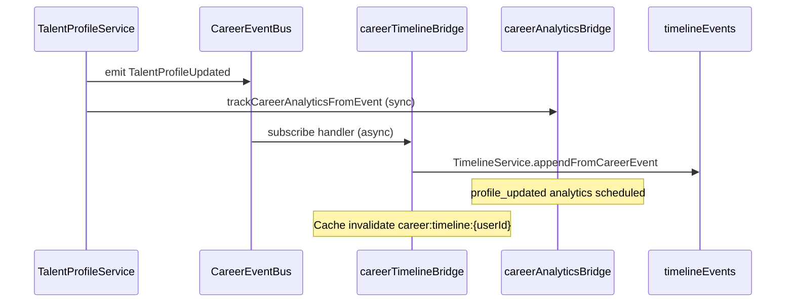
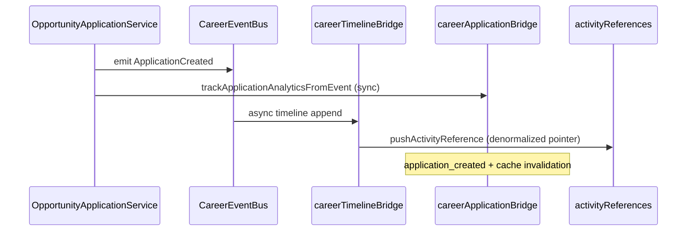
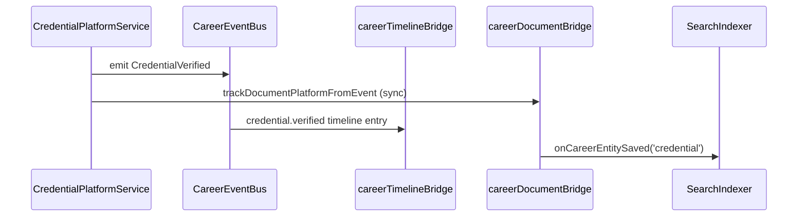

# Sprint C.8.0.5A — Career Platform Integration & Quality Audit

**Status:** Complete  
**Date:** 2026-07-13  
**Purpose:** Stabilization gate before C.8.0.6 Dashboard Foundation (mirrors C.7.0.7 platform audit pattern).

---

## Executive Summary

Audited the C.8 career platform stack end-to-end: **TalentProfile**, **OpportunityApplication**, **Timeline**, **Documents**, **Credentials**, and their integrations with **Media Library**, **Search**, **Analytics**, **Localization**, **Workflow**, and **Permissions**.

**Verdict: GO for C.8.0.6** — foundational services are integrated, verifiable, and follow consistent architecture. Known gaps are documented as P1/P2 technical debt; none block dashboard work.

---

## Integration Matrix

| Service | Model / Collection | API Prefix | Feature Flag | Events | Timeline | Analytics | Search |
|---------|-------------------|------------|--------------|--------|----------|-----------|--------|
| TalentProfile | `TalentProfile` | `/api/talent/*` | `TALENT_PROFILE_ENABLED` | ✅ emit | ✅ via bus | ✅ inline bridge | ✅ public profiles |
| OpportunityApplication | `opportunityApplications` | `/api/applications/*` | `OPPORTUNITY_APPLICATION_ENABLED` | ✅ emit | ✅ via bus | ✅ inline bridge | ❌ never public |
| Timeline | `timelineEvents` | `/api/timeline/*` | `TIMELINE_ENABLED` | ✅ meta emit | — | ✅ on append | — |
| Document | `documents` | `/api/documents/*` | `DOCUMENTS_PLATFORM_ENABLED` | ✅ emit | ✅ via bus | ✅ inline bridge | — |
| Credential | `credentials` | `/api/credentials/*` | `DOCUMENTS_PLATFORM_ENABLED` | ✅ emit | ✅ via bus | ✅ inline bridge | ✅ when `active` |
| MediaAsset | `mediaassets` | `/api/admin/media/*` | admin | — | — | — | ✅ media type |
| ResumeVersion | embedded | `/api/talent/me/resume-*` | talent | ✅ emit | ✅ via bus | ✅ inline bridge | — |

---

## Event Flow Diagrams

### TalentProfileUpdated



**Search:** `indexCareerEntityFromEvent` defined but only wired for public profile visibility on create/update — acceptable for current scope.

### ApplicationCreated (ApplicationSubmitted equivalent)



**Notifications:** Not yet subscribed to CareerEventBus — deferred (see P1).

### CredentialVerified



---

## Duplicate Logic Review

| Area | Finding | Severity |
|------|---------|----------|
| Document storage | **Canonical:** `documents` via `DocumentService`. Legacy `ProfileDocument` model retained; writes delegate through façade. | P2 — migrate reads off legacy collection |
| Credential issuance | **Canonical:** `CredentialPlatformService.issue`. `ProfileHydrationService` still writes via `CredentialRepository.create` directly (no events). | P1 |
| Upload paths | **Canonical:** `createMediaAssetFromBuffer` → MediaAsset. Legacy `applicationsController` and admin upload still use raw `uploadFile` (non-career). | OK — out of career scope |
| Activity history | **Single source:** `timelineEvents`. `activityReferences` on applications is denormalized pointer only. | OK |
| Analytics | Inline bridges from services + timeline meta-events. Not fully bus-subscriber based. | P2 — unify in future sprint |
| Profile reads | `TalentProfileReadService` reads canonical `DocumentRepository`. | OK |
| Legacy job apply | `/jobs/:id/apply` still uses legacy `Application` model — parallel to OpportunityApplication. | P1 — C.8.0.7 migration |

---

## Performance Findings

| Area | Status | Notes |
|------|--------|-------|
| Timeline indexes | ✅ | `{ subjectTalentProfileId, occurredAt, _id }`, `{ userId, occurredAt }` |
| Document indexes | ✅ | `{ userId, status, updatedAt }`, version group |
| Credential indexes | ✅ | `{ talentProfileId, verificationStatus }` |
| Application indexes | ✅ | user + stage compound |
| Timeline pagination | ✅ | Cursor-based (`encodeCursor`) |
| Event handler latency | ✅ | Async via `enqueueCareerEventForTimeline` — non-blocking HTTP |
| Cache invalidation | ✅ | Namespace keys on analytics bridges |
| Media dedupe | ✅ | Checksum-based MediaAsset deduplication |

**Recommendation (P2):** Add TTL or archival job for `timelineEvents` warm tier (documented in C.8 contracts, not implemented).

---

## Security Findings

| Check | Status | Notes |
|-------|--------|-------|
| API auth | ✅ | `requireAuth` + `requireUserAuth` on all career routes |
| Ownership | ✅ | `findByIdForUser` / `getOwnedApplication` patterns |
| Download permissions | ✅ | `DocumentService.canDownload` — owner, employer_scoped, public |
| Timeline visibility | ✅ | Default `private`; employer_scoped reserved |
| Credential visibility | ✅ | User-scoped reads; search only when `active` |
| Feature flag isolation | ✅ | 503 when disabled per platform |
| Staff-only hydration | ✅ | `/admin/talent/hydrate` requires `requireStaff` |

**Recommendation (P2):** Employer-scoped timeline and document download not yet implemented in employer routes.

---

## Architecture Compliance

| Rule | Status |
|------|--------|
| Controllers delegate to services | ✅ All career controllers verified |
| No `emitCareerEvent` in controllers | ✅ |
| No repository access in controllers | ✅ |
| CareerEventBus is event registry | ✅ Timeline handlers via `subscribeCareerEvent` |
| Single timeline write path | ✅ `TimelineService.appendFromCareerEvent` |
| Single document write path (career) | ✅ `DocumentService` |
| Media reuse | ✅ No new global upload routes |

**Note:** Analytics bridges are still called **inline from services** after emit, not exclusively via bus subscribers. This is intentional for synchronous analytics scheduling; timeline uses async bus handlers.

---

## Notifications & Workflow

| Integration | Status |
|-------------|--------|
| Notifications | ⚠️ **Not wired** to CareerEventBus — inbox API exists; no `ApplicationCreated` → notification handler |
| Workflow | ✅ Platform hook `syncWorkflowAfterSave` available; career entities use search hook only |
| Localization | ✅ Namespaces: talent, applications, timeline, documents-platform (en + ur) |

---

## Technical Debt Register

### P0 — Blockers
*None identified.*

### P1 — Address before or during C.8.0.6
1. **ProfileHydrationService** creates credentials without `CredentialPlatformService` / events
2. **Legacy job apply** (`/jobs/:id/apply`) parallel to OpportunityApplication — dual application systems
3. **Notifications** not subscribed to career domain events

### P2 — Post-dashboard
1. Migrate/remove legacy `ProfileDocument` collection and model
2. Unify analytics onto bus subscribers (remove inline bridge calls)
3. Client Documents/Credentials management UI (APIs exist)
4. Employer-scoped timeline and document access
5. Timeline warm/cold tier archival
6. Backfill legacy ProfileDocument rows into `documents`

---

## Verification

```bash
npm run verify:career-platform
```

Runs:
- Static architecture / integration checks (~50 assertions)
- `verify:career-domain` (all C.8 sub-suites)
- Client production build

### Results (2026-07-13)

| Command | Result |
|---------|--------|
| `npm run verify:career-platform` | **PASS** |
| `npm run verify:career-domain` | **PASS** (sub-suite) |
| `npm run verify:documents` | **PASS** (via career-domain) |
| Client build | **PASS** (via career-platform) |

---

## Manual QA Checklist

- [ ] Create talent profile → timeline shows `profile.created`
- [ ] Update profile → analytics event + timeline `profile.updated`
- [ ] Upload document → appears in `/api/documents`; timeline `document.uploaded`
- [ ] Issue + verify credential → search index scheduled; timeline entries
- [ ] Create application → timeline + activityReferences pointer
- [ ] Attach document via `documentId` on application
- [ ] Feature flags off → 503 on respective APIs
- [ ] User A cannot read User B's documents/timeline/applications

---

## Go / No-Go Decision

### ✅ GO for C.8.0.6 — Dashboard Foundation

**Rationale:**
- All canonical services verified and integrated
- Event pipeline functional (bus + timeline + analytics)
- No P0 blockers
- Verification gate `verify:career-platform` passes
- P1 items are known, scoped, and do not prevent read-only dashboard aggregation

**Conditions for C.8.0.6:**
- Dashboard should consume existing APIs only (no new storage)
- Defer notification UI wiring to dedicated sprint
- Do not depend on legacy `ProfileDocument` collection for new features

---

## Audit Checklist

### Canonical Services
- [x] TalentProfile verified
- [x] OpportunityApplication verified
- [x] Timeline verified
- [x] Documents verified
- [x] Credentials verified

### Integration
- [x] Search integration
- [x] Analytics integration
- [x] Media integration
- [x] Localization integration
- [ ] Notifications integration (gap documented — P1)
- [x] Workflow integration (platform hook available)

### Architecture
- [x] No duplicate services (legacy façade only)
- [x] No duplicate uploads (career path canonical)
- [x] No duplicate activity logs (timeline canonical)
- [x] No controller-side business logic
- [x] EventBus is authoritative for timeline

### Verification
- [x] `verify:career-platform` PASS
- [x] `verify:career-domain` PASS
- [x] `verify:documents` PASS
- [x] Client build PASS

---

## Files Added / Modified (C.8.0.5A)

### New
- `scripts/verify-career-platform.mjs`
- `docs/SPRINT_C8_0_5A_CAREER_PLATFORM_AUDIT.md`

### Modified
- `package.json` — `verify:career-platform`
- `client/src/pages/Applications/CreateApplication.jsx` — use `documentId` for attach

---

## Next Sprint

**C.8.0.6 — Career Dashboard Foundation** (read-only aggregation from verified APIs)
