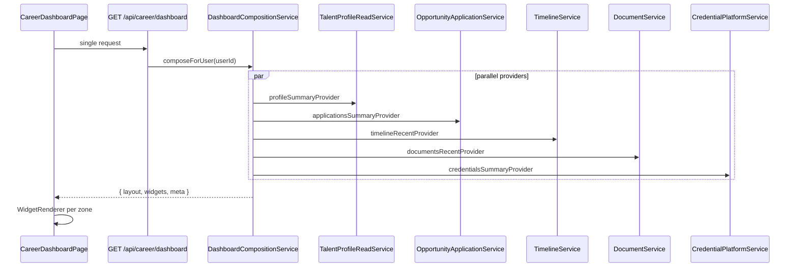

# Sprint C.8.0.6 — Career Dashboard Foundation

**Status:** Complete  
**Date:** 2026-07-13  
**Scope:** Reusable dashboard composition layer (not Dashboard v2). Configuration-driven widgets consuming existing career platform services. No AI, charts, readiness score, employer dashboard, assessments, notifications center, learning, or messaging.

---

## Summary

Introduced a **configuration-driven career dashboard foundation** that separates layout, widget registry, data composition, and rendering. A single `GET /api/career/dashboard` call aggregates widget payloads from canonical platform services. The client loads composition once via `useDashboardComposition` and renders widgets through `WidgetRenderer` — no per-widget duplicate API calls.

When `VITE_CAREER_DASHBOARD_ENABLED=1` (default), `/dashboard` uses the new composition layer. Setting the flag to `0` falls back to the legacy monolithic dashboard unchanged.

---

## Dashboard Architecture

```
CareerDashboardPage
        │
        ▼
useDashboardComposition ──► GET /api/career/dashboard
        │
        ▼
DashboardLayout (hero / main / aside zones)
        │
        ▼
WidgetRenderer ──► widgetComponentMap
        │
        ▼
Widget components (data props only)
        │
        ▼
Existing platform services (server-side aggregation)
```

### Composition flow



---

## Widget Registry

**File:** `shared/career/dashboardWidgetRegistry.js`

| Widget type | Renderer | Provider | Feature flags |
|-------------|----------|----------|---------------|
| `profile-summary` | ProfileSummaryWidget | profileSummaryProvider | talentProfile |
| `applications-summary` | ApplicationsSummaryWidget | applicationsSummaryProvider | opportunityApplication |
| `timeline-recent` | TimelineWidget | timelineRecentProvider | timeline |
| `documents-recent` | DocumentsWidget | documentsRecentProvider | documentsPlatform |
| `credentials-summary` | CredentialsWidget | credentialsSummaryProvider | documentsPlatform |
| `recommendations` | RecommendationsWidget | recommendationsProvider | — |
| `dynamic-content` | DynamicContentWidget | — (client dynamic blocks) | — |
| `quick-links` | QuickLinksWidget | — | — |

**Default layout:**

- **main:** applications-summary, timeline-recent, dynamic-content  
- **aside:** profile-summary, documents-recent, credentials-summary, recommendations  
- **hero:** quick-links (rendered inline in DashboardLayout)

Dashboard v2 will add widgets by extending the registry and layout config — not by rewriting the page.

---

## APIs

| Endpoint | Auth | Description |
|----------|------|-------------|
| `GET /api/career/dashboard` | User + `CAREER_DASHBOARD_ENABLED` | Returns `{ layout, widgets, meta }` |

**Server files:**

- `server/src/services/career/DashboardCompositionService.js`
- `server/src/controllers/career/careerDashboardController.js`
- `server/src/routes/careerDashboard.js`

**Client API:** `client/src/services/careerDashboardApi.js`

---

## Platform Integration

| Platform | Integration |
|----------|-------------|
| TalentProfile | `TalentProfileReadService.getDashboardSummary()` → profile-summary widget |
| OpportunityApplication | `OpportunityApplicationService.listForUser()` → stage counts + recent |
| Timeline | `TimelineService.listForUser()` → timeline-recent; `ActivityFeed` with `prefetchedItems` |
| Documents | `DocumentService.listForUser()` → recent, expiry, resume/certificate counts |
| Credentials | `CredentialPlatformService.listForUser()` → verified skills, latest issued |
| Dynamic Blocks | `BlockListRenderer` + `DASHBOARD_DYNAMIC_BLOCKS` (jobs, scholarships, career articles, admissions) |
| Search / Analytics | Not duplicated — dynamic blocks use existing `dynamicContentApi` |
| Localization | `dashboard.widgets.*` keys in en/ur |
| Permissions | `requireAuth`, `requireUserAuth`, feature-flag middleware |

---

## Client Module Structure

```
client/src/dashboard/
├── CareerDashboardPage.jsx
├── DashboardLayout.jsx
├── WidgetRenderer.jsx
├── WidgetShell.jsx
├── widgetRegistry.js          (re-exports shared registry)
├── widgetComponentMap.js
├── useDashboardComposition.js
├── dashboardDynamicBlocks.js
└── widgets/
    ├── ProfileSummaryWidget.jsx
    ├── ApplicationsSummaryWidget.jsx
    ├── TimelineWidget.jsx
    ├── DocumentsWidget.jsx
    ├── CredentialsWidget.jsx
    ├── RecommendationsWidget.jsx
    ├── DynamicContentWidget.jsx
    └── QuickLinksWidget.jsx
```

---

## Manual QA Checklist

1. Enable flags: `CAREER_DASHBOARD_ENABLED=1`, `VITE_CAREER_DASHBOARD_ENABLED=1`
2. Log in as a user with talent profile, applications, documents, and timeline events
3. Open `/dashboard` — verify composition layout (main + aside grid on desktop)
4. **Profile Summary:** completion %, headline, location, resume status
5. **Application Summary:** Applied / Interview / Offers / Accepted / Rejected counts (no charts)
6. **Timeline:** recent activity from ActivityFeed (no duplicate loading spinner after page load)
7. **Documents:** recent list, expiry reminders if applicable
8. **Credentials:** verified skills and latest issued
9. **Recommendations:** jobs/scholarships/admissions or placeholder text
10. **Dynamic Content:** featured jobs, scholarships, career articles, admissions sections
11. Set `VITE_CAREER_DASHBOARD_ENABLED=0` — legacy dashboard renders
12. Set `CAREER_DASHBOARD_ENABLED=0` — API returns 503; client shows fallback message
13. Switch language en ↔ ur — widget titles translate

---

## Verification

```bash
npm run verify:career-dashboard   # widget registry, composition, reuse, client build
npm run verify:career-platform    # platform integration audit
npm run verify:career-domain      # domain gate (includes dashboard foundation presence)
npm run build --prefix client     # also covered by verify:career-dashboard
```

Run these suites independently — they are not nested into one another (avoids circular/slow gates).

---

## Limitations (by design)

- **Not Dashboard v2** — no drag-and-drop layout editor, no per-user layout persistence
- **No charts** — application summary is count tiles only
- **No AI / readiness score** — recommendations use simple listing + placeholder
- **No notifications center** — legacy dashboard notifications not ported
- **Cache TTL 120s** — dashboard composition cached per user; invalidate on profile/application changes is future work
- **Recommendations provider** — uses latest active listings + targeting context; not full ML recommendations API yet
- **Hero zone** — quick-links hardcoded in layout; registry `quick-links` type reserved for future config

---

## Expected Implementation Checklist

### Dashboard Foundation
- ☑ Dashboard composition layer
- ☑ Widget registry
- ☑ Widget loader
- ☑ Responsive layout

### Widgets
- ☑ Profile Summary
- ☑ Application Summary
- ☑ Timeline widget
- ☑ Documents widget
- ☑ Credentials widget
- ☑ Dynamic Content widget
- ☑ Recommendations placeholder

### Platform Integration
- ☑ TalentProfile
- ☑ OpportunityApplication
- ☑ Timeline
- ☑ Documents
- ☑ Credentials
- ☑ Dynamic Blocks
- ☑ Localization
- ☑ Permissions

### Verification
- ☑ verify:career-dashboard PASS
- ☑ verify:career-platform PASS
- ☑ verify:career-domain PASS
- ☑ Client build PASS

---

## Feature Flags

| Server | Client | Default |
|--------|--------|---------|
| `CAREER_DASHBOARD_ENABLED` | `VITE_CAREER_DASHBOARD_ENABLED` | enabled (`!== '0'`) |

---

## Files Added / Modified

**Added:** `shared/career/dashboardWidgetRegistry.js`, server dashboard route/service/controller, `client/src/dashboard/*`, `client/src/services/careerDashboardApi.js`, `client/src/pages/Dashboard/LegacyDashboard.jsx`, `scripts/verify-career-dashboard.mjs`, this report.

**Modified:** `Dashboard.jsx` (flag gate), `ActivityFeed.jsx` (`prefetchedItems`, `listMine`), career feature flags, `.env.template`, `package.json`, `verify-career-domain.mjs`, dashboard i18n (en/ur), server `index.js`, routes index, cache namespaces.
